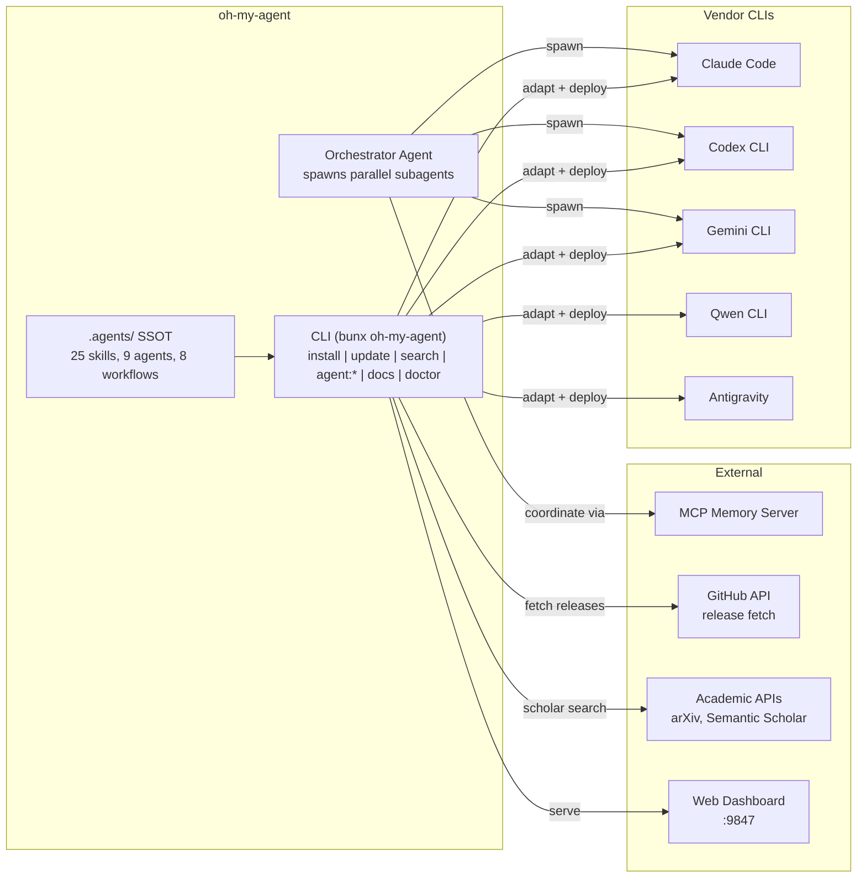
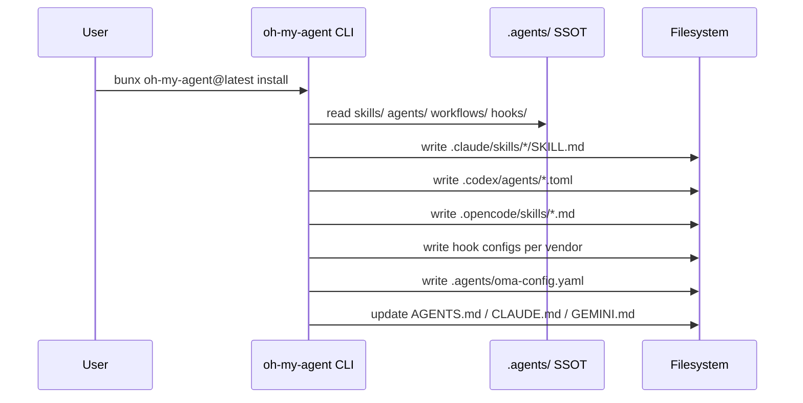
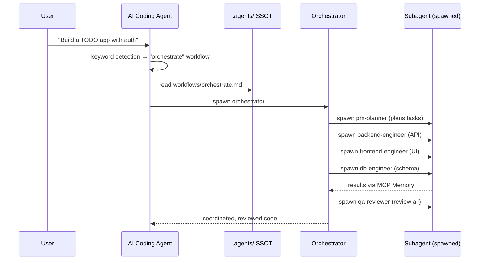

# Codebase Reverse Engineering Report: oh-my-agent

| Field | Value |
|---|---|
| Analysis Date | 2026-05-07 |
| Target | `vendors/oh-my-agent` |
| Repository | https://github.com/first-fluke/oh-my-agent |
| Version | 6.16.1 |
| Mode / Focus / Format | `full` / `all` / `markdown` |
| Confidence | **High** (source-backed throughout) |

---

## 1. Executive Summary

**oh-my-agent** (aka "OMA") is a portable multi-agent harness that transforms AI coding IDEs into coordinated agent teams. It deploys 25 domain-specific skills, 9 subagent definitions, 8 structured workflows, and a keyword-detection hook system across 5 vendor CLIs (Claude Code, Codex, Gemini CLI, Qwen CLI, Antigravity). The system operates from a single source of truth (`.agents/` directory) and is installed via a single command (`bunx oh-my-agent@latest`).

The architecture follows a **SSOT (Single Source of Truth) + vendor adaptation** pattern: all skills, agents, workflows, rules, and hooks are authored once in `.agents/`, then a TypeScript CLI adapts them to each platform's conventions (Claude Code → `.claude/skills/`, Codex → `.codex/agents/`, etc.). An Orchestrator agent can spawn parallel subagents across different vendor CLIs, coordinate via MCP Memory, and run review/remediation loops automatically.

The project has strong architectural discipline (enforced slice boundaries, ADR records, CI boundary checks), comprehensive test coverage (~99 test files for 342 source files), and a sophisticated search pipeline with auto-escalating fetch strategies. It is published as an npm package (`oh-my-agent`) with ~2,000+ stars on GitHub.

---

## 2. Architecture Pattern

**Pattern**: SSOT + Vendor Adaptation + CLI-Driven Orchestration.

```
┌─────────────────────────────────────────────────────────────┐
│                  .agents/  (Single Source of Truth)          │
│  ┌──────────────────────────────────────────────────────┐   │
│  │  skills/    25 domain specialists (SKILL.md each)     │   │
│  │  agents/    9 subagent definitions (.md)              │   │
│  │  workflows/ 8 structured workflows (.md)              │   │
│  │  rules/     11 rule files for code contexts           │   │
│  │  hooks/     keyword-detection triggers               │   │
│  │  config/    oma-config.yaml (language, models, etc.)  │   │
│  └──────────────────────────────────────────────────────┘   │
└────────────────────────┬────────────────────────────────────┘
                         │ install-time adaptation
┌────────────────────────▼────────────────────────────────────┐
│                   cli/  (TypeScript CLI)                     │
│  ┌──────────┐  ┌───────────┐  ┌──────────────────────────┐ │
│  │ commands/│  │ platform/  │  │ vendors/                  │ │
│  │ 20 cmds  │  │ installer  │  │ claude|codex|gemini|qwen  │ │
│  │          │  │ adapter    │  │ auth + settings            │ │
│  └──────────┘  └───────────┘  └──────────────────────────┘ │
│                                                              │
│  ┌──────────────────────────────────────────────────────┐   │
│  │  io/  External adapters                               │   │
│  │  github | tarball | serena | mcp-bridge | workspaces  │   │
│  └──────────────────────────────────────────────────────┘   │
└────────────────────────┬────────────────────────────────────┘
                         │ adaptation output
┌────────────────────────▼────────────────────────────────────┐
│              Target Platform Directories                     │
│  .claude/skills/  .codex/agents/  .opencode/skills/  etc.   │
└─────────────────────────────────────────────────────────────┘
```

### Key Architectural Decisions

1. **`.agents/` as SSOT** — All skills, agents, workflows, rules, and hooks live in `.agents/`. Platform-specific directories (`.claude/`, `.codex/`, `.opencode/`) are **generated artifacts**, never edited directly. The `AGENTS.md` enforces this: "Do not modify `.agents/` files — SSOT protection."

2. **Vendor abstraction layer** — `cli/vendors/{vendor}/` encapsulates per-vendor auth detection and settings management. The `Vendor` registry in `vendors/index.ts` allows iteration over all supported platforms.

3. **Command-slice architecture** (enforced by CI) — Each CLI command lives in `cli/commands/<name>/` with three files: `command.ts` (Commander wiring only), `<name>.ts` (pure business logic — no Clack, no `process.exit`), `ui.ts` (interactive prompts). Cross-slice imports are banned via `cli/scripts/check-boundaries.mjs` in CI.

4. **Auto-escalating search pipeline** — The `oma search` command implements a 5-strategy fetch pipeline (api → probe → impersonate → browser → archive) with automatic escalation based on HTTP response signals (429, 403, WAF markers, JS-essential detection).

5. **Keyword-detection hooks** — Multi-language keyword triggers (English, Korean, Japanese, Chinese, Spanish) auto-detect user intent for workflows. Triggers are defined in `.agents/hooks/core/triggers.json`.

---

## 3. System Context Diagram



---

## 4. Runtime Topology

### Phase A: Install Time (CLI → Platform Dirs)



### Phase C: Runtime (Agent Workflow)



---

## 5. Component Responsibilities

### CLI Commands (20 command groups)

| Command | Role | Key Files |
|---|---|---|
| **install** | Preset-based skill/agent/workflow deployment to target platforms | `commands/install/install.ts` (790 lines) |
| **update** | In-place update from GitHub releases | `commands/update/update.ts` |
| **agent** | Spawn, parallel run, review, tasks, status | `commands/agent/parallel.ts`, `commands/agent/spawn-status.ts` |
| **search** | Intent-based search router with auto-escalating fetch pipeline | `commands/search/pipeline.ts`, 8 API strategies |
| **scholar** | Academic literature search (arXiv, Semantic Scholar, Crossref) | `commands/scholar/search.ts`, `commands/scholar/api.ts` |
| **docs** | Documentation drift detection (verify + sync) | `commands/docs/extract.ts`, `commands/docs/resolve.ts` |
| **doctor** | System health check (vendor auth, config, dependencies) | `commands/doctor/doctor.ts` |
| **image** | Multi-vendor AI image generation | `commands/image/generate.ts` |
| **recap** | Conversation history recap and themed summaries | `commands/recap/recap.ts` |
| **retro** | Sprint/iteration retrospectives | `commands/retro/retro.ts` |
| **stats** | Usage statistics | `commands/stats/stats.ts` |
| **verify** | Pre-commit verification | `commands/verify/verify.ts` |
| **export** | Export agent artifacts | `commands/export/export.ts` |
| **link** | Manage platform symlinks | `commands/link/link.ts` |
| **memory** | Memory management | `commands/memory/memory.ts` |
| **visualize** | Dependency visualization | `commands/visualize/visualize.ts` |
| **star** | GitHub star | `commands/star/star.ts` |
| **cleanup** | Resource cleanup | `commands/cleanup/cleanup.ts` |
| **auth-status** | Vendor authentication status | `commands/auth-status/auth-status.ts` |
| **bridge** | MCP HTTP-stdio bridge | `commands/bridge/bridge.ts` |

### Platform Layer (SSOT → Vendor Adaptation)

| Component | Role |
|---|---|
| **skills-installer.ts** | Core installer: reads SSOT, writes to platform dirs, manages presets |
| **vendor-adapter.ts** | Per-vendor adaptation (Claude workflow routers, Codex TOML agents, etc.) |
| **agent-composer.ts** | Composes agent definitions for each platform's native format |
| **hooks-composer.ts** | Generates platform-specific hook configurations |
| **agent-config.ts** | Reads oma-config.yaml, resolves model presets and per-agent overrides |
| **context-loader.ts** | Loads project context files for agent consumption |
| **manifest.ts** | Version tracking for installed skills |
| **rules.ts** | Rule file deployment (matched by file extension patterns) |

### Vendor Layer (5 supported CLIs)

| Vendor | Key Logic | Auth Detection |
|---|---|---|
| **Claude** | Workflow router SKILL.md generation, settings optimization | Token file check |
| **Codex** | TOML agent generation, workflow prompt installation | Token file check |
| **Gemini** | Skill symlinks, workflow adaptation | OAuth token check |
| **Qwen** | OAuth→API-key migration path, legacy token cleanup | OAuth token check |
| **Antigravity** | Native skill support via `antigravity.skillsPath` in package.json | N/A |

### Skills (25 domain specialists)

| Category | Skills |
|---|---|
| **Core Development** | `oma-frontend`, `oma-backend`, `oma-mobile`, `oma-db`, `oma-architecture` |
| **Quality** | `oma-qa`, `oma-debug`, `oma-docs` |
| **Planning** | `oma-pm`, `oma-brainstorm` |
| **Operations** | `oma-dev-workflow`, `oma-tf-infra`, `oma-scm`, `oma-observability` |
| **Content** | `oma-design`, `oma-image`, `oma-translator`, `oma-pdf`, `oma-hwp` |
| **Meta** | `oma-orchestrator`, `oma-coordination`, `oma-skill-creator`, `oma-recap`, `oma-scholar` |
| **Infrastructure** | `oma-search` |

### Workflows (8 structured process guides)

| Workflow | Type | Persistent? | Description |
|---|---|---|---|
| **orchestrate** | Multi-agent | Yes | Parallel subagents + review loop |
| **work** | Step-by-step | Yes | Sequential execution with remediation loop |
| **ultrawork** | 5-Phase Gate | Yes | 11-review quality gate pipeline |
| **brainstorm** | Ideation | No | Design-first ideation |
| **plan** | Planning | No | PM task breakdown |
| **review** | QA | No | Security/performance/accessibility audit |
| **debug** | Debugging | No | Root cause + minimal fix |
| **scm** | Git | No | Conventional Commits + branching |
| **architecture** | Design | No | ADR/ATAM/CBAM analysis |
| **tools** | Setup | No | Tool configuration |

### Web Dashboard

- **Framework**: Docusaurus 3.x site at `web/`
- **Runtime**: Terminal dashboard (`cli/terminal-dashboard.ts`) with real-time agent monitoring
- **Web dashboard**: Serves on `http://localhost:9847` via `cli/dashboard.ts`
- **State**: Reads from `.serena/memories/` (MCP Memory bridge)

---

## 6. Data Model

### oma-config.yaml (Project Configuration)

```yaml
language: en                    # Response language
translation_voice: balanced     # Translator persona
date_format: ISO
timezone: Asia/Seoul
auto_update_cli: true

docs:
  auto_verify: false
  check_urls: true

model_preset: gemini-only       # Built-in: claude-only|codex-only|gemini-only|qwen-only|antigravity

# Per-agent overrides (optional)
agents:
  backend:
    model: openai/gpt-5.5
    effort: high
  qa:
    model: anthropic/claude-sonnet-4-6

# Custom model slugs (optional)
models:
  my-fast:
    cli: gemini
    cli_model: gemini-3-flash
    supports:
      native_dispatch_from: [gemini]

# Custom presets (optional)
custom_presets:
  my-team:
    extends: claude-only
    description: "Team A — sonnet base, codex backend"
    agent_defaults:
      backend: { model: openai/gpt-5.5, effort: high }
```

### Keyword Triggers (`.agents/hooks/core/triggers.json`)

```json
{
  "workflows": {
    "orchestrate": {
      "persistent": true,
      "keywords": {
        "*": ["orchestrate"],
        "en": ["parallel", "do everything", "run everything", "automate", ...],
        "ko": ["자동 실행", "병렬 실행", "전부 실행", ...],
        "ja": ["オーケストレート", "並列実行", "自動実行", ...],
        "zh": ["编排", "并行执行", "自动执行", ...],
        "es": ["orquestar", "paralelo", "ejecutar todo", ...]
      }
    }
  }
}
```

### Skill Metadata (each SKILL.md)

```yaml
---
name: oma-backend
description: Backend specialist for APIs, databases, authentication...
---
# Backend Agent - API & Server Specialist
## Scheduling
### Goal / Intent signature / When to use / When NOT to use
### Expected inputs / Expected outputs / Dependencies
```

### Agent Definitions (`.agents/agents/*.md`)

9 files: `architecture-reviewer.md`, `backend-engineer.md`, `db-engineer.md`, `debug-investigator.md`, `frontend-engineer.md`, `mobile-engineer.md`, `pm-planner.md`, `qa-reviewer.md`, `tf-infra-engineer.md`.

---

## 7. Integration Map

| Integration | Mechanism | Direction |
|---|---|---|
| OMA CLI → GitHub | `cli/io/github.ts` — release fetch, star, auth check | Outbound |
| OMA CLI → Vendor CLIs | `child_process.spawn` for parallel agent execution | Outbound |
| OMA CLI → MCP Memory | `cli/commands/bridge/bridge.ts` — HTTP-stdio bridge | Bidirectional |
| OMA CLI → Academic APIs | `cli/commands/scholar/api.ts` — arXiv, Semantic Scholar, Crossref | Outbound |
| OMA CLI → npm registry | `cli/io/self-update.ts` — version check | Outbound |
| Skills → Target platforms | `cli/platform/vendor-adapter.ts` — Claude/Codex/Gemini/Qwen/Antigravity adapters | Install-time |
| Agent hooks → IDE | `UserPromptSubmit` / `PreToolUse` / `Stop` hooks | Runtime |
| Web Dashboard → MCP | `cli/dashboard/state.ts` — reads `.serena/memories/` | Inbound |

---

## 8. Main Flows

### Flow 1: Install with Preset

```
1. User: bunx oh-my-agent@latest install
2. CLI detects vendor CLIs on system (which CLIs are installed/auth'd)
3. CLI prompts for preset (All/Fullstack/Frontend/Backend/Mobile/DevOps)
4. CLI reads .agents/ sources from built-in package
5. For each selected skill:
   a. Reads SKILL.md from .agents/skills/<skill>/
   b. Writes to .claude/skills/<skill>/SKILL.md (Claude)
   c. Generates .codex/agents/<name>.toml (Codex)
   d. Creates symlinks/skills for other platforms
6. CLI generates workflow router SKILL.md files
7. CLI writes AGENTS.md / CLAUDE.md / GEMINI.md
8. CLI writes hook configs per vendor
9. CLI prompts to uninstall competitor tools (optional)
```

### Flow 2: Parallel Agent Orchestration

```
1. User: "Build a TODO app with user authentication" → keyword detection triggers "orchestrate"
2. Orchestrator agent reads workflows/orchestrate.md
3. Task decomposition: PM planner creates subtask list
4. Parallel dispatch:
   a. spawn backend-engineer (API + auth) → Claude Code
   b. spawn frontend-engineer (React UI) → Codex
   c. spawn db-engineer (schema + migrations) → Gemini
5. Coordination: subagents write to shared MCP Memory
6. Progress monitoring: orchestrator polls completion status
7. Review: spawn qa-reviewer (security, performance, accessibility)
8. Remediation: fix issues, re-review
9. Collect results, report to user
```

### Flow 3: Search Pipeline (Auto-Escalation)

```
1. User: oma search "topic"
2. Pipeline initializes with strategy order: [api, probe, impersonate, browser, archive]
3. Try API strategy (direct API calls to source):
   a. 429/503 → jitter retry 1x, then escalate to probe
   b. 403/406/WAF → skip to impersonate
4. Probe strategy: lightweight HTTP HEAD/GET with rotating user agents
5. Impersonate strategy: full browser-emulated request
6. Browser strategy: Puppeteer-based full rendering
7. Archive fallback: cached content with provenance tagging
8. Result adoption: accuracy > freshness > completeness > structure > cost
```

---

## 9. Cross-Cutting Concerns

| Concern | Implementation |
|---|---|
| **Type Safety** | TypeScript 6.x with strict mode, Zod 4.x for runtime validation |
| **Linting/Formatting** | Biome 2.4.12 (double quotes, no semicolons, 2-space indent) |
| **Testing** | Vitest 4.x with V8 coverage; 99 test files; colocated tests |
| **CI/CD** | `.github/workflows/` with `release-please` for automated versioning |
| **Boundary Enforcement** | CI check via `cli/scripts/check-boundaries.mjs` + code review |
| **Versioning** | Conventional Commits enforced via `commitlint` + `husky` |
| **Self-Update** | CLI checks npm registry for latest version; auto-updates unless `OMA_SKIP_VERSION_CHECK=1` |
| **Multi-Language** | i18n guide rule file; triggers.json with 6+ languages; Docusaurus i18n for web docs |
| **Error Handling** | Structured error messages with context; `TerminationError` for clean exit |
| **Logging** | Console-based with `picocolors` for terminal output; file logging in `.serena/memories/` |

---

## 10. Security Audit

### Findings

| Severity | Finding | Evidence |
|---|---|---|
| **Info** | Environment variables for configuration only (not secrets). No hardcoded API keys, tokens, or credentials in source. | Scan of all `.ts` files for `secret\|password\|api_key\|ANTHROPIC_API_KEY` — only auth detection logic and type definitions. |
| **Info** | `ANTHROPIC_API_KEY` referenced in type definitions and code comments only; actual value never hardcoded. | `cli/types/docs.ts:27` — references `env` detection type |
| **Low** | CLI writes to user's home directory (`~/.claude/`, `~/.codex/`) during install. User consent is prompted. | `cli/commands/install/install.ts:433` — `allowHomeWriteVendors` checked |
| **Info** | `SECURITY.md` exists and documents the threat model | `SECURITY.md` at repo root |
| **Info** | Shell pipe install (`curl \| bash`) is the recommended install path — standard for CLI tools but carries supply-chain risk. npm-based install (`bunx oh-my-agent@latest`) is safer. | `README.md` install section |

**Assessment**: No critical or high security findings. The codebase is security-conscious: no hardcoded secrets, consent-based home directory writes, and a documented security policy. The recommended `curl | bash` install path is standard for CLI tools but users concerned with supply-chain security should prefer the npm-based install.

---

## 11. Quality Audit

### Test Coverage

| Metric | Value |
|---|---|
| Total TypeScript source files | 342 |
| Test files | 99 |
| Test-to-source ratio | **0.29** (29%) |
| Integrated tests in `cli/__tests__/` | 11 |
| Test framework | Vitest 4.x |

### Test Distribution by Component

| Component | Test Files | Assessment |
|---|---|---|
| `cli/vendors/` | Auth + settings tests per vendor | Good |
| `cli/commands/search/` | Strategy tests (API helpers, registry, browser) | Good |
| `cli/commands/image/` | No tests found | **Gap** |
| `cli/commands/install/` | No colocated tests | **Gap** (790-line file) |
| `cli/platform/` | No colocated tests | **Gap** |
| `cli/io/` | No colocated tests | **Gap** |

### Code Quality Observations

| Severity | Finding | Evidence |
|---|---|---|
| **Medium** | `cli/commands/install/install.ts` is 790 lines with no colocated tests. This is the most critical code path (SSOT→platform deployment). | `cli/commands/install/install.ts` — 790 lines |
| **Medium** | `cli/platform/skills-installer.ts` is 560+ lines with no colocated tests. Core adaptation logic is untested. | `cli/platform/skills-installer.ts` |
| **Low** | Some commands use `node:` imports (`node:fs`, `node:child_process`) — Bun-first policy is project-specific to cc-agents, not OMA's policy | `cli/commands/agent/parallel.ts:1-2` |
| **Info** | Boundary enforcement is manual (CI grep + code review) — no static analysis tool like `dependency-cruiser` | `cli/scripts/check-boundaries.mjs` |

### Architecture Quality

| Aspect | Rating | Notes |
|---|---|---|
| **Module boundaries** | **Excellent** | Command-slice pattern with enforced separation; CI boundary checks; ADR documentation |
| **Naming consistency** | **Good** | `oma-{domain}` pattern throughout; `register*()` convention for Commander wiring |
| **Code duplication** | **Low** | Shared abstractions in `cli-kit/`, `io/`, `platform/` |
| **Documentation** | **Good** | `cli/ARCHITECTURE.md` with ADR reference; `README.md` in 10+ languages; `web/docs/` for user guide |
| **Circular dependencies** | **None found** | Slice isolation prevents circular imports |

---

## 12. Performance Audit

| Severity | Finding | Evidence |
|---|---|---|
| **Low** | `better-sqlite3` used for state persistence — synchronous, but appropriate for CLI usage | `cli/package.json:58`, `cli/dashboard/state.ts` |
| **Info** | Search pipeline auto-escalation is latency-optimized (try API first, browser last as heaviest strategy) | `cli/commands/search/pipeline.ts:32-40` |
| **Info** | Parallel agent spawning uses `node:child_process.spawn` — no shared process pool, each is an independent OS process | `cli/commands/agent/parallel.ts` |
| **Info** | CLI build: `bun build --minify --target node` → single-file binary ~3MB | `cli/package.json:46` |
| **Info** | Web dashboard runs on Express with Docusaurus for docs — lightweight | `web/` directory |

---

## 13. Dependency Graph

```mermaid
flowchart TD
    CLI["cli/cli.ts (Commander root)"] --> INSTALL["commands/install/"]
    CLI --> AGENT["commands/agent/"]
    CLI --> SEARCH["commands/search/"]
    CLI --> SCHOLAR["commands/scholar/"]
    CLI --> DOCS["commands/docs/"]
    CLI --> IMAGE["commands/image/"]
    CLI --> DOCTOR["commands/doctor/"]
    CLI --> RECAP["commands/recap/"]
    CLI --> RETRO["commands/retro/"]
    CLI --> UPDATE["commands/update/"]
    CLI --> OTHERS["20 other commands"]

    INSTALL --> PLATFORM["platform/"]
    PLATFORM --> SKILLS["skills-installer.ts"]
    PLATFORM --> VENDOR_ADAPT["vendor-adapter.ts"]
    PLATFORM --> HOOKS["hooks-composer.ts"]
    PLATFORM --> AGENT_COMP["agent-composer.ts"]

    AGENT --> VENDORS["vendors/"]
    VENDORS --> CLAUDE_V["vendors/claude/"]
    VENDORS --> CODEX_V["vendors/codex/"]
    VENDORS --> GEMINI_V["vendors/gemini/"]
    VENDORS --> QWEN_V["vendors/qwen/"]

    SEARCH --> PIPELINE["search/pipeline.ts"]
    PIPELINE --> API_STRAT["strategies/api/"]
    PIPELINE --> BROWSER_STRAT["strategies/browser.ts"]

    CLI --> IO["io/"]
    IO --> GH["io/github.ts"]
    IO --> TAR["io/tarball.ts"]
    IO --> MCP_BRIDGE["io/mcp-bridge.ts"]

    CLI --> KIT["cli-kit/ (shared utilities)"]
    KIT --> FW["cli-framework.ts"]
    KIT --> SIG["process-signals.ts"]
    KIT --> FM["frontmatter.ts"]
```



---

## 14. Prioritized Remediation Roadmap

### Immediate (within 1-2 sprints)

| # | Action | Priority | Effort |
|---|---|---|---|
| 1 | Add unit tests for `cli/commands/install/install.ts` — 790 lines, zero tests, most critical code path | High | 3-5 days |
| 2 | Add unit tests for `cli/platform/skills-installer.ts` — 560+ lines, zero tests | High | 3-4 days |
| 3 | Add tests for `cli/commands/image/` command group | Medium | 2-3 days |

### Short-term (next month)

| # | Action | Priority | Effort |
|---|---|---|---|
| 4 | Add tests for `cli/io/` (github, tarball, serena, mcp-bridge) | Medium | 2-3 days |
| 5 | Add tests for `cli/platform/` remaining modules (agent-config, context-loader, manifest) | Medium | 2-3 days |
| 6 | Consider upgrading boundary enforcement from grep-based to `dependency-cruiser` for DAG-level dependency rules | Low | 1-2 days |
| 7 | Add E2E tests for install → update → verify cycle | Medium | 3-5 days |

### Medium-term

| # | Action | Priority | Effort |
|---|---|---|---|
| 8 | Extract `install.ts` Clack prompts into `ui.ts` per the command-slice pattern already adopted for other commands | Low | 1-2 days |
| 9 | Extract MCP HTTP-stdio bridge from `commands/bridge/bridge.ts` into `io/mcp-bridge.ts` per ADR recommendation | Low | 1-2 days |
| 10 | Add integration tests for parallel agent spawning with mocked vendor CLIs | Medium | 3-5 days |

---

## 15. Open Questions & Unknowns

| # | Question | Context |
|---|---|---|
| 1 | What is the `ralph` workflow? It exists in `.agents/workflows/ralph.md` with `ralph/resources/` but is not documented in the AGENTS.md or README. | `.agents/workflows/ralph.md` |
| 2 | What are `.agents/workflows/deepinit.md`, `design.md`, `stack-set.md`? These are not listed in AGENTS.md's workflow table. | `.agents/workflows/` |
| 3 | What is the relationship between `action/` directory and the main CLI? | `action/action/` exists but appears to be CI-only |
| 4 | The `benchmarks/` directory has scoring infrastructure — what benchmarks exist and what do they measure? | `benchmarks/scoring/`, `benchmarks/runs/` |
| 5 | `.serena/` directory references — is this the MCP Memory server? Relationship to `cli/dashboard/state.ts`? | `cli/dashboard/state.ts` references `MEMORIES_DIR` |

---

## 16. Evidence Index

| Claim | Evidence |
|---|---|
| Version 6.16.1, Bun + TypeScript monorepo | `package.json:3`, `cli/package.json:3` |
| 25 skills in `.agents/skills/` | Directory listing — 25 SKILL.md files |
| 9 subagent definitions | `.agents/agents/` — 9 .md files |
| 8+ workflows | `.agents/workflows/` — 18 files in 15 .md files |
| 5 vendor CLIs supported | `cli/vendors/` — claude, codex, gemini, qwen + antigravity in package.json |
| ~58K lines TypeScript across 342 source files | `find -name "*.ts" -exec wc -l` → 57,842 |
| 99 test files | `find -name "*.test.ts" \| wc -l` → 99 |
| Command-slice architecture with boundary enforcement | `cli/ARCHITECTURE.md` rules section; `cli/scripts/check-boundaries.mjs` |
| Auto-escalating search pipeline (5 strategies) | `cli/commands/search/pipeline.ts` |
| Keyword-detection with multi-language triggers | `.agents/hooks/core/triggers.json` |
| No hardcoded secrets | Full grep scan — only auth detection logic, type definitions, and comments |
| `.agents/` SSOT protection rule | `AGENTS.md` rules section |
| ADR documentation | `cli/ARCHITECTURE.md` references `.agents/results/architecture/adr-cli-refactor-boundaries.md` |
| Web dashboard on port 9847 | `cli/dashboard.ts:12-13` |
| Terminal dashboard with real-time monitoring | `cli/terminal-dashboard.ts` |
| Academic search via arXiv, Semantic Scholar, Crossref | `cli/commands/scholar/api.ts` |
| Claude Code plugin manifest | `.claude-plugin/plugin.json` |

---

## 17. Machine-Readable Summary

```json
{
  "target": "vendors/oh-my-agent",
  "analysisDate": "2026-05-07",
  "mode": "full",
  "focus": "all",
  "confidence": "high",
  "stack": [
    { "layer": "runtime", "technology": "Bun.js", "version": "latest" },
    { "layer": "language", "technology": "TypeScript", "version": "6.x" },
    { "layer": "linter", "technology": "Biome", "version": "2.4.12" },
    { "layer": "test", "technology": "Vitest", "version": "4.x" },
    { "layer": "cli", "technology": "Commander.js", "version": "14.x" },
    { "layer": "db", "technology": "better-sqlite3", "version": "12.x" },
    { "layer": "web", "technology": "Docusaurus 3", "version": "latest" },
    { "layer": "validation", "technology": "Zod", "version": "4.x" }
  ],
  "entryPoints": [
    { "name": "CLI entry", "path": "cli/cli.ts", "builtTo": "bin/cli.js" },
    { "name": "Install script (macOS/Linux)", "path": "cli/install.sh" },
    { "name": "Install script (Windows)", "path": "cli/install.ps1" }
  ],
  "components": [
    { "name": "CLI", "type": "cli-tool", "commands": 20 },
    { "name": "Skills SSOT", "type": "content", "skills": 25, "location": ".agents/skills/" },
    { "name": "Agent definitions", "type": "content", "agents": 9, "location": ".agents/agents/" },
    { "name": "Workflows", "type": "content", "workflows": 8, "location": ".agents/workflows/" },
    { "name": "Hook system", "type": "infrastructure", "location": ".agents/hooks/" },
    { "name": "Web dashboard", "type": "web-app", "location": "web/" }
  ],
  "dependencies": [
    { "from": "CLI", "to": "Vendor CLIs (5)", "type": "subprocess" },
    { "from": "CLI", "to": "GitHub API", "type": "http" },
    { "from": "CLI", "to": "Academic APIs", "type": "http" },
    { "from": "CLI", "to": "MCP Memory", "type": "stdio/http" },
    { "from": ".agents/ SSOT", "to": "Platform dirs (.claude, .codex, etc.)", "type": "install-time" }
  ],
  "dataModel": [
    { "entity": "oma-config.yaml", "storage": "YAML", "location": ".agents/oma-config.yaml" },
    { "entity": "SKILL.md frontmatter", "storage": "YAML-in-Markdown", "location": ".agents/skills/*/SKILL.md" },
    { "entity": "triggers.json", "storage": "JSON", "location": ".agents/hooks/core/triggers.json" },
    { "entity": "Memory state", "storage": "SQLite (better-sqlite3)", "location": ".serena/memories/" }
  ],
  "interfaces": [
    { "name": "oh-my-agent CLI", "type": "CLI", "commands": ["install", "update", "agent:*", "search", "scholar:*", "docs:*", "doctor", "image:*", "recap", "retro", "stats", "verify", "export", "link", "memory", "visualize", "star", "cleanup", "auth-status", "bridge"] },
    { "name": "Web Dashboard", "type": "HTTP", "port": 9847 },
    { "name": "MCP Memory Bridge", "type": "stdio", "location": "cli/commands/bridge/" }
  ],
  "flows": [
    { "name": "Install with preset", "steps": ["detect vendors", "select preset", "read SSOT", "adapt per vendor", "write platform dirs", "generate hooks"] },
    { "name": "Parallel agent orchestration", "steps": ["keyword detection", "task decomposition", "parallel spawn", "MCP coordination", "QA review", "report"] },
    { "name": "Search pipeline", "steps": ["api → probe → impersonate → browser → archive", "auto-escalate on 429/403/WAF", "return best result"] }
  ],
  "risks": [
    { "severity": "medium", "category": "quality", "finding": "install.ts (790 lines) and skills-installer.ts (560+ lines) — zero tests; most critical code path" },
    { "severity": "medium", "category": "quality", "finding": "cli/commands/image/ — no tests" },
    { "severity": "low", "category": "quality", "finding": "cli/platform/ and cli/io/ — no colocated tests" },
    { "severity": "low", "category": "security", "finding": "curl | bash install — supply-chain risk (mitigated by npm alternative)" }
  ],
  "unknowns": [
    "Purpose of ralph workflow and its resources (judge-protocol.md)",
    "Purpose of action/ CI directory",
    "Benchmark coverage and scoring methodology",
    "deepinit, design, stack-set workflows — not in AGENTS.md workflow table"
  ]
}
```

---

*Report generated by `rd3-reverse-engineering` (mode: full, focus: all). All claims backed by source file references.*
