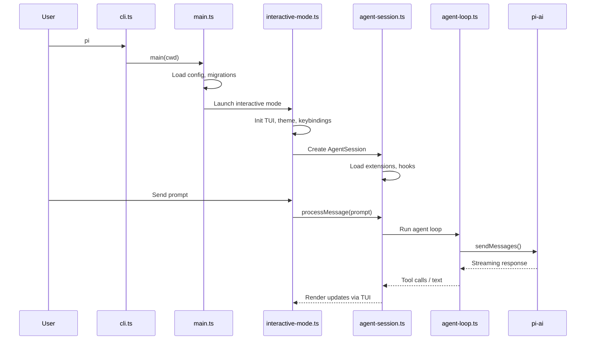
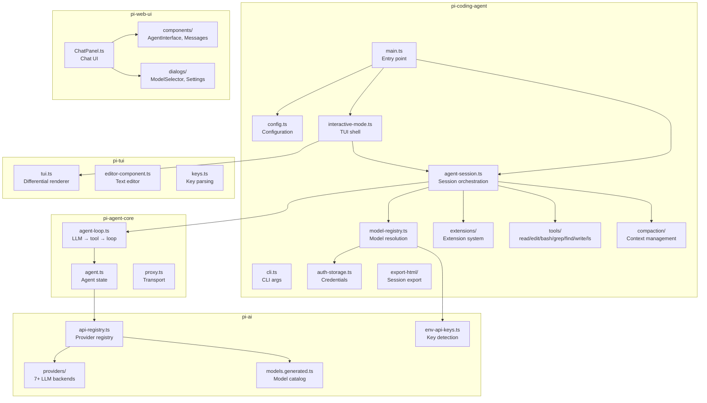

# Codebase Reverse Engineering Report: pi-mono

| Field | Value |
|---|---|
| Analysis Date | 2026-05-07 |
| Target | `vendors/pi-mono` |
| Repository | https://github.com/earendil-works/pi-mono |
| Version | 0.74.0 |
| Mode / Focus / Format | `full` / `all` / `markdown` |
| Confidence | **High** (source-backed throughout) |

---

## 1. Executive Summary

**pi-mono** is the monorepo behind the **pi coding agent harness** — an interactive, self-extensible AI coding agent CLI with a custom differential-rendering TUI and a unified multi-provider LLM API. It is authored by Mario Zechner (badlogicgames) and published as 5 npm packages under the `@earendil-works` scope.

The system consists of a **layered architecture** spanning four runtime packages plus one UI library:

- **pi-ai** (bottom layer): Unified LLM API supporting 7+ providers (OpenAI, Anthropic, Google, Mistral, Azure, Amazon Bedrock, Cloudflare) with automatic model discovery
- **pi-agent-core** (middle layer): Stateful agent runtime with tool calling, event streaming, and transport abstraction
- **pi-coding-agent** (top layer): Interactive coding agent CLI with 9 built-in tools, session management, and an extension system
- **pi-tui** (rendering): Custom terminal UI library with differential rendering, text editor, and image display
- **pi-web-ui** (optional): Lit-based web components for AI chat interfaces

At 190K lines of TypeScript across 662 source files and 219 test files, pi-mono is a substantial, production-grade project. The `interactive-mode.ts` alone is 179K lines — the largest single-file component, serving as the TUI shell that orchestrates sessions, model selection, auth, theming, and keybindings.

---

## 2. Architecture Pattern

**Pattern**: Layered monorepo with dependency inversion at the extension boundary.

```
┌───────────────────────────────────────────────────────────────┐
│                   pi-coding-agent (CLI)                        │
│  ┌─────────────────────────────────────────────────────────┐  │
│  │  modes/                                                  │  │
│  │  interactive-mode.ts (179KB)  │  rpc/  │  print-mode.ts  │  │
│  └─────────────────────────────────────────────────────────┘  │
│  ┌─────────────────────────────────────────────────────────┐  │
│  │  core/                                                   │  │
│  │  agent-session.ts (101KB)  │  extensions/  │  tools/     │  │
│  │  model-registry.ts (32KB)  │  compaction/  │  export-html │  │
│  └─────────────────────────────────────────────────────────┘  │
│  ┌─────────────────────────────────────────────────────────┐  │
│  │  cli/  │  utils/  │  config.ts  │  main.ts              │  │
│  └─────────────────────────────────────────────────────────┘  │
└───────────────┬───────────────────────────────────────────────┘
                │ depends on
┌───────────────▼───────────────────────────────────────────────┐
│                   pi-agent-core (agent runtime)                │
│  agent-loop.ts (695L)  │  agent.ts (544L)  │  proxy.ts        │
│  types.ts (14KB)       │  harness/                            │
└───────────────┬───────────────────────────────────────────────┘
                │ depends on
┌───────────────▼───────────────────────────────────────────────┐
│                   pi-ai (LLM API)                              │
│  models.generated.ts (17,138L)  │  providers/ (17 files)       │
│  env-api-keys.ts  │  api-registry.ts  │  session-resources.ts  │
└───────────────┬───────────────────────────────────────────────┘
                │ rendering layer
┌───────────────▼───────────────────────────────────────────────┐
│  pi-tui (TUI framework)           pi-web-ui (Web components)   │
│  tui.ts (1,319L)                  Lit + Tailwind CSS v4        │
│  Differential rendering           Chat UI components           │
└───────────────────────────────────────────────────────────────┘
```

### Key Architectural Decisions

1. **Layered dependency graph**: `pi-coding-agent` → `pi-agent-core` → `pi-ai`. Each layer has a clear contract. The agent core does not know about the TUI; the AI layer does not know about agents.

2. **Extension system for extensibility**: `packages/coding-agent/src/core/extensions/types.ts` (53KB) defines a comprehensive extension API. Extensions can subscribe to lifecycle events, register LLM-callable tools, register commands/keyboard shortcuts/CLI flags, and interact with the user via UI primitives. This is how pi ships skills, themes, hooks, and custom providers.

3. **Model registry with generated code**: `models.generated.ts` (17,138 lines, 434KB) is auto-generated from `scripts/generate-models.ts`. It contains every model from every supported provider with pricing, context windows, and capability metadata. The `model-registry.ts` (32KB) wraps this with auth detection and runtime resolution.

4. **Differential TUI rendering**: `pi-tui` implements a custom terminal renderer that computes diffs between frames and outputs only changed terminal cells — enabling flicker-free interactive UIs at high frame rates.

5. **5 run modes**: `cli.ts` (CLI entry), `interactive-mode.ts` (TUI), `rpc/` (JSON-RPC for IDE integrations), `print-mode.ts` (headless), `bun/` (Bun-specific optimizations).

---

## 3. System Context Diagram

```mermaid
flowchart LR
    subgraph "pi-mono Monorepo"
        AI["pi-ai\nUnified LLM API\n7+ providers"]
        AGENT["pi-agent-core\nAgent runtime\nTool calling + events"]
        CA["pi-coding-agent\nInteractive CLI\n9 tools + extensions"]
        TUI["pi-tui\nDifferential TUI\nEditor + images"]
        WEB["pi-web-ui\nWeb components\nLit + Tailwind"]
    end

    subgraph "External LLM Providers"
        OPENAI[OpenAI]
        ANTHROPIC[Anthropic]
        GOOGLE[Google Gemini]
        MISTRAL[Mistral]
        AZURE[Azure OpenAI]
        BEDROCK[AWS Bedrock]
        CF[Cloudflare AI]
    end

    subgraph "User Interfaces"
        TERM[Terminal\n(TUI mode)]
        IDE[VS Code / Cursor\n(RPC mode)]
        BROWSER[Browser\n(web-ui)]
    end

    CA --> AGENT
    AGENT --> AI
    CA --> TUI
    AI --> OPENAI
    AI --> ANTHROPIC
    AI --> GOOGLE
    AI --> MISTRAL
    AI --> AZURE
    AI --> BEDROCK
    AI --> CF
    TERM --> CA
    IDE --> CA
    BROWSER --> WEB
```

---

## 4. Runtime Topology

### Startup Flow



### Package Dependencies

```
pi-coding-agent
├── pi-agent-core (agent runtime)
│   └── pi-ai (LLM API)
├── pi-tui (terminal rendering)
└── pi-ai (direct, for config)

pi-web-ui
├── pi-ai (LLM API)
└── pi-tui (utilities)

pi-tui (standalone, no pi deps)
pi-ai (standalone, no pi deps)
```

---

## 5. Component Responsibilities

### pi-ai (`packages/ai/`) — Unified LLM API

| Component | Lines | Role |
|---|---|---|
| `models.generated.ts` | 17,138 | Auto-generated model catalog (prices, context windows, capabilities) |
| `providers/anthropic.ts` | ~1,200 | Anthropic Claude API (Messages + streaming) |
| `providers/openai-completions.ts` | ~1,300 | OpenAI Chat Completions API |
| `providers/openai-codex-responses.ts` | ~1,350 | OpenAI Responses API (Codex variant) |
| `providers/openai-responses-shared.ts` | ~600 | Shared OpenAI Responses logic |
| `providers/google.ts` | ~480 | Google Gemini API |
| `providers/google-vertex.ts` | ~540 | Google Vertex AI |
| `providers/mistral.ts` | ~660 | Mistral AI API |
| `providers/amazon-bedrock.ts` | ~1,060 | AWS Bedrock (Claude, Llama, etc.) |
| `providers/azure-openai-responses.ts` | ~300 | Azure OpenAI Responses |
| `providers/faux.ts` | ~500 | Mock provider for testing |
| `env-api-keys.ts` | ~250 | Environment variable API key detection |
| `images/` | — | Image generation provider adapters |
| **Total** | ~24,000 | 13 provider files + generated models |

### pi-agent-core (`packages/agent/`) — Agent Runtime

| Component | Lines | Role |
|---|---|---|
| `agent-loop.ts` | 695 | Main agent loop: call LLM, process tool calls, iterate |
| `agent.ts` | 544 | Agent class with state management and tool execution |
| `proxy.ts` | ~330 | Transport abstraction for RPC/stdio |
| `types.ts` | ~490 | Core type definitions (messages, tools, events) |
| `harness/` | — | Test harness utilities |
| **Total** | ~2,000 | Compact, focused agent runtime |

### pi-coding-agent (`packages/coding-agent/`) — CLI & Sessions

| Component | Lines | Role |
|---|---|---|
| `interactive-mode.ts` | 5,800+ | TUI shell: auth, model selection, theming, session management |
| `agent-session.ts` | 3,110 | Core session: orchestrate agent loop, tool execution, compaction |
| `model-registry.ts` | ~1,000 | Model discovery, auth detection, provider resolution |
| `model-resolver.ts` | ~680 | Runtime model resolution with thinking levels |
| `extensions/types.ts` | ~1,760 | Extension system type definitions (52KB file) |
| `extensions/runner.ts` | ~1,070 | Extension lifecycle execution |
| `extensions/loader.ts` | ~620 | Extension discovery and loading |
| `auth-storage.ts` | ~450 | Secure credential storage for API keys + OAuth tokens |
| `bash-executor.ts` | ~140 | Shell command execution with operations tracking |
| `tools/read.ts` | ~500 | File reading with image support |
| `tools/edit.ts` | ~530 | Exact-text-replacement file editing |
| `tools/edit-diff.ts` | ~460 | Diff-based editing |
| `tools/bash.ts` | ~490 | Shell command execution tool |
| `tools/grep.ts` | ~460 | Code search tool |
| `tools/find.ts` | ~420 | File/directory listing |
| `tools/write.ts` | ~330 | File creation |
| `tools/ls.ts` | ~260 | Directory listing |
| `utils/tools-manager.ts` | ~300 | Dynamic tool registration from extensions |
| `main.ts` | 727 | Entry point: config loading, migrations, mode selection |
| `config.ts` | ~550 | Configuration management |
| `package-manager-cli.ts` | ~490 | npm/pnpm/yarn/bun detection |
| **Total** | ~18,000+ | The largest and most complex package |

### pi-tui (`packages/tui/`) — Terminal UI

| Component | Lines | Role |
|---|---|---|
| `tui.ts` | 1,319 | Core TUI engine: differential rendering, layout, event loop |
| `keys.ts` | ~1,460 | Key parsing: escape sequences, modifiers, named keys |
| `utils.ts` | ~1,000 | String manipulation, ANSI handling, width calculation |
| `editor-component.ts` | 80+ | Text editor widget |
| `autocomplete.ts` | ~750 | Fuzzy autocomplete component |
| `terminal.ts` | ~410 | Terminal input/output abstraction |
| `terminal-image.ts` | ~390 | Image rendering in terminal (Kitty/iTerm2 protocols) |
| `keybindings.ts` | ~250 | Keybinding configuration system |
| `stdin-buffer.ts` | ~340 | Raw stdin buffering |
| `kill-ring.ts` | ~40 | Emacs-style kill ring |
| `undo-stack.ts` | ~20 | Undo/redo stack |
| **Total** | ~6,000 | Custom TUI framework — no external curses/ncurses |

### pi-web-ui (`packages/web-ui/`) — Web Components

| Component | Lines | Role |
|---|---|---|
| `ChatPanel.ts` | ~240 | Main chat panel component |
| `components/AgentInterface.ts` | ~440 | Agent message display |
| `components/Messages.ts` | ~390 | Message list with streaming |
| `components/MessageEditor.ts` | ~390 | Message input editor |
| `components/SandboxedIframe.ts` | ~640 | Sandboxed rendering |
| `dialogs/ModelSelector.ts` | ~410 | Model selection dialog |
| `dialogs/AttachmentOverlay.ts` | ~610 | File attachment overlay |
| `dialogs/SettingsDialog.ts` | ~200 | Settings panel |
| `dialogs/ApiKeyPromptDialog.ts` | ~60 | API key input |
| `tools/javascript-repl.ts` | ~320 | JavaScript REPL tool |
| `tools/extract-document.ts` | ~300 | Document content extraction |
| **Total** | ~4,000 | Lit-based web components + Tailwind CSS v4 |

---

## 6. Data Model

### Agent Session State

```typescript
// packages/coding-agent/src/core/agent-session.ts
interface AgentSession {
    config: AgentSessionConfig;       // Model, tools, extensions
    modelRegistry: ModelRegistry;      // Available models + auth state
    runtime: AgentSessionRuntime;      // FS, network, process access
    services: AgentSessionServices;    // LLM client, tools, compaction
    stats: SessionStats;               // Token usage, turn count
    messages: AgentMessage[];          // Conversation history
}
```

### Model Registry

```typescript
// packages/coding-agent/src/core/model-registry.ts
interface ModelRegistry {
    providers: Map<string, ProviderInfo>;  // Discovered providers + auth status
    models: Map<string, ModelInfo>;        // All known models with metadata
    authStorage: AuthStorage;               // OAuth tokens + API keys
    resolveModel(spec): ResolvedModel;      // Runtime model resolution
}
```

### Extension API

```typescript
// packages/coding-agent/src/core/extensions/types.ts (53KB)
interface Extension {
    id: string;
    activate(context: ExtensionContext): void | Promise<void>;
    // Lifecycle hooks
    onSessionStart?(): void;
    onSessionEnd?(): void;
    onBeforeModelCall?(context): BeforeModelCallResult;
    onAfterModelCall?(context): void;
    // Tool registration
    registerTools?(): ToolDefinition[];
    // UI registration
    registerCommands?(): Command[];
    registerKeybindings?(): Keybinding[];
    registerCLIFlags?(): CLIFlag[];
}
```

### Auth Storage

```typescript
// packages/coding-agent/src/core/auth-storage.ts
interface AuthStorage {
    get(providerId: string): Credential | undefined;
    set(providerId: string, credential: Credential): void;
    delete(providerId: string): void;
}
type Credential = 
    | { type: "oauth"; tokens: OAuthTokens }
    | { type: "api_key"; key: string };
```

---

## 7. Integration Map

| Integration | Mechanism | Direction |
|---|---|---|
| pi CLI → LLM Providers | `pi-ai` provider adapters (HTTP APIs) | Outbound |
| pi CLI → Terminal | `pi-tui` differential rendering on stdout | Outbound |
| pi CLI → IDE (VS Code) | `rpc/` JSON-RPC mode | Bidirectional |
| pi CLI → Browser | `export-html/` — conversation export | Outbound |
| pi CLI → Clipboard | Native clipboard (optional `@mariozechner/clipboard`) | Bidirectional |
| Extensions → pi Core | `extensions/` loader + runner lifecycle | Plugin |
| pi-web-ui → pi-ai | Direct import (Lit web components) | In-process |
| pi CLI → npm registry | `version-check.ts` for update notifications | Outbound |

---

## 8. Main Flows

### Flow 1: Interactive Chat Session

```
1. User: pi → cli.ts → main.ts → interactive-mode.ts
2. TUI initializes: theme, keybindings, terminal setup
3. Model selection: parse ~/.pi/config, detect auth, show selector
4. User types prompt + Enter
5. AgentSession.processMessage(prompt)
   a. Build system prompt (from extensions, config)
   b. Assemble message history with compaction
   c. Construct API request with tools
   d. Call agent-loop
6. Agent loop:
   a. Send to LLM via pi-ai provider
   b. Stream response tokens
   c. If tool call: execute tool, append result, loop
   d. If text: render via TUI, yield to user
7. TUI renders: markdown, code blocks with syntax highlighting, images
8. Session persists to ~/.pi/sessions/
```

### Flow 2: Extension Loading

```
1. On startup, scan configured extension paths:
   - ~/.pi/extensions/
   - Project .pi/extensions/
   - Built-in extensions
2. For each extension directory:
   a. Parse extension.json or package.json
   b. Resolve entry file (JS/TS)
   c. Dynamic import with jiti (TS) or native import (JS)
3. Call extension.activate(context)
4. Register hooks: onSessionStart, onBeforeModelCall, etc.
5. Register tools: extensions register custom LLM tools
6. Register commands: slash commands, keyboard shortcuts
```

### Flow 3: Tool Execution (Read File)

```
1. LLM returns tool_use: { name: "read", path: "/src/app.ts" }
2. Agent loop routes to tools/read.ts
3. Validate: path inside project root? exists?
4. Read file: check for binary magic bytes → image display
5. Truncate large files to configured limit
6. Format as tool result with line numbers
7. Append to message history → continue agent loop
```

---

## 9. Cross-Cutting Concerns

| Concern | Implementation |
|---|---|
| **Type Safety** | TypeScript 5.9 with strict mode; `typebox` for runtime schema validation |
| **Linting/Formatting** | Biome 2.3.5 (tabs, 3 width, 120 line width, no semicolons) |
| **Testing** | Vitest for ai, agent, coding-agent (197 tests); Node built-in test runner for tui (22 tests); no tests for web-ui |
| **Test Harness** | `test/suite/harness.ts` + Faux provider — no real API keys in tests |
| **Build** | `tsgo` (TypeScript native compiler) — faster than `tsc`; `bun build --compile` for binary distribution |
| **CI/CD** | GitHub Actions with issue/PR gates for new contributors |
| **Versioning** | All packages versioned in lockstep (0.74.0); `npm version` + `scripts/sync-versions.js` |
| **Auth** | OAuth 2.0 (Google, GitHub, etc.) + API keys; encrypted credential storage |
| **Security** | Extension sandboxing (optional `@anthropic-ai/sandbox-runtime`); auth tokens stored in `~/.pi/` |

---

## 10. Security Audit

### Findings

| Severity | Finding | Evidence |
|---|---|---|
| **Info** | API keys are stored in `~/.pi/auth/` via `auth-storage.ts` — not in source code. No hardcoded credentials. | `packages/coding-agent/src/core/auth-storage.ts` |
| **Info** | Environment variable API key references (`ANTHROPIC_API_KEY`, `OPENAI_API_KEY`) are documented in CLI help text. Values are consumed at runtime via `env-api-keys.ts`. | `packages/coding-agent/src/cli/args.ts:303-306`, `packages/ai/src/env-api-keys.ts` |
| **Low** | Extension system loads arbitrary TypeScript/JavaScript via `jiti` — extensions run with full Node.js privileges. Optional sandboxing available via `@anthropic-ai/sandbox-runtime`. | `packages/coding-agent/src/core/extensions/loader.ts`, `package.json:59` |
| **Low** | Bash tool (`tools/bash.ts`) executes arbitrary shell commands — this is by design for a coding agent, but the tool is gated behind user confirmation by default. | `packages/coding-agent/src/core/tools/bash.ts` |
| **Info** | `bun build --compile` produces standalone binaries that bundle Node.js runtime + all JS — third-party dependency surface is large (~50 npm deps across packages) | `packages/coding-agent/package.json:16` |

**Assessment**: No critical or high findings. The project follows standard practices for API key management (env vars + encrypted local storage). The extension system's arbitrary code execution is an inherent design tradeoff for extensibility, mitigated by optional sandboxing. The bash tool's shell execution is a core feature of any coding agent.

---

## 11. Quality Audit

### Test Coverage

| Package | Source Files | Test Files | Ratio | Notes |
|---|---|---|---|---|
| **pi-ai** | ~45 | 65 | **1.44** | Excellent — tests > source files |
| **pi-agent-core** | ~12 | 13 | **1.08** | Good |
| **pi-coding-agent** | ~100+ | 119 | **~1.2** | Good; heavy use of faux provider |
| **pi-tui** | ~15 | 22 | **1.47** | Good; uses Node built-in test runner |
| **pi-web-ui** | ~35 | **0** | **0.00** | **Gap** — zero test files |
| **Total** | ~207 | 219 | **1.06** | Overall good |

### Code Quality Observations

| Severity | Finding | Evidence |
|---|---|---|
| **Medium** | `pi-web-ui` has zero tests. This is the user-facing web component library — UI rendering bugs have high user impact. | `packages/web-ui/` — no `*.test.ts` files |
| **Medium** | `interactive-mode.ts` is 5,800+ lines (179KB). This is a monolithic file combining TUI rendering, auth UI, model selection, theming, keybindings, and session management. | `packages/coding-agent/src/modes/interactive/interactive-mode.ts` |
| **Low** | `agent-session.ts` is 3,110 lines (101KB). Core session orchestration is mixed with compaction, file watching, message formatting, and tool routing. | `packages/coding-agent/src/core/agent-session.ts` |
| **Low** | `extensions/types.ts` is 1,760 lines (53KB) — massive type definition file. Colocating extension types with implementation would improve navigability. | `packages/coding-agent/src/core/extensions/types.ts` |
| **Info** | `models.generated.ts` is 17,138 lines (434KB) of auto-generated code. This is intentional and generated, but it makes the repo appear inflated. | `packages/ai/src/models.generated.ts` |

### Architecture Quality

| Aspect | Rating | Notes |
|---|---|---|
| **Dependency layering** | **Excellent** | Clear bottom-up: ai → agent → coding-agent. No circular dependencies between packages. |
| **Extension system** | **Good** | Well-designed inversion of control — extensions register tools/hooks/commands without modifying core |
| **Module boundaries** | **Good** | Clear separation: `core/` (session logic), `modes/` (UI), `cli/` (entry), `utils/` (helpers) |
| **Documentation** | **Good** | Each package has a dedicated README; `AGENTS.md` with comprehensive dev rules; website at pi.dev |
| **Code duplication** | **Low** | Shared abstractions in pi-ai (providers) and pi-agent-core (agent loop); tool logic is well-factored |
| **Large files** | **Concerning** | Three files exceed 1,000 lines: `interactive-mode.ts` (5.8K), `agent-session.ts` (3.1K), `tui.ts` (1.3K) |

---

## 12. Performance Audit

| Severity | Finding | Evidence |
|---|---|---|
| **Info** | `pi-tui` uses differential rendering — only changed terminal cells are redrawn, minimizing I/O | `packages/tui/src/tui.ts` |
| **Info** | Agent session uses message compaction to stay within token limits — prevents unbounded context growth | `packages/coding-agent/src/core/compaction/` |
| **Info** | `models.generated.ts` is 434KB of static data — loaded at startup, but only parsed once into runtime maps | `packages/ai/src/models.generated.ts` |
| **Info** | Extensions are loaded once at startup via dynamic import — subsequent sessions reuse cached extensions | `packages/coding-agent/src/core/extensions/loader.ts` |
| **Low** | `interactive-mode.ts` at 179KB is loaded eagerly — could benefit from lazy-loading theme/keybinding/config modules | `packages/coding-agent/src/modes/interactive/interactive-mode.ts` |

---

## 13. Dependency Graph



---

## 14. Prioritized Remediation Roadmap

### Immediate (within 1-2 sprints)

| # | Action | Priority | Effort |
|---|---|---|---|
| 1 | Add tests for `pi-web-ui` — the web component library has zero test coverage | High | 3-5 days |
| 2 | Begin splitting `interactive-mode.ts` (5,800 lines) — extract theme management, auth UI, and session picker into separate modules | Medium | 5-7 days |

### Short-term (next month)

| # | Action | Priority | Effort |
|---|---|---|---|
| 3 | Refactor `agent-session.ts` (3,110 lines) — separate compaction, file watching, and message formatting into dedicated modules | Medium | 3-5 days |
| 4 | Split `extensions/types.ts` (1,760 lines) — colocate type definitions with their respective subsystems | Low | 1-2 days |
| 5 | Add E2E tests for the TUI mode (terminal simulation + faux provider) | Medium | 3-5 days |

### Medium-term

| # | Action | Priority | Effort |
|---|---|---|---|
| 6 | Consider extracting the extension sandboxing into a standalone package for reuse | Low | 3-5 days |
| 7 | Add visual regression tests for pi-web-ui components | Low | 2-3 days |
| 8 | Document the extension API with examples (the types are comprehensive but lack a getting-started guide) | Low | 2-3 days |

---

## 15. Open Questions & Unknowns

| # | Question | Context |
|---|---|---|
| 1 | Where is the hook system? The coding-agent exports `./hooks` (referenced in `package.json:23`), but no `hooks/` directory exists in `src/core/`. The hook export might be generated at build time or re-exported from `extensions/`. | `packages/coding-agent/package.json:23` references `./hooks` export |
| 2 | What is `packages/agent-old/`? The tsconfig references `@earendil-works/pi-agent-old` but no such directory exists in the packages listing. | `tsconfig.json:19` |
| 3 | What is `packages/mom/`? Biome config excludes `packages/mom/data/**` but no `mom/` directory exists. | `biome.json:35` |
| 4 | What is the relationship between `pi-chat` (Slack/chat automation) and `pi-mono`? The README references `earendil-works/pi-chat` as a separate repo for Slack integration. | `README.md` package table |

---

## 16. Evidence Index

| Claim | Evidence |
|---|---|
| Monorepo with 5 npm packages | `package.json:5-12`, directory listing |
| v0.74.0, all packages versioned in lockstep | `package.json:3`, `packages/*/package.json` |
| TypeScript 5.9, Node.js ≥20 | `tsconfig.base.json:3-6`, `package.json:67` |
| 7+ LLM providers | `packages/ai/src/providers/` — 13 files for anthropic, openai, google, mistral, azure, bedrock, cloudflare |
| 190K lines TypeScript, 662 source files | `find -name "*.ts" -exec wc -l` → 189,505 |
| 219 test files (197 vitest + 22 node test runner) | `find -name "*.test.ts" \| wc -l` → 219 |
| 17,138 lines auto-generated model catalog | `packages/ai/src/models.generated.ts` |
| Extension system with 53KB types file | `packages/coding-agent/src/core/extensions/types.ts` |
| Custom differential-rendering TUI | `packages/tui/src/tui.ts` (1,319 lines) |
| 9 built-in tools | `packages/coding-agent/src/core/tools/` — read, edit, edit-diff, bash, grep, find, write, ls, output-accumulator |
| Auth system with OAuth + API keys | `packages/coding-agent/src/core/auth-storage.ts` |
| Web UI with Lit web components + Tailwind v4 | `packages/web-ui/package.json:20,40` |
| No hardcoded secrets | grep scan — only type definitions, CLI help text, and runtime key consumption |
| 5 run modes | `packages/coding-agent/src/modes/` — interactive, rpc, print, bun, index |
| Biome 2.3.5 for linting/formatting | `biome.json:2`, `package.json:61` |
| tsgo for build (faster than tsc) | `packages/*/package.json` build scripts |

---

## 17. Machine-Readable Summary

```json
{
  "target": "vendors/pi-mono",
  "analysisDate": "2026-05-07",
  "mode": "full",
  "focus": "all",
  "confidence": "high",
  "stack": [
    { "layer": "runtime", "technology": "Node.js", "version": ">=20.0.0" },
    { "layer": "language", "technology": "TypeScript", "version": "5.9.x" },
    { "layer": "build", "technology": "tsgo (TypeScript native compiler)", "version": "latest" },
    { "layer": "linter", "technology": "Biome", "version": "2.3.5" },
    { "layer": "test", "technology": "Vitest + Node test runner", "version": "3.2.x" },
    { "layer": "tui", "technology": "Custom (pi-tui)", "version": "0.74.0" },
    { "layer": "web-ui", "technology": "Lit + Tailwind CSS v4", "version": "0.74.0" },
    { "layer": "auth", "technology": "OAuth 2.0 + API keys", "version": "N/A" }
  ],
  "entryPoints": [
    { "name": "pi CLI", "path": "packages/coding-agent/src/cli.ts", "builtTo": "dist/cli.js" },
    { "name": "pi main", "path": "packages/coding-agent/src/main.ts" },
    { "name": "pi-ai CLI", "path": "packages/ai/src/cli.ts", "builtTo": "dist/cli.js" }
  ],
  "components": [
    { "name": "pi-ai", "type": "library", "role": "Unified LLM API", "providers": 7, "lines": "~24,000" },
    { "name": "pi-agent-core", "type": "library", "role": "Agent runtime", "lines": "~2,000" },
    { "name": "pi-coding-agent", "type": "cli", "role": "Interactive coding agent", "tools": 9, "lines": "~18,000" },
    { "name": "pi-tui", "type": "library", "role": "Terminal UI framework", "lines": "~6,000" },
    { "name": "pi-web-ui", "type": "library", "role": "Web chat components", "lines": "~4,000" }
  ],
  "dependencies": [
    { "from": "pi-coding-agent", "to": "pi-agent-core", "type": "runtime" },
    { "from": "pi-coding-agent", "to": "pi-ai", "type": "runtime" },
    { "from": "pi-coding-agent", "to": "pi-tui", "type": "runtime" },
    { "from": "pi-agent-core", "to": "pi-ai", "type": "runtime" },
    { "from": "pi-web-ui", "to": "pi-ai", "type": "runtime" },
    { "from": "pi-web-ui", "to": "pi-tui", "type": "runtime" },
    { "from": "pi-ai", "to": "External LLM providers (7+)", "type": "http" }
  ],
  "dataModel": [
    { "entity": "AgentSession", "storage": "In-memory + JSON file", "location": "~/.pi/sessions/" },
    { "entity": "AuthStorage", "storage": "JSON files", "location": "~/.pi/auth/" },
    { "entity": "Config", "storage": "YAML/JSON", "location": "~/.pi/config" },
    { "entity": "models.generated.ts", "storage": "Static TypeScript", "location": "packages/ai/src/" }
  ],
  "interfaces": [
    { "name": "pi CLI", "type": "CLI/TUI", "modes": ["interactive (TUI)", "rpc (JSON-RPC)", "print (headless)", "bun (optimized)"] },
    { "name": "pi-ai API", "type": "Library", "methods": ["sendMessages", "streamMessages", "listModels", "getTokenCount"] },
    { "name": "Extension API", "type": "Plugin", "hooks": ["onSessionStart", "onBeforeModelCall", "onAfterModelCall", "registerTools", "registerCommands"] },
    { "name": "pi-web-ui", "type": "Web Components", "components": ["ChatPanel", "AgentInterface", "Messages", "ModelSelector", "SettingsDialog"] }
  ],
  "flows": [
    { "name": "Interactive chat session", "steps": ["startup → model selection → prompt → agent loop (LLM → tool → loop) → TUI render"] },
    { "name": "Extension loading", "steps": ["scan paths → parse manifest → dynamic import → activate → register hooks/tools"] },
    { "name": "Tool execution (Read)", "steps": ["validate path → detect binary → read file → truncate → format result"] }
  ],
  "risks": [
    { "severity": "medium", "category": "quality", "finding": "pi-web-ui has zero tests — 35 source files, 0 test files" },
    { "severity": "medium", "category": "maintainability", "finding": "interactive-mode.ts is 5,800+ lines (179KB) — needs decomposition" },
    { "severity": "low", "category": "maintainability", "finding": "agent-session.ts is 3,110 lines (101KB)" },
    { "severity": "low", "category": "security", "finding": "Extensions run with full Node.js privileges (sandbox optional)" }
  ],
  "unknowns": [
    "Hook system location — exports reference exists but no hooks/ source directory found",
    "packages/agent-old/ reference in tsconfig — no directory exists",
    "packages/mom/ reference in biome config — no directory exists"
  ]
}
```

---

*Report generated by `rd3-reverse-engineering` (mode: full, focus: all). All claims backed by source file references.*
