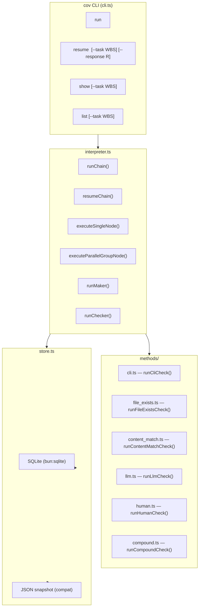

# verification-chain (cov) — Architecture

## Overview

`verification-chain` (cov) implements a Chain-of-Verification (CoV) protocol — a Maker-Checker pattern where each chain node runs a maker action then verifies its output with one or more automated or human checkers.

**Key design principle:** Stateless CLI that orchestrates verification workflows with durable state persistence. Chains can pause for human input and resume later.

---

## System Boundaries



---

## Module Architecture

### File Structure

```
plugins/rd3/skills/verification-chain/
├── SKILL.md                           # Skill definition (source of truth)
├── scripts/
│   ├── cli.ts                        # CLI entry point (cov run/resume/show/list)
│   ├── interpreter.ts                # Chain orchestrator (runChain, resumeChain)
│   ├── store.ts                      # SQLite-backed state persistence
│   ├── types.ts                      # All TypeScript interfaces
│   └── methods/
│       ├── index.ts                  # Barrel export
│       ├── cli.ts                    # CLI checker
│       ├── file_exists.ts            # File existence checker
│       ├── content_match.ts          # Content regex checker
│       ├── llm.ts                    # LLM judge checker
│       ├── human.ts                   # Human gate checker
│       └── compound.ts               # AND/OR/quorum compound checker
├── tests/
│   ├── cli.test.ts
│   ├── interpreter.test.ts
│   ├── store.test.ts
│   ├── methods.test.ts
│   └── integration.test.ts
└── references/
    ├── examples.md                   # Example manifests
    └── profiles/
        └── typescript-bun-biome/
            └── profile.json          # Verification profile
```

---

## Core Concepts

### Chain

A **chain** is a directed sequence of **nodes**, identified by:
- `chain_id` — unique identifier
- `task_wbs` — associated task WBS ID
- `chain_name` — human-readable name

### Node Types

| Type | Description |
|:---|:---|
| `single` | Sequential maker → checker flow |
| `parallel-group` | Multiple makers run concurrently, then single checker verifies convergence |

### Maker

Produces output. Defined by one of:
- `command` — raw shell command
- `delegate_to` — skill to delegate to
- `task_ref` — path to task file

### Checker

Verifies maker output. Six methods available:

| Method | Purpose |
|:---|:---|
| `cli` | Run command, pass if exit code matches |
| `file-exists` | Verify file paths exist |
| `content-match` | Verify/hunt content in file (regex) |
| `llm` | LLM judges checklist items pass/fail |
| `human` | Pause chain, wait for human approval |
| `compound` | AND/OR/quorum of sub-checks |

---

## State Machine

### Chain Status

```
running → completed  (all nodes pass)
running → paused    (human gate hit)
running → failed    (checker fails with halt policy)
running → halted    (on_node_fail policy)
```

### Node Status

```
pending → running → completed  (pass)
pending → running → failed     (fail with halt)
pending → running → skipped    (fail with skip policy)
pending → running → paused     (human gate)
```

### Checker Result

```
pass    — checker succeeded, node continues
fail    — checker failed, apply on_fail policy
paused  — waiting for human input
```

---

## Data Flow

### Run Chain

1. Load manifest from JSON file
2. Create or resume `ChainState`
3. For each node:
   a. Run maker (or skip if already completed)
   b. Run checker
   c. Apply on_fail policy if fail
   d. Save state to SQLite + JSON snapshot
4. Return final state

### Resume Chain

1. Load persisted `ChainState` from SQLite or JSON
2. If `humanResponse` provided, store as `paused_response`
3. Clear pause state
4. Continue from paused node via `runChain()`

---

## Persistence

### SQLite Schema

```sql
-- chain header
CREATE TABLE chain_state (
  chain_id TEXT NOT NULL,
  task_wbs TEXT NOT NULL,
  chain_name TEXT NOT NULL,
  status TEXT NOT NULL,
  current_node TEXT NOT NULL,
  created_at TEXT NOT NULL,
  updated_at TEXT NOT NULL,
  paused_at TEXT,
  paused_node TEXT,
  paused_response TEXT,
  global_retry TEXT,
  state TEXT NOT NULL,        -- full ChainState JSON
  manifest TEXT,               -- original manifest JSON
  PRIMARY KEY (chain_id, task_wbs)
);

-- per-node execution records
CREATE TABLE chain_state_nodes (
  chain_id TEXT NOT NULL,
  task_wbs TEXT NOT NULL,
  node_name TEXT NOT NULL,
  ordinal INTEGER NOT NULL,
  type TEXT NOT NULL,
  status TEXT NOT NULL,
  maker_status TEXT NOT NULL,
  checker_status TEXT NOT NULL,
  checker_result TEXT,
  maker_output TEXT,
  maker_error TEXT,
  started_at TEXT,
  completed_at TEXT,
  parallel_children TEXT,
  node_json TEXT NOT NULL,
  PRIMARY KEY (chain_id, task_wbs, node_name)
);

-- checker evidence records
CREATE TABLE chain_state_evidence (
  chain_id TEXT NOT NULL,
  task_wbs TEXT NOT NULL,
  node_name TEXT NOT NULL,
  evidence_index INTEGER NOT NULL,
  method TEXT NOT NULL,
  result TEXT NOT NULL,
  timestamp TEXT NOT NULL,
  evidence_json TEXT NOT NULL,
  PRIMARY KEY (chain_id, task_wbs, node_name, evidence_index)
);

-- pause checkpoints
CREATE TABLE chain_state_checkpoints (
  chain_id TEXT NOT NULL,
  task_wbs TEXT NOT NULL,
  status TEXT NOT NULL,
  current_node TEXT NOT NULL,
  paused_at TEXT,
  paused_node TEXT,
  paused_response TEXT,
  updated_at TEXT NOT NULL,
  PRIMARY KEY (chain_id, task_wbs)
);
```

### Compatibility JSON

State is also written to:
```
<stateDir>/cov/<chain_id>-<task_wbs>-cov-state.json
```

### Environment Variables

| Variable | Purpose | Default |
|:---|:---|:---|
| `COV_STATE_DIR` | Base runtime directory | `docs/.workflow-runs` |
| `COV_STORE_PATH` | SQLite path (absolute or relative) | `cov/cov-store.db` |
| `COV_STORE_TABLE` | SQLite table namespace | `chain_state` |

---

## Error Handling

| Exit Code | Meaning |
|:---|:---|
| 0 | Success (chain completed or output JSON) |
| 1 | Validation error, chain failed, or not found |

All CLI output is structured JSON to stdout. Errors are logged to stderr via logger.

---

## Testing Architecture

### Test Files (244 tests across 7 files)

| File | Focus |
|:---|:---|
| `cli.test.ts` | CLI command parsing and output |
| `interpreter.test.ts` | Chain execution, node handling, retry logic |
| `store.test.ts` | SQLite persistence, state loading |
| `methods.test.ts` | Individual checker methods |
| `integration.test.ts` | End-to-end chain scenarios |

### Coverage Targets

| Layer | Target |
|:---|:---|
| Interpreter | 90%+ |
| Store | 90%+ |
| Methods | 90%+ |
| CLI | 90%+ |
