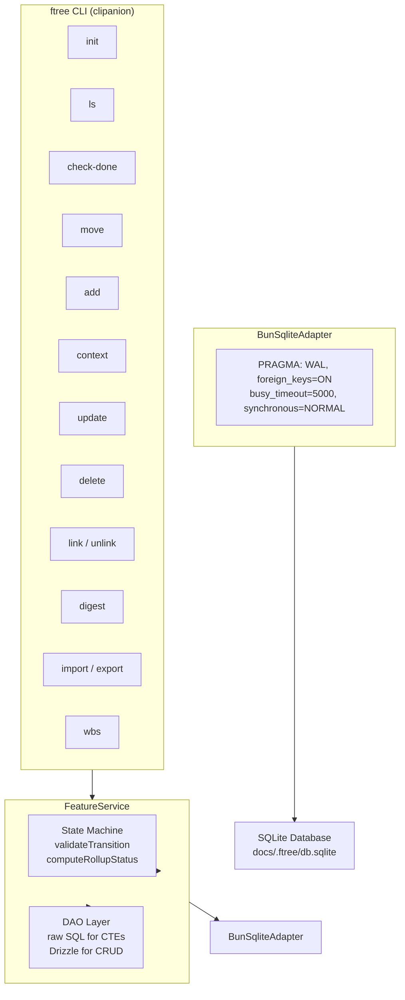

# Feature Tree (ftree) — Architecture

## Overview

`ftree` is a CLI tool for managing hierarchical feature trees with automatic status roll-up and WBS (Work Breakdown Structure) task linking. Designed for AI agent workflows where features are decomposed into sub-features, linked to implementation tasks, and tracked through a state machine.

**Key design principle:** Thin CLI over embedded SQLite — no daemon, no HTTP server. The CLI opens the database, runs the operation, and exits. This matches agent execution patterns (stateless, one-shot commands) and eliminates process management complexity.

---

## System Boundaries



Commands interact only with FeatureService — no direct database access from CLI layer.

---

## Module Architecture

### Monorepo Structure

```
plugins/rd3/skills/feature-tree/
├── SKILL.md                           # Skill definition (read-only source of truth)
├── scripts/
│   ├── package.json                    # Workspace root
│   ├── tsconfig.json                   # Base TypeScript config
│   ├── drizzle.config.ts              # Drizzle config
│   │
│   ├── packages/
│   │   └── core/                      # @ftree/core — domain logic
│   │       ├── package.json
│   │       ├── tsconfig.json
│   │       └── src/
│   │           ├── index.ts           # Barrel export
│   │           ├── config.ts          # CORE_CONFIG (pragmas, paths)
│   │           ├── logger.ts          # logtape logger
│   │           ├── logging.ts
│   │           ├── errors.ts          # AppError hierarchy
│   │           │
│   │           ├── types/
│   │           │   ├── feature.ts    # FeatureStatus, Feature, FeatureNode, etc.
│   │           │   └── result.ts     # Result<T, E>
│   │           │
│   │           ├── db/
│   │           │   ├── adapter.ts     # DbAdapter interface
│   │           │   ├── client.ts       # getDefaultAdapter(), singleton
│   │           │   ├── schema.ts      # Drizzle schema (features, feature_wbs_links)
│   │           │   └── adapters/
│   │           │       └── bun-sqlite.ts  # BunSqliteAdapter implementation
│   │           │
│   │           ├── lib/
│   │           │   ├── dao/
│   │           │   │   ├── sql.ts     # SQL constants (DDL, CTEs, mutations)
│   │           │   │   └── parsers.ts # Row parsers (parseFeature)
│   │           │   ├── state-machine.ts # TRANSITION_MAP, validateTransition, computeRollupStatus
│   │           │   └── tree-utils.ts  # buildFeatureTree, renderTree, findNode
│   │           │
│   │           └── services/
│   │               └── feature-service.ts  # FeatureService class
│   │
│   ├── apps/
│   │   └── cli/                        # ftree CLI — clipanion commands
│   │       ├── package.json
│   │       ├── tsconfig.json
│   │       └── src/
│   │           ├── index.ts           # CLI entry, command registration
│   │           ├── config.ts           # CLI_CONFIG (binaryName, version)
│   │           ├── cli-contracts.test.ts
│   │           ├── lib/
│   │           │   └── template-loader.ts  # loadBuiltinTemplate, BUILTIN_TEMPLATES
│   │           └── commands/
│   │               ├── feature-init.ts
│   │               ├── feature-add.ts
│   │               ├── feature-update.ts
│   │               ├── feature-delete.ts
│   │               ├── feature-move.ts
│   │               ├── feature-list.ts
│   │               ├── feature-context.ts
│   │               ├── feature-link.ts
│   │               ├── feature-unlink.ts
│   │               ├── feature-unlink-wbs.ts
│   │               ├── feature-digest.ts
│   │               ├── feature-check-done.ts
│   │               ├── feature-export.ts
│   │               └── feature-import.ts
│   │
│   └── templates/
│       ├── web-app.json
│       ├── cli-tool.json
│       └── api-service.json
│
└── agents/
    └── openai.yaml
```

### Key Design Decisions

| Decision | Rationale |
|:---|:---|
| **Monorepo (core + cli packages)** | Separates domain logic from CLI concerns; core can be imported by other tools |
| **BunSqliteAdapter** | Abstracts database access; enables testing with mock adapters |
| **Raw SQL for CTEs** | Drizzle doesn't support recursive CTEs well; raw SQL needed for `getSubtree()` |
| **crypto.randomUUID()** | Bun native, no external dependency; collision-resistant |
| **clipanion + typanion** | Type-safe CLI with excellent TypeScript support |
| **logtape** | Structured logging, multiple sinks, no external deps |

---

## State Machine Design

### Status Values

| Status | Meaning |
|:---|:---|
| `backlog` | Feature exists but not yet designed |
| `validated` | Design/sub-features confirmed by architect |
| `executing` | Actively being implemented (has linked WBS tasks) |
| `done` | All linked WBS tasks and sub-features complete |
| `blocked` | Manual flag — implementation stalled |

### Transition Map

```
backlog   → validated, blocked
validated → executing, backlog, blocked
executing → done, blocked
blocked   → backlog, validated, executing
done      → blocked  (regression allowed)
```

### Roll-up Logic

Roll-up is **display-only** (not stored). Parent effective status = worst-case among children:

```
blocked (4) > executing (3) > validated (2) > done (1) > backlog (0)
```

CLI shows `[stored → rollup]` when they differ, e.g., `backlog → validated` means stored status is `backlog` but all children are `validated`.

**Rationale:** Triggers that auto-mutate parent status cause surprising side-effects for agents. Explicit control with advisory roll-up is safer.

---

## Database Design

### Schema

```sql
CREATE TABLE features (
    id           TEXT PRIMARY KEY,
    parent_id    TEXT REFERENCES features(id) ON DELETE CASCADE,
    title        TEXT NOT NULL,
    status       TEXT NOT NULL DEFAULT 'backlog',
    metadata     TEXT NOT NULL DEFAULT '{}',
    depth        INTEGER NOT NULL DEFAULT 0,
    position     INTEGER NOT NULL DEFAULT 0,
    created_at   TEXT NOT NULL DEFAULT (datetime('now')),
    updated_at   TEXT NOT NULL DEFAULT (datetime('now'))
);

CREATE TABLE feature_wbs_links (
    feature_id   TEXT NOT NULL REFERENCES features(id) ON DELETE CASCADE,
    wbs_id       TEXT NOT NULL,
    created_at   TEXT NOT NULL DEFAULT (datetime('now')),
    PRIMARY KEY (feature_id, wbs_id)
);
```

### Indexes

- `idx_features_parent_id` — tree traversal (parent lookups)
- `idx_features_status` — status queries
- `idx_feature_wbs_links_feature_id` — feature → WBS lookup
- `idx_feature_wbs_links_wbs_id` — WBS → feature reverse lookup

### Pragma Configuration

```typescript
PRAGMA journal_mode = WAL;        // Concurrent read safety
PRAGMA foreign_keys = ON;          // Cascading deletes
PRAGMA busy_timeout = 5000;         // 5s wait on lock contention
PRAGMA synchronous = NORMAL;       // Balanced durability/performance
```

---

## Error Handling

| Exit Code | Meaning |
|:---|:---|
| 0 | Success |
| 1 | Validation/logic error (invalid transition, feature not found, circular reference) |
| 2 | Database/internal error |

Error output format:
- Human mode: `<error-prefix>: <message>` to STDERR
- JSON mode: `{"error": "<code>", "message": "<description>"}` to STDOUT

### Error Hierarchy

```typescript
AppError (code: INTERNAL | VALIDATION | NOT_FOUND | CONFLICT)
├── ValidationError    // Invalid input or state transition
├── NotFoundError      // Feature or parent not found
├── ConflictError      // Cannot delete (has children/links)
└── InternalError      // DB errors, unexpected failures
```

---

## Testing Architecture

### Test Files (183 tests across 13 files)

| File | Focus |
|:---|:---|
| `db/adapter.test.ts` | Adapter interface contract |
| `db/adapters/bun-sqlite.test.ts` | BunSqliteAdapter specific behavior |
| `db/client.test.ts` | Client singleton, adapter creation |
| `lib/dao/parsers.test.ts` | Row parsing |
| `lib/state-machine.test.ts` | Transition validation, roll-up computation |
| `lib/tree-utils.test.ts` | Tree building, rendering |
| `services/feature-service.test.ts` | CRUD operations |
| `services/feature-service-queries.test.ts` | Query operations (list, getById, getContext) |
| `services/feature-service-mutations.test.ts` | Mutations (update, delete, move) |
| `errors.test.ts` | Error hierarchy |
| `config.test.ts` | Configuration defaults |
| `logging.test.ts` | Logger configuration |

### Coverage Targets

| Layer | Target |
|:---|:---|
| Database | 90%+ |
| State Machine | 100% |
| CLI Commands | 90%+ |
| Tree Operations | 90%+ |
| Import/Export | 90%+ |

---

## Dependencies

| Package | Purpose | Notes |
|:---|:---|:---|
| `bun:sqlite` | Embedded database | Native Bun, no polyfill needed |
| `drizzle-orm` | ORM for schema + simple CRUD | Lightweight, TypeScript-first |
| `@logtape/logtape` | Structured logging | Zero deps, tree-shakeable |
| `clipanion` | CLI framework | Type-safe, excellent TS support |
| `typanion` | Runtime type validation | Complements clipanion |
| `crypto.randomUUID()` | ID generation | Bun native, no cuid2 dep |

No runtime external dependencies beyond Bun.
