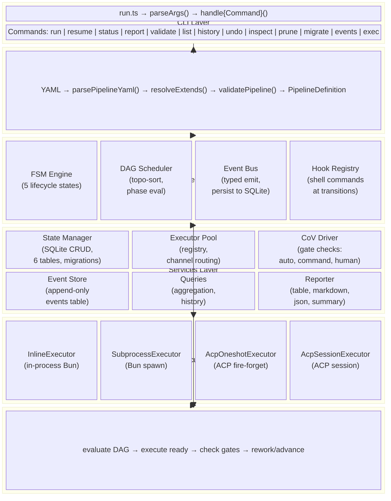

# Orchestration v2 — System Architecture

**Version:** 1.1.0
**Date:** 2026-04-09
**Authors:** Robin Min, Lord Robb
**Status:** Current
**Source:** `plugins/rd3/skills/orchestration-v2/`

---

## Table of Contents

1. [System Overview](#1-system-overview)
2. [Architecture Diagram](#2-architecture-diagram)
3. [Subsystem Catalog](#3-subsystem-catalog)
4. [Data Flow](#4-data-flow)
5. [State Management](#5-state-management)
6. [Key Design Decisions](#6-key-design-decisions)
7. [Executor Architecture](#7-executor-architecture)
8. [Verification Integration](#8-verification-integration)
9. [Error Handling Architecture](#9-error-handling-architecture)
10. [Coexistence with v1](#10-coexistence-with-v1)

---

## 1. System Overview

Orchestration-v2 is a CLI-first pipeline engine for AI agent workflows. It replaces the hardcoded sequential loop in `orchestration-v1` with an FSM-supervised DAG scheduler, swaps JSON state files for event-sourced SQLite, externalizes pipeline definitions into YAML, and introduces a comprehensive CLI (`orchestrator`).

### Six Architectural Pillars

| # | Pillar | Description |
|---|--------|-------------|
| 1 | CLI-first | All operations driven by `orchestrator` CLI with typed flags and exit codes |
| 2 | SQLite State | Event-sourced SQLite replaces JSON files; WAL mode for concurrent reads |
| 3 | Unified Executor Interface | Single `Executor` interface with four backends: `inline`, `subprocess`, `acp-oneshot`, `acp-session` |
| 4 | Pluggable CoV Driver | `VerificationDriver` adapter over verification-chain interpreter |
| 5 | Event-Sourced Observability | All subsystems emit events through a typed `EventBus` → SQLite |
| 6 | FSM + DAG Separation | 5-state FSM (lifecycle) + 7-state DAG (scheduling) — orthogonal concerns |

### System at a Glance

| Metric | Value |
|--------|-------|
| Entry point | `scripts/run.ts` (shebang: `#!/usr/bin/env bun`) |
| CLI commands | 13 (run, resume, status, report, validate, list, history, undo, inspect, prune, migrate, events, exec) |
| FSM states | 5 (IDLE, RUNNING, PAUSED, COMPLETED, FAILED) |
| DAG phase states | 7 (pending, ready, running, completed, failed, paused, skipped) |
| SQLite tables | 6 |
| Error codes | 17 |
| Event types | 14 |
| Executor types | 4 (inline, subprocess, acp-oneshot, acp-session) |

---

## 2. Architecture Diagram



---

## 3. Subsystem Catalog

| Subsystem | Responsibility | Key Files |
|-----------|---------------|-----------|
| **CLI Layer** | Command parsing, output formatting, user interaction | `cli/commands.ts`, `cli/status.ts`, `cli/report.ts`, `cli/events.ts`, `run.ts` |
| **Pipeline Compiler** | Parse YAML, validate schema, resolve extends | `config/schema.ts`, `config/parser.ts`, `config/resolver.ts` |
| **FSM Engine** | Lifecycle state machine — 5 states, 10 transitions | `engine/fsm.ts` |
| **DAG Scheduler** | Dependency resolution, topological sort, phase state tracking | `engine/dag.ts` |
| **Hook Registry** | Shell command execution at FSM transition points | `engine/hooks.ts` |
| **Pipeline Runner** | Orchestrates FSM + DAG + executors + state | `engine/runner.ts` |
| **State Manager** | SQLite schema, CRUD operations, migrations | `state/manager.ts`, `state/migrations.ts` |
| **Event Store** | Append-only event persistence and querying | `state/events.ts` |
| **Queries** | Aggregation queries for status, history | `state/queries.ts` |
| **Executor Pool** | Registry, channel routing, session-aware execution | `executors/pool.ts` |
| **InlineExecutor** | In-process execution in current Bun process | `executors/inline.ts` |
| **SubprocessExecutor** | Explicit Bun subprocess via `bun:spawn` | `executors/subprocess.ts` |
| **AcpOneshotExecutor** | ACP fire-and-forget execution | `executors/acp-oneshot.ts` |
| **AcpSessionExecutor** | ACP persistent session execution | `executors/acp-session.ts` |
| **Routing Policy** | Phase-to-executor routing with override support | `routing/policy.ts` |
| **ACP Transport** | ACP transport layer for LLM query | `integrations/acp/transport.ts` |
| **ACP Sessions** | Session lifecycle management | `integrations/acp/sessions.ts` |
| **ACP Prompts** | Prompt building for ACP execution | `integrations/acp/prompts.ts` |
| **CoV Driver** | Gate verification (auto, command, human gates) | `verification/cov-driver.ts` |
| **Event Bus** | Typed pub/sub — all subsystems emit, consumers subscribe | `observability/event-bus.ts` |
| **Reporter** | Pipeline report generation in 4 formats | `observability/reporter.ts`, `observability/metrics.ts` |
| **Pruner** | Event compaction — age-based and keep-last strategies | `state/prune.ts` |
| **Migration** | v1 JSON state → v2 SQLite conversion | `state/migrate-v1.ts` |

---

## 4. Data Flow

### 4.1 Run Command Flow

```
User runs: orchestrator run 0266 --preset complex
    │
    ▼
parseArgs() → ParsedCommand { command: "run", options: { taskRef: "0266", preset: "complex" } }
    │
    ▼
handleRun() → resolvePreset() → resolvePipelineFile()
    │
    ▼
loadValidatedPipeline()
    ├── parsePipelineYaml() → PipelineDefinition
    ├── resolveExtends() → merged PipelineDefinition
    └── validatePipeline() → ValidationResult
    │
    ▼
PipelineRunner.run()
    ├── Initialize DAG from pipeline phases
    ├── Load hooks from pipeline definition
    ├── Create run record in SQLite (status: RUNNING)
    ├── FSM: IDLE → RUNNING
    └── main loop ←────────────────────────────────────┐
         │                                                │
         ├── DAG evaluate() → ready phases                │
         │   │                                            │
         │   ▼                                            │
         ├── For each ready phase:                         │
         │   ├── Capture git snapshot                      │
         │   ├── ExecutorPool.execute() → result            │
         │   ├── If success: check gate                   │
         │   │   ├── Gate pass → mark completed ──────────┘
         │   │   ├── Gate fail + rework → re-execute
         │   │   └── Human gate → FSM: PAUSED, return
         │   └── If fail: rework or fail pipeline
         │
         └── All phases done → FSM: COMPLETED, return
```

### 4.2 Event Flow

```
ExecutorPool ─── executor.invoked ───────┐
              ─── executor.completed ────┤
                                          │
DAGScheduler ── phase.started ────────────┤
              ── phase.completed ─────────┤
              ── phase.failed ────────────┤
              ── phase.rework ────────────┤  EventBus ──→  EventStore (SQLite)
              ── phase.undo ──────────────┤     │
                                          │     ├──→ CLI (status updates)
FSMEngine ───── run.created ─────────────┤     └──→ Reporter (aggregation)
              ── run.started ────────────┤
              ── run.paused ─────────────┤
              ── run.resumed ────────────┤
              ── run.completed ──────────┤
              ── run.failed ─────────────┘

CoVDriver ───── gate.evaluated ───────────┘
```

Events are written asynchronously — `EventStore.append()` is fire-and-forget with error logging.

---

## 5. State Management

### 5.1 Storage Configuration

| Setting | Value | Rationale |
|---------|-------|-----------|
| Database path | `docs/.workflow-runs/state.db` | Project-local, git-ignored |
| Driver | `bun:sqlite` | Zero-dependency, built into Bun |
| Journal mode | WAL | Concurrent reads during execution |
| Busy timeout | 5000ms | Wait for locks instead of failing |
| Schema versioning | `schema_version` table | Checked on every `init()` |

### 5.2 Schema (current)

```sql
-- Version tracking
CREATE TABLE schema_version (
    version INTEGER PRIMARY KEY,
    applied_at DATETIME DEFAULT CURRENT_TIMESTAMP
);

-- Append-only event log
CREATE TABLE events (
    sequence INTEGER PRIMARY KEY AUTOINCREMENT,
    run_id TEXT NOT NULL,
    event_type TEXT NOT NULL,
    payload JSON NOT NULL,
    timestamp DATETIME DEFAULT CURRENT_TIMESTAMP
);

-- Pipeline run records
CREATE TABLE runs (
    id TEXT PRIMARY KEY,
    task_ref TEXT NOT NULL,
    preset TEXT,
    phases_requested TEXT NOT NULL,
    status TEXT NOT NULL CHECK (status IN ('IDLE','RUNNING','PAUSED','COMPLETED','FAILED')),
    config_snapshot JSON NOT NULL,
    pipeline_name TEXT NOT NULL,
    created_at DATETIME DEFAULT CURRENT_TIMESTAMP,
    updated_at DATETIME DEFAULT CURRENT_TIMESTAMP
);

-- Phase execution records
CREATE TABLE phases (
    run_id TEXT NOT NULL,
    name TEXT NOT NULL,
    status TEXT NOT NULL CHECK (status IN ('pending','ready','running','completed','failed','paused','skipped')),
    skill TEXT NOT NULL,
    payload JSON,
    started_at DATETIME,
    completed_at DATETIME,
    error_code TEXT,
    error_message TEXT,
    rework_iteration INTEGER DEFAULT 0,
    PRIMARY KEY (run_id, name),
    FOREIGN KEY (run_id) REFERENCES runs(id)
);

-- Gate verification results
CREATE TABLE gate_results (
    run_id TEXT NOT NULL,
    phase_name TEXT NOT NULL,
    step_name TEXT NOT NULL,
    checker_method TEXT NOT NULL,
    passed INTEGER NOT NULL,
    evidence JSON,
    duration_ms INTEGER,
    created_at DATETIME DEFAULT CURRENT_TIMESTAMP,
    PRIMARY KEY (run_id, phase_name, step_name),
    FOREIGN KEY (run_id) REFERENCES runs(id)
);

-- Git-based rollback snapshots
CREATE TABLE rollback_snapshots (
    run_id TEXT NOT NULL,
    phase_name TEXT NOT NULL,
    git_head TEXT,
    files_before JSON,
    files_after JSON,
    created_at DATETIME DEFAULT CURRENT_TIMESTAMP,
    PRIMARY KEY (run_id, phase_name),
    FOREIGN KEY (run_id) REFERENCES runs(id)
);

-- Resource usage metrics
CREATE TABLE resource_usage (
    id INTEGER PRIMARY KEY AUTOINCREMENT,
    run_id TEXT NOT NULL,
    phase_name TEXT NOT NULL,
    model_id TEXT NOT NULL,
    model_provider TEXT NOT NULL,
    input_tokens INTEGER DEFAULT 0,
    output_tokens INTEGER DEFAULT 0,
    cache_read_tokens INTEGER DEFAULT 0,
    cache_creation_tokens INTEGER DEFAULT 0,
    wall_clock_ms INTEGER NOT NULL,
    execution_ms INTEGER NOT NULL,
    first_token_ms INTEGER,
    recorded_at DATETIME DEFAULT CURRENT_TIMESTAMP,
    FOREIGN KEY (run_id) REFERENCES runs(id)
);

-- Indexes
CREATE INDEX idx_events_run ON events(run_id);
CREATE INDEX idx_events_type ON events(event_type);
CREATE INDEX idx_runs_task ON runs(task_ref);
CREATE INDEX idx_runs_status ON runs(status);
CREATE INDEX idx_phases_status ON phases(status);
CREATE INDEX idx_resource_usage_run ON resource_usage(run_id);
```

### 5.3 Event Sourcing Pattern

The `EventStore` subscribes to the `EventBus` globally. Every event emitted by any subsystem is persisted to the `events` table with auto-incrementing sequence, run_id, event_type, JSON payload, and timestamp.

---

## 6. Key Design Decisions

### 6.1 FSM + DAG Split

| Concern | Owner | Analogy |
|---------|-------|---------|
| Is the pipeline alive, paused, done, or dead? | FSM (5 states) | Kitchen open/closed |
| Given what's finished, what runs next? | DAG (per-phase states) | Ticket board |

The FSM+DAG split keeps the FSM at exactly 5 states regardless of pipeline complexity. Adding a parallel phase adds one `after:` edge to the DAG — zero FSM changes.

### 6.2 SQLite over JSON

| Aspect | v1 (JSON) | v2 (SQLite) |
|--------|-----------|-------------|
| Concurrent access | File locking, corruption risk | WAL mode, safe concurrent reads |
| Queries | Read entire file, parse, filter | SQL aggregation, indexes |
| Event history | Not tracked | Append-only events table |
| Migration | Manual file editing | Schema versioning |

### 6.3 YAML Pipeline Configuration

Pipelines are defined in YAML for:
1. **Per-project customization** — Each project can have `docs/.workflows/pipeline.yaml`
2. **Extends/inheritance** — Base pipeline extended per-project without duplication
3. **Version control** — YAML diffs are human-readable

### 6.4 Unified Executor Interface

The single `Executor` interface replaced a dual-interface design (separate `Executor` in `model.ts` and `PhaseExecutorAdapter` in `adapter.ts`). This eliminates dual maps in `ExecutorPool`, type casts, and the `useAdapters` toggle.

### 6.5 Executor Naming

Clean vocabulary for clarity:
- `inline` — in-process execution (was `local`)
- `subprocess` — explicit Bun subprocess (was `direct`)
- `acp-oneshot` — ACP fire-and-forget (was `acp-stateless`)
- `acp-session` — ACP persistent session (was `acp-sessioned`)

Legacy aliases (`local`, `direct`, `auto`, `current`, `acp-stateless:*`, `acp-sessioned:*`) are normalized with deprecation warnings.

---

## 7. Executor Architecture

### 7.1 Unified Executor Interface

```typescript
interface Executor {
    readonly id: string;
    readonly name: string;
    readonly channels: readonly string[];
    readonly maxConcurrency: number;
    execute(req: ExecutionRequest): Promise<ExecutionResult>;
    healthCheck(): Promise<ExecutorHealth>;
    dispose(): Promise<void>;
}
```

### 7.2 Executor Implementations

| Executor | ID | Description |
|----------|----|-------------|
| `InlineExecutor` | `inline` | In-process execution in current Bun process. Resolves skill entrypoint at `<skillBaseDir>/<plugin>/<skill>/scripts/local.ts`. Falls back to `local.ts`, then `index.ts`. Clear error if no local entrypoint: `"Skill X does not expose a local in-process entrypoint. Use executor.mode: subprocess."` |
| `SubprocessExecutor` | `subprocess` | Explicit Bun subprocess via `bun:spawn`. No ACP/acpx dependency. Uses `acp-oneshot` transport as fallback for SKILL-only packages. |
| `AcpOneshotExecutor` | `acp-oneshot:<ch>` | ACP fire-and-forget. Channel from config (`pi`, `codex`, etc.). |
| `AcpSessionExecutor` | `acp-session:<ch>` | ACP persistent session with context carry-over. Channel from config. |

### 7.3 Executor Pool

The `ExecutorPool` manages a single `Map<string, Executor>` registry. Routing uses `normalizeExecutorId()` for legacy alias handling.

**Default:** `inline` (InlineExecutor). ACP executors registered for each configured channel.

### 7.4 Legacy Aliases

All legacy aliases normalize to modern IDs with deprecation warnings:

| Legacy | Modern |
|--------|--------|
| `local` | `inline` |
| `direct` | `subprocess` |
| `auto` | `inline` |
| `current` | `inline` |
| `acp-stateless:<x>` | `acp-oneshot:<x>` |
| `acp-sessioned:<x>` | `acp-session:<x>` |

### 7.5 InlineExecutor Local Entrypoint Resolution

```
1. plugins/<plugin>/<skill>/scripts/local.ts
2. plugins/<plugin>/<skill>/local.ts
3. plugins/<plugin>/<skill>/index.ts
```

Handler lookup order: `runLocalPhase` → `executeLocal` → `default`

---

## 8. Verification Integration

### 8.1 VerificationDriver Interface

```typescript
interface VerificationDriver {
    runChain(manifest: ChainManifest): Promise<ChainState>;
    resumeChain(stateDir: string, action?: 'approve' | 'reject'): Promise<ChainState>;
}
```

### 8.2 Gate Types

| Gate Type | Checker | Pass Criteria |
|-----------|---------|---------------|
| `command` | Shell command | Exit code 0 |
| `auto` | verification-chain LLM checker | All checklist items pass |
| `human` | Manual approval | Always returns `pending` → triggers PAUSE |

### 8.3 Gate Flow

```
Phase execution succeeds
    │
    ▼
checkGate(runId, phaseName, gateConfig)
    │
    ├── gate.type === 'command' → run shell command
    │   ├── Exit 0 → mark completed
    │   └── Exit ≠0 → rework or fail
    │
    ├── gate.type === 'auto' → CoV driver runs automated checks
    │   ├── All checks pass → ChainState.status === 'pass'
    │   └── Any check fails → rework or fail
    │
    └── gate.type === 'human' → ChainState.status === 'pending'
        └── FSM: RUNNING → PAUSED, awaits resume --approve/--reject
```

---

## 9. Error Handling Architecture

### 9.1 OrchestratorError Class

```typescript
class OrchestratorError extends Error {
    readonly code: ErrorCode;        // 17 specific codes
    readonly category: ErrorCategory; // config | state | execution | verification
    readonly exitCode: number;       // Maps to process exit code
}
```

### 9.2 Error Code Catalog

| Code | Category | Exit | Recovery |
|------|----------|:----:|----------|
| `PIPELINE_NOT_FOUND` | config | 11 | Create pipeline.yaml or specify `--pipeline` |
| `TASK_NOT_FOUND` | config | 12 | Check task reference |
| `PRESET_NOT_FOUND` | config | 10 | Check preset name |
| `PHASE_NOT_FOUND` | config | 10 | Check phase name |
| `PIPELINE_VALIDATION_FAILED` | config | 11 | Fix YAML errors, run `validate` |
| `DAG_CYCLE_DETECTED` | config | 11 | Remove circular `after:` dependencies |
| `EXTENDS_CIRCULAR` | config | 11 | Fix extends chain |
| `EXTENDS_DEPTH_EXCEEDED` | config | 11 | Max 2 levels |
| `STATE_CORRUPT` | state | 13 | Delete `docs/.workflow-runs/state.db` and re-run |
| `STATE_LOCKED` | state | 13 | Wait for lock release |
| `STATE_MIGRATION_NEEDED` | state | 13 | Run `migrate` |
| `EXECUTOR_UNAVAILABLE` | execution | 20 | Check channel config |
| `EXECUTOR_TIMEOUT` | execution | 1 | Increase timeout |
| `EXECUTOR_FAILED` | execution | 1 | Check `inspect` output |
| `CHANNEL_UNAVAILABLE` | execution | 20 | Verify channel name |
| `CONTRACT_VIOLATION` | execution | 1 | Fix worker output |
| `GATE_FAILED` | verification | 1 | Inspect evidence |
| `GATE_PENDING` | verification | 2 | `resume --approve` |
| `REWORK_EXHAUSTED` | verification | 1 | Max iterations reached |
| `UNDO_UNCOMMITTED_CHANGES` | state | 1 | Use `--force` |

---

## 10. Coexistence with v1

### 10.1 Directory Structure

```
plugins/rd3/skills/orchestration-v1/   # Legacy (frozen)
plugins/rd3/skills/orchestration-v2/   # Active
```

- `orchestrator` CLI always points to v2
- No shared state — v1 uses JSON, v2 uses SQLite
- State migration via `orchestrator migrate --from-v1`

### 10.2 Migration Path

1. `orchestrator migrate --from-v1` — converts JSON state to SQLite
2. Phase number mapping: 1→intake, 2→arch, 3→design, 4→decompose, 5→implement, 6→test, 7→review, 8→verify-bdd, 9→docs
3. Evidence migrated as events with `v1.migrated.{kind}` type

---

## Appendix A: Public API per Module

| Module | Key Exports |
|--------|-------------|
| `model.ts` | `FSMState`, `DAGPhaseState`, `PipelineDefinition`, `PhaseDefinition`, `GateConfig`, `Executor`, `ExecutionRequest`, `ExecutionResult`, `OrchestratorError`, `normalizeExecutorId()`, exit code constants |
| `config/parser.ts` | `parsePipelineYaml(path)`, `validatePipeline(def)`, `parseYamlString(content)` |
| `config/resolver.ts` | `resolveExtends(def, basePath)` |
| `config/schema.ts` | `validateSchema(raw)` |
| `engine/fsm.ts` | `FSMEngine` — `transition()`, `getState()`, `onTransition()`, `reset()` |
| `engine/dag.ts` | `DAGScheduler` — `buildFromPhases()`, `evaluate()`, `markCompleted/Failed/Paused/Running()`, `hasCycle()`, `topologicalSort()`; `validatePhaseSubset()` |
| `engine/hooks.ts` | `HookRegistry` — `loadFromPipeline()`, `register()`, `execute()` |
| `engine/runner.ts` | `PipelineRunner` — `run()`, `resume()`, `undo()` |
| `state/manager.ts` | `StateManager` — `init()`, `createRun()`, `getRun()`, `getRunByTaskRef()`, `updateRunStatus()`, `createPhase()`, `updatePhaseStatus()`, `getPhases()`, `saveGateResult()`, `saveRollbackSnapshot()`, `saveResourceUsage()`, `getDb()` |
| `state/events.ts` | `EventStore` — `append()`, `query()`, `getEventsForRun()`, `prune()` |
| `state/queries.ts` | `Queries` — `getRunSummary()`, `getHistory()` |
| `executors/pool.ts` | `ExecutorPool` — `register()`, `resolve()`, `execute()`, `healthCheckAll()`, `disposeAll()` |
| `executors/inline.ts` | `InlineExecutor` — implements `Executor` |
| `executors/subprocess.ts` | `SubprocessExecutor` — implements `Executor` |
| `executors/acp-oneshot.ts` | `AcpOneshotExecutor` — implements `Executor` |
| `executors/acp-session.ts` | `AcpSessionExecutor` — implements `Executor` |
| `routing/policy.ts` | `ExecutionRoutingPolicy`, `routePhase()`, `loadRoutingPolicy()`, `materializePolicyChannels()` |
| `integrations/acp/transport.ts` | `executeStateless()`, `executeSessioned()` |
| `integrations/acp/sessions.ts` | `SessionStore`, `createSession()`, `closeSession()` |
| `integrations/acp/prompts.ts` | `buildPromptFromRequest()`, `buildSessionedPrompt()` |
| `observability/event-bus.ts` | `EventBus` — `emit()`, `subscribe()`, `subscribeAll()` |
| `observability/reporter.ts` | `Reporter` — `format()`, `formatStatusTable()`, `formatMarkdownReport()` |
| `observability/metrics.ts` | `aggregateMetrics()`, `formatTokenCount()`, `formatDuration()` |
| `verification/cov-driver.ts` | `DefaultCoVDriver` — implements `VerificationDriver` |
| `state/prune.ts` | `Pruner` — `prune()`, `parseDuration()` |
| `state/migrate-v1.ts` | `migrateFromV1(db, v1Dir)` |

---

*End of Architecture Document. v1.1.0 — Lord Robb — 2026-04-09.*
