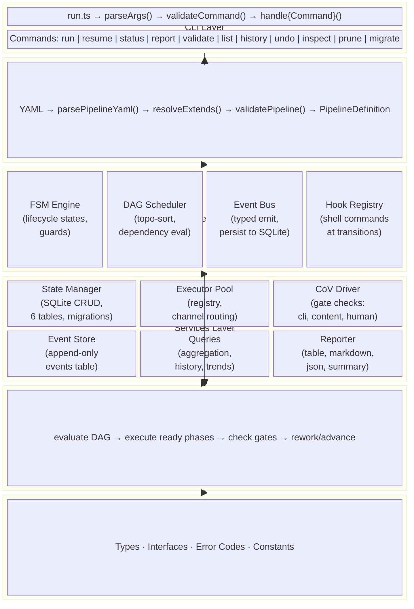

# Orchestration v2 — System Architecture

**Version:** 1.0.0
**Date:** 2026-04-02
**Authors:** Robin Min, Lord Robb
**Status:** Current
**Parent:** [Blueprint v1.1.0](./orchestrator-blueprint-v2.md)

---

## Table of Contents

1. [System Overview](#1-system-overview)
2. [Architecture Diagram](#2-architecture-diagram)
3. [Subsystem Catalog](#3-subsystem-catalog)
4. [Data Flow](#4-data-flow)
5. [State Management](#5-state-management)
6. [Module Dependency Graph](#6-module-dependency-graph)
7. [Key Design Decisions](#7-key-design-decisions)
8. [Executor Architecture](#8-executor-architecture)
9. [Verification Integration](#9-verification-integration)
10. [Error Handling Architecture](#10-error-handling-architecture)
11. [Coexistence with v1](#11-coexistence-with-v1)

---

## 1. System Overview

Orchestration-v2 is a CLI-first pipeline engine for AI agent workflows. It replaces the hardcoded sequential loop in `orchestration-dev` (v1) with an FSM-supervised DAG scheduler, swaps JSON state files for event-sourced SQLite, externalizes pipeline definitions into YAML, and introduces a comprehensive CLI (`orchestrator`).

### Seven Architectural Pillars

| # | Pillar | Description |
|---|--------|-------------|
| 1 | CLI-first | All operations driven by `orchestrator` CLI with typed flags and exit codes |
| 2 | SQLite State | Event-sourced SQLite replaces JSON files; WAL mode for concurrent reads |
| 3 | Async Executor Abstraction | `Executor` interface with pluggable backends (local, mock, future: ACP) |
| 4 | Pluggable CoV Driver | `VerificationDriver` adapter over verification-chain interpreter |
| 5 | Event-Sourced Observability | All subsystems emit events through a typed `EventBus` → SQLite |
| 6 | FSM Lifecycle Management | 5-state machine (IDLE → RUNNING → PAUSED/COMPLETED/FAILED) |
| 7 | DAG-Based Scheduling | Topological dependency resolution with parallel-ready dispatch |

### System at a Glance

| Metric | Value |
|--------|-------|
| Source files | 22 TypeScript modules |
| Entry point | `scripts/run.ts` (shebang: `#!/usr/bin/env bun`) |
| CLI commands | 11 (run, resume, status, report, validate, list, history, undo, inspect, prune, migrate) |
| FSM states | 5 |
| DAG phase states | 7 |
| SQLite tables | 6 (+ 1 version tracker) |
| Error codes | 20 across 4 categories |
| Event types | 14 |

---

## 2. Architecture Diagram



---

## 3. Subsystem Catalog

| Subsystem | Responsibility | Key Types | Key Files | Dependencies |
|-----------|---------------|-----------|-----------|-------------|
| **CLI Layer** | Command parsing, output formatting, user interaction | `ParsedCommand`, `RunOptions`, `ResumeOptions`, `StatusOptions`, etc. | `cli/commands.ts`, `cli/status.ts`, `cli/report.ts`, `run.ts` | All subsystems |
| **Pipeline Compiler** | Parse YAML, validate schema, resolve extends, produce DAG | `PipelineDefinition`, `ValidationResult`, `PhaseDefinition` | `config/schema.ts`, `config/parser.ts`, `config/resolver.ts` | `model.ts` |
| **FSM Engine** | Lifecycle state machine — 5 states, 10 transitions | `FSMState`, `FSMTransition`, `FSMTransitionResult` | `engine/fsm.ts` | `model.ts` |
| **DAG Scheduler** | Dependency resolution, topological sort, phase state tracking | `DAGNode`, `DAGEvaluation`, `DAGPhaseState` | `engine/dag.ts` | `model.ts` |
| **Hook Registry** | Shell command execution at FSM transition points | `HookAction`, `HookContext`, `PipelineHooks` | `engine/hooks.ts` | `model.ts`, `logger` |
| **Pipeline Runner** | Orchestrates FSM + DAG + executors + state into a running pipeline | `PipelineRunResult` | `engine/runner.ts` | All engine modules, state, executors, verification, observability |
| **State Manager** | SQLite schema, CRUD operations, migrations | `RunRecord`, `PhaseRecord`, `GateResult`, `RollbackSnapshot`, `ResourceUsageRecord` | `state/manager.ts`, `state/migrations.ts` | `bun:sqlite`, `model.ts` |
| **Event Store** | Append-only event persistence and querying | `OrchestratorEvent`, `EventType` | `state/events.ts` | `bun:sqlite`, `model.ts` |
| **Queries** | Aggregation queries for status, history, trends | `RunSummary`, `HistoryEntry`, `TrendReport`, `PresetStats` | `state/queries.ts` | `bun:sqlite`, `model.ts` |
| **Executor Pool** | Executor registry, channel-based routing | `Executor`, `ExecutionRequest`, `ExecutionResult` | `executors/pool.ts`, `executors/local.ts`, `executors/mock.ts` | `model.ts` |
| **ACP Query Adapter** | Dual-backend LLM query library (acpx/agy) | `AcpxQueryOptions`, `AcpxQueryResult`, `Backend` | `scripts/libs/acpx-query.ts` | `spawnSync` |
| **CoV Driver** | Gate verification via CLI commands and content matching | `ChainManifest`, `ChainState`, `GateResult` | `verification/cov-driver.ts` | `model.ts`, `logger` |
| **Event Bus** | Typed pub/sub — all subsystems emit, consumers subscribe | `EventType`, `EventHandler` | `observability/event-bus.ts` | `model.ts` |
| **Reporter** | Pipeline report generation in 4 formats | `ReportFormat`, `RunSummary` | `observability/reporter.ts`, `observability/metrics.ts` | `model.ts`, `queries.ts` |
| **Pruner** | Event compaction — age-based and keep-last strategies | `PruneOptions`, `PruneCounts`, `ParsedDuration` | `state/prune.ts` | `bun:sqlite` |
| **Migration** | v1 JSON state → v2 SQLite conversion | `MigrationResult`, `V1State` | `state/migrate-v1.ts` | `bun:sqlite`, `logger` |

---

## 4. Data Flow

### 4.1 Run Command Flow

```
User runs: orchestrator run 0266 --preset complex
    │
    ▼
parseArgs() → ParsedCommand { command: "run", options: { taskRef: "0266", preset: "complex" } }
    │
    ▼
validateCommand() → null (valid)
    │
    ▼
resolvePipelineFile() → .rd3/pipeline.yaml OR references/examples/complex.yaml
    │
    ▼
loadValidatedPipeline()
    ├── parsePipelineYaml() → PipelineDefinition
    ├── resolveExtends() → merged PipelineDefinition
    └── validatePipeline() → ValidationResult
    │
    ▼
PipelineRunner.run()
    ├── Initialize DAG from pipeline phases
    ├── Load hooks from pipeline definition
    ├── Create run record in SQLite
    ├── FSM: IDLE → RUNNING
    └── executeRunLoop() ←────────────────────────────┐
         │                                              │
         ├── DAG evaluate() → ready phases              │
         │   │                                          │
         │   ▼                                          │
         ├── For each ready phase:                      │
         │   ├── Capture git snapshot                   │
         │   ├── FSM: mark running                      │
         │   ├── ExecutorPool.execute() → result        │
         │   ├── If success: check gate                 │
         │   │   ├── Gate pass → mark completed ────────┘
         │   │   ├── Gate fail + rework → re-execute
         │   │   └── Human gate → FSM: PAUSED, return
         │   └── If fail: rework or fail pipeline
         │
         └── All phases done → FSM: COMPLETED, return
```

### 4.2 Event Flow

```
Executor Pool ─── executor.invoked ──────┐
              ─── executor.completed ────┤
                                         │
DAG Scheduler ── phase.started ──────────┤
              ── phase.completed ────────┤
              ── phase.failed ───────────┤
              ── phase.rework ───────────┤  Event Bus  ──→  EventStore (SQLite)
              ── phase.undo ─────────────┤     │
                                         │     ├──→ CLI (status updates)
FSM Engine ───── run.created ────────────┤     └──→ Reporter (aggregation)
              ── run.started ────────────┤
              ── run.paused ─────────────┤
              ── run.resumed ────────────┤
              ── run.completed ──────────┤
              ── run.failed ─────────────┘

CoV Driver ───── gate.evaluated ─────────┘
```

All events are synchronous-in-process. The EventBus emits to typed and global handlers. The EventStore subscribes globally and persists to the `events` table asynchronously (fire-and-forget with error logging).

---

## 5. State Management

### 5.1 Storage Configuration

| Setting | Value | Rationale |
|---------|-------|-----------|
| Database path | `docs/.workflow-runs/state.db` | Project-local, git-ignored |
| Driver | `bun:sqlite` | Zero-dependency, built into Bun |
| Journal mode | WAL | Concurrent reads during execution |
| Busy timeout | 5000ms | Wait for locks instead of failing |
| Schema versioning | `schema_version` table | Checked on every `init()` |

### 5.2 Schema (v1)

```sql
-- Version tracking
CREATE TABLE schema_version (
    version INTEGER PRIMARY KEY,
    applied_at DATETIME DEFAULT CURRENT_TIMESTAMP
);

-- Append-only event log
CREATE TABLE events (
    sequence INTEGER PRIMARY KEY AUTOINCREMENT,
    run_id TEXT NOT NULL,
    event_type TEXT NOT NULL,
    payload JSON NOT NULL,
    timestamp DATETIME DEFAULT CURRENT_TIMESTAMP
);

-- Pipeline run records
CREATE TABLE runs (
    id TEXT PRIMARY KEY,
    task_ref TEXT NOT NULL,
    preset TEXT,
    phases_requested TEXT NOT NULL,
    status TEXT NOT NULL CHECK (status IN ('pending','running','paused','completed','failed')),
    config_snapshot JSON NOT NULL,
    pipeline_name TEXT NOT NULL,
    created_at DATETIME DEFAULT CURRENT_TIMESTAMP,
    updated_at DATETIME DEFAULT CURRENT_TIMESTAMP
);

-- Phase execution records
CREATE TABLE phases (
    run_id TEXT NOT NULL,
    name TEXT NOT NULL,
    status TEXT NOT NULL CHECK (status IN ('pending','ready','running','completed','failed','paused','skipped')),
    skill TEXT NOT NULL,
    payload JSON,
    started_at DATETIME,
    completed_at DATETIME,
    error_code TEXT,
    error_message TEXT,
    rework_iteration INTEGER DEFAULT 0,
    PRIMARY KEY (run_id, name),
    FOREIGN KEY (run_id) REFERENCES runs(id)
);

-- Gate verification results
CREATE TABLE gate_results (
    run_id TEXT NOT NULL,
    phase_name TEXT NOT NULL,
    step_name TEXT NOT NULL,
    checker_method TEXT NOT NULL,
    passed INTEGER NOT NULL,
    evidence JSON,
    duration_ms INTEGER,
    created_at DATETIME DEFAULT CURRENT_TIMESTAMP,
    PRIMARY KEY (run_id, phase_name, step_name),
    FOREIGN KEY (run_id) REFERENCES runs(id)
);

-- Git-based rollback snapshots
CREATE TABLE rollback_snapshots (
    run_id TEXT NOT NULL,
    phase_name TEXT NOT NULL,
    git_head TEXT,
    files_before JSON,
    files_after JSON,
    created_at DATETIME DEFAULT CURRENT_TIMESTAMP,
    PRIMARY KEY (run_id, phase_name),
    FOREIGN KEY (run_id) REFERENCES runs(id)
);

-- Resource usage metrics
CREATE TABLE resource_usage (
    id INTEGER PRIMARY KEY AUTOINCREMENT,
    run_id TEXT NOT NULL,
    phase_name TEXT NOT NULL,
    model_id TEXT NOT NULL,
    model_provider TEXT NOT NULL,
    input_tokens INTEGER DEFAULT 0,
    output_tokens INTEGER DEFAULT 0,
    cache_read_tokens INTEGER DEFAULT 0,
    cache_creation_tokens INTEGER DEFAULT 0,
    wall_clock_ms INTEGER NOT NULL,
    execution_ms INTEGER NOT NULL,
    first_token_ms INTEGER,
    recorded_at DATETIME DEFAULT CURRENT_TIMESTAMP,
    FOREIGN KEY (run_id) REFERENCES runs(id)
);

-- Indexes
CREATE INDEX idx_events_run ON events(run_id);
CREATE INDEX idx_events_type ON events(event_type);
CREATE INDEX idx_runs_task ON runs(task_ref);
CREATE INDEX idx_runs_status ON runs(status);
CREATE INDEX idx_phases_status ON phases(status);
CREATE INDEX idx_resource_usage_run ON resource_usage(run_id);
CREATE INDEX idx_resource_usage_model ON resource_usage(model_id);
CREATE INDEX idx_resource_usage_phase ON resource_usage(phase_name);
```

### 5.3 Event Sourcing Pattern

The `EventStore` subscribes to the `EventBus` globally. Every event emitted by any subsystem is persisted to the `events` table with auto-incrementing sequence, run_id, event_type, JSON payload, and timestamp. This provides a complete audit trail for any run.

Events are written asynchronously — the `EventBus.emit()` call fires the handler synchronously, but the `EventStore.append()` is non-blocking (errors are logged, not thrown).

### 5.4 Migration Strategy

Schema versioning uses a `schema_version` table. On `StateManager.init()`, the current version is compared against `CURRENT_SCHEMA_VERSION`. If outdated, the full DDL is re-applied (all statements use `IF NOT EXISTS`, making them idempotent).

---

## 6. Module Dependency Graph

### 6.1 Import Graph

```
run.ts
├── cli/commands.ts          (parseArgs, validateCommand)
├── cli/status.ts            (formatStatusOutput, formatStatusJson, ...)
├── cli/report.ts            (outputReport)
├── engine/runner.ts         (PipelineRunner)
│   ├── engine/fsm.ts        (FSMEngine)
│   ├── engine/dag.ts        (DAGScheduler, validatePhaseSubset)
│   ├── engine/hooks.ts      (HookRegistry)
│   ├── executors/pool.ts    (ExecutorPool)
│   │   └── executors/local.ts (LocalBunExecutor)
│   ├── state/manager.ts     (StateManager)
│   ├── state/events.ts      (EventStore)
│   ├── verification/cov-driver.ts (DefaultCoVDriver)
│   └── observability/event-bus.ts (EventBus)
├── config/parser.ts         (parsePipelineYaml, validatePipeline)
│   ├── config/schema.ts     (validateSchema)
│   └── config/resolver.ts   (resolveExtends)
│       └── config/parser.ts (parseYamlString — shared YAML parser)
├── state/manager.ts         (StateManager)
├── state/queries.ts         (Queries)
├── observability/reporter.ts (Reporter)
├── state/migrate-v1.ts      (migrateFromV1)
├── state/prune.ts           (Pruner)
└── model.ts                 (all types, error codes)
```

### 6.2 Build Order

```
1. model.ts                    (zero dependencies)
2. observability/event-bus.ts  (model.ts)
3. config/schema.ts            (model.ts)
4. config/parser.ts            (model.ts, config/schema.ts)
5. config/resolver.ts          (model.ts, config/parser.ts)
6. state/migrations.ts         (bun:sqlite)
7. state/manager.ts            (model.ts, state/migrations.ts, bun:sqlite)
8. state/events.ts             (model.ts, bun:sqlite)
9. state/queries.ts            (model.ts, bun:sqlite)
10. executors/local.ts         (model.ts, logger)
11. executors/mock.ts          (model.ts)
12. executors/pool.ts          (model.ts, executors/local.ts)
13. engine/fsm.ts              (model.ts)
14. engine/dag.ts              (model.ts)
15. engine/hooks.ts            (model.ts, logger)
16. verification/cov-driver.ts (model.ts, logger)
17. observability/metrics.ts   (model.ts)
18. observability/reporter.ts  (model.ts, state/queries.ts, observability/metrics.ts)
19. engine/runner.ts           (all above)
20. cli/status.ts              (state/queries.ts, observability/metrics.ts)
21. cli/report.ts              (model.ts, state/queries.ts, observability/reporter.ts, logger)
22. cli/commands.ts            (standalone)
23. state/migrate-v1.ts        (bun:sqlite, logger)
24. state/prune.ts             (bun:sqlite)
25. run.ts                     (all above)
```

---

## 7. Key Design Decisions

### 7.1 FSM + DAG Split

| Concern | Owner | Analogy |
|---------|-------|---------|
| Is the pipeline alive, paused, done, or dead? | FSM (5 states) | Kitchen open/closed |
| Given what's finished, what runs next? | DAG (per-phase states) | Ticket board |

**Why not pure FSM?** With N phases each in 5 states, the combinatorial state space is O(5^N). The FSM+DAG split keeps the FSM at exactly 5 states regardless of pipeline complexity. Adding a parallel phase adds one `after:` edge to the DAG — zero FSM changes.

### 7.2 SQLite over JSON

| Aspect | v1 (JSON) | v2 (SQLite) |
|--------|-----------|-------------|
| Concurrent access | File locking, corruption risk | WAL mode, safe concurrent reads |
| Queries | Read entire file, parse, filter | SQL aggregation, indexes |
| Event history | Not tracked | Append-only events table |
| Migration | Manual file editing | Schema versioning |
| Trend analysis | Not possible | SQL aggregation queries |

### 7.3 YAML Pipeline Configuration

Pipelines are defined in YAML (not code) for three reasons:
1. **Per-project customization** — Each project can have its own `.rd3/pipeline.yaml`
2. **Extends/inheritance** — Base pipeline extended per-project without duplication
3. **Version control** — YAML diffs are human-readable

The YAML parser is custom-built (not a library) to minimize dependencies and handle only the subset needed for pipeline definitions.

### 7.4 CLI-First Design

Every operation is exposed through the `orchestrator` CLI. This ensures:
1. **Scriptability** — All operations work in CI/CD pipelines
2. **Testability** — Commands can be tested via process spawning
3. **Discoverability** — `--help` provides complete documentation
4. **No agent coupling** — Any AI agent or human can drive the engine

---

## 8. Executor Architecture

### 8.1 Executor Interface

```typescript
interface Executor {
    readonly id: string;
    readonly capabilities: ExecutorCapabilities;
    execute(req: ExecutionRequest): Promise<ExecutionResult>;
    healthCheck(): Promise<ExecutorHealth>;
    dispose(): Promise<void>;
}
```

### 8.2 Implementations

| Executor | Status | Use Case | `parallel` | `maxConcurrency` | `structuredOutput` |
|----------|--------|----------|:----------:|:-----------------:|:-------------------:|
| `LocalBunExecutor` | **Implemented** | Default — runs skill scripts via `Bun.spawn` | No | 1 | Via JSON extraction |
| `MockExecutor` | **Implemented** | Testing — returns scripted responses | Yes | Unlimited | Yes |
| `AcpExecutor` | **Implemented** | Cross-channel via `acpx` or `agy` CLI (dual-backend) | Yes | Configurable | Via `--format json` (acpx) or plain text (agy) |

### 8.3 LocalBunExecutor Details

- **Execution**: `Bun.spawn(['bun', 'run', skill, '--payload', JSON.stringify(payload)])`
- **Timeout**: `AbortController` with configurable timeout (default 30 minutes)
- **Metrics extraction**: Parses `<!-- metrics:{JSON} -->` blocks from stdout
- **Structured output**: Extracts JSON from markdown code fences in stdout
- **Output caps**: stdout limited to 50KB, stderr to 10KB
- **Environment**: Sets `ORCH_PHASE`, `ORCH_CHANNEL`, `ORCH_TASK_REF` in child process

### 8.4 ExecutorPool Pattern

The pool registers executors by their channel strings. Route resolution:
- `auto` → configured default executor (`current` is a deprecated alias)
- `mock` → `MockExecutor`
- Custom channels → matched by executor `capabilities.channels`

The pool is initialized with `LocalBunExecutor` as default. Additional executors are registered via `pool.register()`.

### 8.5 ACP Dual-Backend Adapter (acpx-query.ts)

The `acpx-query.ts` library provides a unified interface for LLM queries across the codebase with dual-backend support:

```
┌─────────────────────────────────────────────────────────────┐
│                    acpx-query.ts                             │
│  ┌─────────────────────────────────────────────────────┐   │
│  │       Backend Selector (BACKEND env var)              │   │
│  └─────────────────────────────────────────────────────┘   │
│           │                           │                     │
│           ▼                           ▼                     │
│  ┌─────────────────┐       ┌─────────────────────┐        │
│  │   acpx Adapter   │       │   agy Adapter       │        │
│  │  (default)      │       │  (Antigravity)      │        │
│  └─────────────────┘       └─────────────────────┘        │
└─────────────────────────────────────────────────────────────┘
```

| Feature | acpx Backend | agy Backend |
|---------|-------------|-------------|
| **Default** | Yes | No |
| **Slash commands** | ✅ Full support | ❌ Returns "not supported" |
| **Structured output** | ✅ JSON events | ❌ Plain text only |
| **Metrics extraction** | ✅ Token/usage events | ❌ Not available |
| **Environment** | `BACKEND=acpx` | `BACKEND=antigravity` or `BACKEND=agy` |

**Backend Selection:**
- `BACKEND=acpx` (default): Uses acpx CLI for full feature support
- `BACKEND=antigravity` or `BACKEND=agy`: Uses agy CLI (VSCode Antigravity extension)

**Usage:**
```typescript
import { queryLlm, runSlashCommand, checkHealth } from 'acpx-query';

// Automatic backend selection via BACKEND env var
const result = queryLlm('Analyze this code');

// Health check for current backend
const health = checkHealth();
```

**Key exports:**
- `queryLlm(prompt, options)` — LLM query with prompt string
- `queryLlmFromFile(filePath, options)` — LLM query reading prompt from file
- `runSlashCommand(slashCmd, options)` — Execute slash command (acpx only)
- `checkHealth()` — Health check for current backend
- `checkAllBackendsHealth()` — Health check for both acpx and agy

---

## 9. Verification Integration

### 9.1 VerificationDriver Interface

```typescript
interface VerificationDriver {
    runChain(manifest: ChainManifest): Promise<ChainState>;
    resumeChain(stateDir: string, action?: 'approve' | 'reject'): Promise<ChainState>;
}
```

### 9.2 DefaultCoVDriver

The `DefaultCoVDriver` implements `VerificationDriver` with three check methods:

| Method | Description | Pass Criteria |
|--------|-------------|---------------|
| `cli` | Execute shell command | Exit code 0 |
| `content_match` | Regex match file content | Pattern found in file |
| `human` | Placeholder for human review | Always returns `passed=false` (triggers pause) |

### 9.3 Gate Flow

```
Phase execution succeeds
    │
    ▼
checkGate(runId, phaseName, gateConfig)
    │
    ├── gate.type === 'auto' → CoV driver runs automated checks
    │   ├── All checks pass → ChainState.status === 'pass'
    │   └── Any check fails → ChainState.status === 'fail' → rework or fail
    │
    └── gate.type === 'human' → ChainState.status === 'pending'
        └── FSM transitions to PAUSED, awaits resume --approve/--reject
```

---

## 10. Error Handling Architecture

### 10.1 OrchestratorError Class

```typescript
class OrchestratorError extends Error {
    readonly code: ErrorCode;       // 20 specific codes
    readonly category: ErrorCategory; // config | state | execution | verification
    readonly exitCode: number;      // Maps to process exit code
}
```

### 10.2 Error Code Catalog

| Code | Category | Exit Code | Recovery |
|------|----------|:---------:|----------|
| `PIPELINE_NOT_FOUND` | config | 11 | Create pipeline.yaml or specify `--pipeline` |
| `TASK_NOT_FOUND` | config | 12 | Check task reference |
| `PRESET_NOT_FOUND` | config | 10 | Check preset name |
| `PHASE_NOT_FOUND` | config | 10 | Check phase name |
| `PIPELINE_VALIDATION_FAILED` | config | 11 | Fix YAML errors, run `validate` |
| `DAG_CYCLE_DETECTED` | config | 11 | Remove circular `after:` dependencies |
| `EXTENDS_CIRCULAR` | config | 11 | Fix extends chain |
| `EXTENDS_DEPTH_EXCEEDED` | config | 11 | Max 2 levels |
| `STATE_CORRUPT` | state | 13 | Delete `.rdinstate/orchestrator.db` and re-run |
| `STATE_LOCKED` | state | 13 | Wait for lock release |
| `STATE_MIGRATION_NEEDED` | state | 13 | Run `migrate` |
| `EXECUTOR_UNAVAILABLE` | execution | 20 | Check channel config |
| `EXECUTOR_TIMEOUT` | execution | 1 | Increase timeout |
| `EXECUTOR_FAILED` | execution | 1 | Check `inspect` output |
| `CHANNEL_UNAVAILABLE` | execution | 20 | Verify channel name |
| `CONTRACT_VIOLATION` | execution | 1 | Fix worker output |
| `GATE_FAILED` | verification | 1 | Inspect evidence |
| `GATE_PENDING` | verification | 2 | `resume --approve` |
| `REWORK_EXHAUSTED` | verification | 1 | Max iterations reached |
| `UNDO_UNCOMMITTED_CHANGES` | state | 1 | Use `--force` |

### 10.3 Error Propagation

```
Executor throws → runner catches → OrchestratorError(code, message)
    → Runner logs error
    → Runner emits run.failed event
    → Runner updates SQLite run status to FAILED
    → Runner returns PipelineRunResult { status: FAILED }
    → run.ts calls process.exit(exitCode)
```

---

## 11. Coexistence with v1

### 11.1 Coexistence Strategy

```
plugins/rd3/skills/orchestration-dev/     # v1 — frozen (Track 1 fixes only)
plugins/rd3/skills/orchestration-v2/      # v2 — active development
```

- `orchestrator` CLI always points to v2
- v1 continues through existing agent/command wrappers
- No shared state — v1 uses JSON, v2 uses SQLite
- State migration via `orchestrator migrate --from-v1`

### 11.2 Migration Path

1. `orchestrator migrate --from-v1` — converts JSON state to SQLite
2. Phase number mapping: 1→intake, 2→arch, 3→design, 4→decompose, 5→implement, 6→test, 7→review, 8→verify-bdd, 9→docs
3. Evidence migrated as events with `v1.migrated.{kind}` type
4. Migration is transactional per file — partial failures are isolated

### 11.3 Validation Criteria

- All existing tests pass with v2 engine
- A/B comparison: same task, both engines, identical outcomes
- Performance: v2 within 10% of v1 for sequential execution
- Feature parity: every v1 feature has a v2 equivalent

---

## Appendix A: Public API per Module

| Module | Key Exports |
|--------|-------------|
| `model.ts` | `FSMState`, `DAGPhaseState`, `PipelineDefinition`, `PhaseDefinition`, `GateConfig`, `Executor`, `ExecutionRequest`, `ExecutionResult`, `ResourceMetrics`, `OrchestratorEvent`, `RunRecord`, `PhaseRecord`, `GateResult`, `ErrorCode`, `OrchestratorError`, exit code constants |
| `config/parser.ts` | `parsePipelineYaml(path)`, `validatePipeline(def)`, `parseYamlString(content)` |
| `config/resolver.ts` | `resolveExtends(def, basePath)` |
| `config/schema.ts` | `validateSchema(raw)`, `getPipelineJsonSchema()` |
| `engine/fsm.ts` | `FSMEngine` — `transition()`, `getState()`, `onTransition()`, `reset()` |
| `engine/dag.ts` | `DAGScheduler` — `buildFromPhases()`, `evaluate()`, `markCompleted/Failed/Paused/Running()`, `hasCycle()`, `topologicalSort()`; `validatePhaseSubset()` |
| `engine/hooks.ts` | `HookRegistry` — `loadFromPipeline()`, `register()`, `execute()`, `getHookCount()`, `clear()` |
| `engine/runner.ts` | `PipelineRunner` — `run()`, `resume()`, `undo()`, `getStatus()` |
| `state/manager.ts` | `StateManager` — `init()`, `createRun()`, `getRun()`, `getRunByTaskRef()`, `updateRunStatus()`, `createPhase()`, `updatePhaseStatus()`, `getPhases()`, `saveGateResult()`, `saveRollbackSnapshot()`, `saveResourceUsage()`, `getDb()` |
| `state/events.ts` | `EventStore` — `append()`, `query()`, `getEventsForRun()`, `prune()` |
| `state/queries.ts` | `Queries` — `getRunSummary()`, `getHistory()`, `getPresetStats()`, `getTokenUsageByModel()`, `getAveragePhaseDuration()`, `getTrends()` |
| `executors/pool.ts` | `ExecutorPool` — `register()`, `resolve()`, `execute()`, `healthCheckAll()`, `disposeAll()` |
| `executors/local.ts` | `LocalBunExecutor` — implements `Executor` |
| `executors/mock.ts` | `MockExecutor` — implements `Executor`, `addResponse()`, `getCallLog()`, `reset()` |
| `scripts/libs/acpx-query.ts` | `queryLlm()`, `queryLlmFromFile()`, `runSlashCommand()`, `checkHealth()`, `checkAllBackendsHealth()`, `getBackend()`, `ALLOWED_TOOLS` |
| `observability/event-bus.ts` | `EventBus` — `emit()`, `subscribe()`, `subscribeAll()`, `unsubscribe()`, `clear()` |
| `observability/reporter.ts` | `Reporter` — `format()`, `formatStatusTable()`, `formatMarkdownReport()`, `formatJsonReport()`, `formatSummary()`, `formatTrendReport()` |
| `observability/metrics.ts` | `aggregateMetrics()`, `metricsToRecord()`, `formatTokenCount()`, `formatDuration()` |
| `verification/cov-driver.ts` | `DefaultCoVDriver` — implements `VerificationDriver` |
| `state/prune.ts` | `Pruner` — `prune()`, `parseDuration()` |
| `state/migrate-v1.ts` | `migrateFromV1(db, v1Dir)` |

---

*End of Architecture Document. v1.0.0 — Generated by Lord Robb — 2026-04-02.*
