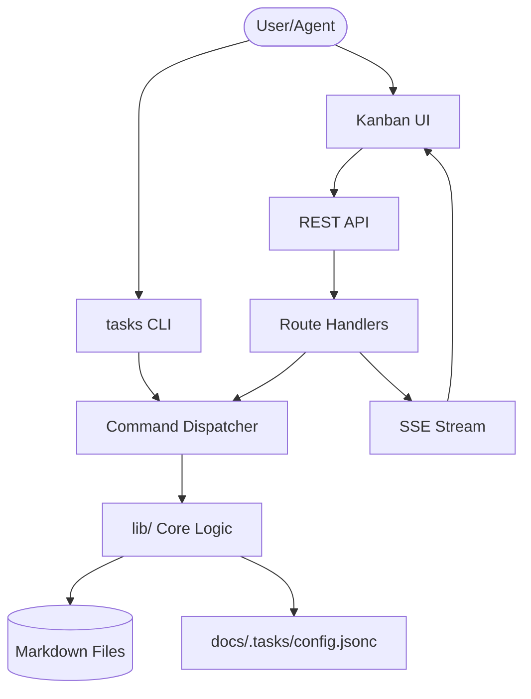
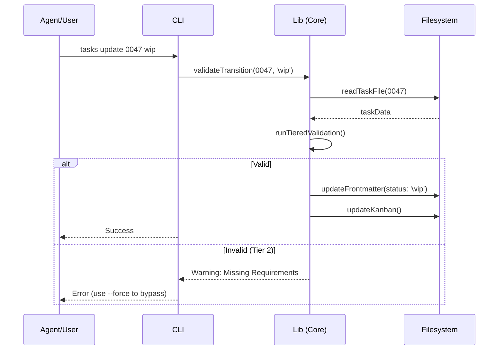

# Tasks Architecture V2 Specification

**Version:** 2.2
**Status:** Canonical
**Date:** 2026-04-14

---

## 1. System Overview

The `rd3:tasks` system is a high-performance, markdown-centric task management engine designed for AI-native coding workflows. It serves as the primary state repository for the `rd3` orchestration pipeline, providing a bridge between high-level requirements and low-level implementation artifacts.

### 1.1 Architectural Pillars

1.  **Markdown-as-Storage**: Task records are stored as plain-text Markdown files with YAML frontmatter, ensuring human-readability, version-control compatibility, and easy integration with LLM context windows.
2.  **CLI-First Interface**: A robust CLI (`tasks`) provides the primary interaction layer, enforcing WBS numbering and structural integrity.
3.  **WBS Scoping**: Globally unique Work Breakdown Structure (WBS) numbers across multiple folders ensure clear task identification and referencing.
4.  **Tiered Validation**: A three-tier validation system (Structural, Content, Consistency) prevents "lazy" status transitions and ensures high-quality task descriptions.
5.  **Dual-Mode Configuration**: Supports both zero-config "legacy" mode for quick prototypes and "config" mode for professional multi-folder project management.
6.  **Tool-Integrated Server**: A background server providing REST APIs and SSE (Server-Sent Events) for real-time task monitoring and multi-agent coordination.
7.  **Web UI Coexistence**: An embedded React-based Kanban UI served directly from the tasks server for visual management and interactive refinement.

### 1.2 System at a Glance



---

## 2. Component Hierarchy

The system follows a layered architecture where logic is centralized in the `lib` and `commands` layers, while the CLI and Server act as thin entry-point wrappers.

### 2.1 Entry Points

| Component | Responsibility | Key Files |
|-----------|----------------|-----------|
| **tasks CLI** | Command-line parsing, global flag handling, and console output. | `tasks.ts` |
| **Tasks Server** | HTTP interface, authentication-less local API, and SSE event streaming. | `server/router.ts` |
| **Kanban UI** | Single Page Application (SPA) for visual task management. | `server/ui/` |

### 2.2 Subsystems

| Subsystem | Responsibility | Implementation |
|-----------|----------------|----------------|
| **Command Implementation** | Individual command logic for `create`, `update`, `list`, etc. | `commands/*.ts` |
| **WBS Manager** | Global WBS counter management and task resolution by ID. | `lib/wbs.ts` |
| **Task File Core** | Markdown parsing, YAML frontmatter manipulation, and section-based updates. | `lib/taskFile.ts` |
| **Integrity Guard** | PreToolUse hook integration to prevent direct unauthorized file writes. | `commands/writeGuard.ts` |
| **Kanban Engine** | Aggregation logic for generating the `kanban.md` board. | `lib/kanban.ts` |

---

## 3. Data Flow

### 3.1 Task Lifecycle Transition



### 3.2 Server-Sent Events (SSE) Flow

The server maintains a singleton `SSE` manager that broadcasts all mutations to connected UI clients.

1.  **Mutation**: A CLI command or API call modifies a task.
2.  **Event Generation**: The logic layer emits a `MutationEvent` (type: `task_updated`, `task_created`, etc.).
3.  **Broadcast**: The SSE manager pushes the JSON payload to all active `GET /events` subscribers.
4.  **UI Refresh**: The Kanban UI receives the event and performs a targeted state update without a full page reload.

---

## 4. State Management

### 4.1 Storage Schema

#### Markdown Files (Source of Truth)
Located in `docs/tasks/` (configurable).
- **Format**: `.md`
- **Metadata**: YAML Frontmatter (name, status, created_at, updated_at).
- **Progress**: `impl_progress` block (planning, design, implementation, review, testing).

#### Configuration (`docs/.tasks/config.jsonc`)
Manages multi-folder environments.
```jsonc
{
  "active_folder": "docs/tasks",
  "folders": {
    "docs/tasks": { "base_counter": 100, "label": "Feature Team A" },
    "docs/prompts": { "base_counter": 500, "label": "Legacy Prompts" }
  }
}
```

### 4.2 WBS Numbering Protocol

1.  **Normalization**: All IDs are zero-padded string keys (e.g., `0047`).
2.  **Uniqueness**: `getNextWbs()` scans all configured folders to find `max(WBS) + 1`.
3.  **Resolution**: `findTaskByWbs()` iterates over folders in configured order to locate the physical file path.

---

## 5. Security & Integrity

### 5.1 Write Guard Implementation

To prevent agents from bypassing the `tasks` CLI (which would skip WBS numbering and validation), a `write-guard` is integrated into the platform's `PreToolUse` hook.

- **Trigger**: `Write` tool calls targeting paths matching configured task folders.
- **Enforcement**:
    - `tasks update` -> **Allowed** (uses `tasks` CLI internally).
    - `tasks put` -> **Allowed** (manages artifacts).
    - Direct `Write(docs/tasks/0047_name.md)` -> **Blocked**.

### 5.2 Server-Side Write Locking

Mutating REST requests (`POST`, `PATCH`, `DELETE`) are serialized per-WBS using a memory-based lock queue (`server/writeLock.ts`). This prevents concurrent modification corruption when multiple agents are updating the same task record.

---

## 6. Key Design Decisions

### 6.1 No Database (File-System First)
**Rationale**: By using Markdown files, we inherit git-based history, branching, and auditability for free. It also makes the system "agent-native" as LLMs can easily read and reason about the files without a specialized adapter.

### 6.2 Tiered Validation
**Rationale**: Traditional task managers are too permissive. `rd3:tasks` enforces "content-driven status". You cannot mark a task as `Done` if the `Solution` section is empty, ensuring that documentation is a byproduct of implementation, not an afterthought.

### 6.3 Dual-Mode Configuration
**Rationale**: Lowering the barrier to entry with legacy mode allows ad-hoc usage, while config mode supports professional enterprise-grade multi-agent environments.

### 6.4 Unified main agent model (UMAM)
**Rationale**: The `tasks` skill is designed to be platform-agnostic. While it defaults to Claude Code patterns, it supports all UMAM-compliant platforms (Codex, Antigravity, etc.) through JSON output and standardized CLI flags.

---

## 7. Error Handling Architecture

### 7.1 Tiered Validation Logic

| Tier | Type | Blocks Transition | Rationale |
|------|------|:----------------:|-----------|
| **Tier 1** | Structural | **YES** | Missing status or invalid YAML corrupts the record. |
| **Tier 2** | Content | **WIP/Testing/Done** | Prevents "empty" tasks from advancing without context. |
| **Tier 3** | Quality | **NO** | Suggestions (e.g., missing References) to improve quality. |

### 7.2 CLI Error Handling
- **Exit Code 1**: General failures or validation errors (when not using `--force`).
- **Exit Code 2**: Reserved for write-guard blocks.
- **JSON Error Envelope**:
  ```json
  {
    "ok": false,
    "error": "Short descriptive message"
  }
  ```

---

## 8. Appendix A: Public API per Module

| Module | Key Exports |
|--------|-------------|
| `lib/config.ts` | `getProjectRoot()`, `loadConfig()`, `saveConfig()`, `resolveActiveFolder()`, `getStaticDir()`, `getUiDir()`, `getMetaDir()` |
| `lib/taskFile.ts` | `readTaskFile()`, `parseFrontmatter()`, `parseSection()`, `updateStatus()`, `updateSection()`, `updateTaskBody()`, `updateImplPhase()`, `updateFrontmatterField()`, `updatePresetFrontmatterField()`, `appendArtifactRow()`, `validateTaskForTransition()` |
| `lib/wbs.ts` | `getNextWbs()`, `formatWbs()`, `findTaskByWbs()` |
| `lib/kanban.ts` | `refreshKanban()`, `renderKanban()`, `buildKanbanFromFolder()` |
| `lib/template.ts` | `renderTemplate()`, `loadTemplate()`, `substituteTemplateVars()`, `getTemplateVars()`, `stripInputTips()` |
| `server/router.ts` | `createRequestHandler()` |
| `server/routeHandlers.ts` | `purgeTempDir()` |
| `server/sse.ts` | `EventBroadcaster` — `broadcast()`, `createStream()`, `closeAll()`, `clientCount` |
| `server/writeLock.ts` | `acquire()` |

---

*End of Architecture Document. v2.2.0 — Generated by Antigravity — 2026-04-14.*
