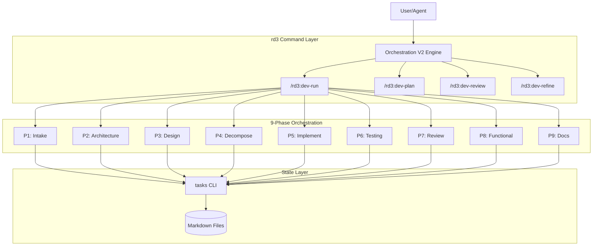

# Tasks Functional Specification Document (FSD) V2

**Version:** 2.3 (rd3)
**Status:** Canonical
**Date:** 2026-04-07

---

## 1. Overview

The `rd3:tasks` system is the foundational state management layer for the `rd3` orchestration ecosystem. It provides the "Single Source of Truth" for all development activities, leveraging a markdown-centric storage model that is both human-readable and agent-optimized. 

In the `rd3` architecture, functional workflows (planning, implementation, review) are decoupled from storage primitives, allowing a sophisticated 9-phase orchestration pipeline to drive complex development cycles while maintaining a simple, robust task registry.

### 1.1 Design Principles

| Principle | Description |
|-----------|-------------|
| **Markdown-as-Storage** | Task records are plain Markdown files with YAML frontmatter, ensuring git-compatibility and LLM readability. |
| **Orchestration-Decoupled** | The `tasks` skill handles storage and validation; the `orchestrator` handles workflow and delegation. |
| **Tiered Validation** | Content-driven status enforcement (e.g., cannot mark `Done` without a `Solution` description). |
| **WBS Uniqueness** | Globally unique Work Breakdown Structure (WBS) numbers across multi-folder environments. |
| **Agent-Friendly CLI** | Structured stdout, JSON output modes, and non-interactive defaults for seamless agent integration. |

### 1.2 Component Hierarchy (rd3)



---

## 2. Command Specifications

The `rd3` environment uses specialized commands that wrap the orchestration engine for specific lifestyle phases.

### 2.1 Orchestration Command Family

| Command | Purpose | Default Phases |
|---------|---------|----------------|
| `/rd3:dev-run` | Full task execution | Variable (per profile) |
| `/rd3:dev-plan` | Requirements to decomposition | 1, 2, 3, 4 |
| `/rd3:dev-refine`| Intensive requirements elicitation | 1 (refine mode) |
| `/rd3:dev-review`| Targeted code review | 7 |
| `/rd3:dev-unit`  | Targeted unit testing | 6 |
| `/rd3:dev-docs`  | Documentation refresh | 9 |

### 2.2 Storage Command Family (`tasks` CLI)

These commands provide low-level access to the task registry and are primarily used by agents during pipeline execution.

| Command | Description | Key Flag |
|---------|-------------|----------|
| `tasks create` | Create a new task file with WBS | `--from-json` |
| `tasks update` | Update status, phases, or sections | `--phase`, `--section` |
| `tasks list`   | List tasks with filtering | `--json` |
| `tasks open`   | Output full task content | (raw output) |
| `tasks check`  | Run tiered validation | `--force` |
| `tasks refresh`| Regenerate `kanban.md` | (global) |

---

## 3. The 9-Phase Pipeline

All development work in `rd3` follows a standardized 9-phase lifecycle, managed by the `rd3:orchestration-dev` skill.

| Phase | Name | Primary Skill | Gate Requirement |
|-------|------|---------------|------------------|
| **1** | Request Intake | `rd3:request-intake` | Valid Requirements/Background |
| **2** | Architecture | `rd3:backend-architect` | HLD Document produced |
| **3** | Design | `rd3:frontend-design` | Detailed design specs |
| **4** | Decomposition | `rd3:task-decomposition`| WBS subtasks created |
| **5** | Implementation | `rd3:super-coder` | Artifacts produced, lint pass |
| **6** | Unit Testing | `rd3:super-tester` | Coverage target met (>90%) |
| **7** | Code Review | `rd3:super-reviewer` | No "High" priority issues |
| **8** | functional | `rd3:bdd-workflow` | Traceability matrix match |
| **9** | Documentation | `rd3:code-docs` | Specification docs refreshed |

---

## 4. Task File Specification

### 4.1 Storage Location
Task files are stored in one or more configured folders (default: `docs/tasks/`).
Path pattern: `<WBS>_<human_readable_name>.md` (e.g., `0047_oauth_integration.md`).

### 4.2 Frontmatter Metadata
```yaml
---
name: Feature Name
description: Brief summary
status: Backlog | Todo | WIP | Testing | Done | Blocked
created_at: ISO-8601
updated_at: ISO-8601
type: task | research | bug
impl_progress:
  planning: pending | completed
  design: pending | completed
  implementation: pending | completed
  review: pending | completed
  testing: pending | completed
---
```

### 4.3 Mandatory Sections
- `### Background`: Context and rationale.
- `### Requirements`: Atomic acceptance criteria.
- `### Solution`: Technical strategy and approach.
- `### Design`: (Optional) UI/Architecture specs.
- `### Plan`: Step-by-step implementation steps.
- `### Artifacts`: Markdown table tracking generated files.

---

## 5. Execution Profiles

Profiles control which segments of the 9-phase pipeline are executed for a given task.

| Profile | Active Phases | Use Case |
|---------|---------------|----------|
| `simple` | 5, 6 | Minor tweaks, well-defined fixes. |
| `standard` | 1, 4, 5, 6, 7, 8, 9 | Most feature development. |
| `complex` | 1-9 (Full) | Major architectural changes. |
| `research` | 1, 9 | Exploratory work, documentation only. |

---

## 6. Functional Integrity (Write Guard)

To ensure WBS continuity and validation enforcement, `rd3` implements a platform-level `write-guard`.

1.  **Detection**: The `PreToolUse` hook intercepts `Write` tool calls to task directories.
2.  **Enforcement**: External agents cannot create files directly. They must use the `tasks` CLI.
3.  **Rationale**: This forces all task creation through the `getNextWbs()` logic, preventing ID collisions and bypassing of Tiered Validation.

---

## 7. Error Handling & Rework

The orchestration engine implements automated "Rework Loops":
- **Phase 5/6 Loop**: If tests fail (Phase 6), the engine injects test errors back into Phase 5 for automated debugging (max 3 retries).
- **Phase 7 Loop**: If Code Review (Phase 7) identifies high-priority issues, the engine injects feedback back into Phase 5.
- **Escalation**: If rework loops are exhausted, the task status is set to `Blocked`, and a human-in-the-loop checkpoint is triggered.

---

## 8. Tasks CLI Usage Guide

The `tasks` CLI is the primary interaction layer for the storage system. It ensures that all modifications to the task registry are validated and that WBS numbering remains consistent.

### 8.1 Getting Started

```bash
# Initialize a new project with Tasks V2 configuration
tasks init

# View current multi-folder configuration
tasks config
```

### 8.2 Task Creation

WBS numbers are automatically assigned based on the highest existing WBS and base counters.

```bash
# Basic creation
tasks create "Implement User Authentication"

# Creation with full context (multi-line strings supported)
tasks create "OAuth Integration" \
  --background "We need to support Google and GitHub login for compliance." \
  --requirements $'- Google OAuth2 setup\n- JWT token validation'
```

### 8.3 Managing Task State

Status transitions are guarded by **Tiered Validation**.

```bash
# Move task to WIP (Blocks if Background/Requirements are empty)
tasks update 0047 wip

# Force a transition (Bypass content warnings)
tasks update 0047 testing --force

# Update specific implementation phases
tasks update 0047 --phase planning --phase-status completed
tasks update 0047 --phase design --phase-status in_progress
```

### 8.4 Content Refinement

Updating specific markdown sections without rewriting the whole file.

```bash
# Update the Solution section from a local file
tasks update 0047 --section Solution --from-file ./docs/plans/auth-strategy.md

# Append a row to the Artifacts table
tasks update 0047 --section Artifacts --append-row "image|0047/ui-mock.png|designer|2026-04-04"
```

### 8.5 Visualization & Inspection

```bash
# List all tasks
tasks list

# List only tasks in WIP or Testing
tasks list wip testing

# Show full JSON content for a specific task
tasks show 0047 --json

# Regenerate the kanban.md board
tasks refresh
```

### 8.6 Artifact Management

The CLI manages isolated artifact directories per WBS under `docs/tasks/<WBS>/`.

```bash
# Store an artifact (copies file and updates path)
tasks put 0047 ./tmp/design-spec.pdf --name design-spec.pdf

# List artifacts for a task
tasks get 0047

# View artifact tree
tasks tree 0047
```

### 8.7 Task Server

The background server provides a REST API for the Kanban UI and multi-agent coordination.

```bash
# Start server with default port (3456)
tasks server

# Start on custom port and host
TASKS_PORT=5000 tasks server --host 0.0.0.0
```

#### 8.7.1 REST API Endpoints

| Method | Endpoint | Description |
|--------|----------|-------------|
| `GET` | `/health` | Server health check with uptime |
| `GET` | `/tasks` | List all tasks (supports `?status=`, `?folder=`, `?all=true`) |
| `POST` | `/tasks` | Create a new task |
| `GET` | `/tasks/:wbs` | Get a single task by WBS |
| `PATCH` | `/tasks/:wbs` | Update task status or fields |
| `DELETE` | `/tasks/:wbs` | Delete a task |
| `POST` | `/tasks/:wbs/artifacts` | Upload artifact to task |
| `GET` | `/tasks/:wbs/artifacts` | List artifacts for a task |
| `GET` | `/tasks/:wbs/tree` | Get artifact tree for a task |
| `POST` | `/tasks/:wbs/check` | Run validation on a task |
| `POST` | `/tasks/batch` | Batch create multiple tasks |
| `POST` | `/tasks/refresh` | Refresh kanban boards |
| `GET` | `/config` | Get server configuration |
| `PATCH` | `/config` | Update server configuration |
| `GET` | `/events` | SSE stream for real-time updates |
| `POST` | `/tasks/:wbs/action` | Execute task actions (e.g., decompose) |
| `GET` | `/template` | Get task template |

#### 8.7.2 SSE Events

Connect to `/events` for real-time task updates:

```typescript
const eventSource = new EventSource('/events');
eventSource.addEventListener('task.created', (e) => {
  const task = JSON.parse(e.data);
  // Add to kanban board
});
eventSource.addEventListener('task.updated', (e) => {
  const { wbs, changes } = JSON.parse(e.data);
  // Update task card
});
eventSource.addEventListener('task.deleted', (e) => {
  const { wbs } = JSON.parse(e.data);
  // Remove from kanban board
});
```

Event types: `task.created`, `task.updated`, `task.deleted`, `config.updated`, `refresh.completed`.

#### 8.7.3 Web UI (Kanban Board)

The server serves a React-based Kanban UI at `/`:

- **Drag-and-drop** status transitions via `@hello-pangea/dnd`
- **Real-time updates** via SSE — no page refresh needed
- **Task detail panel** with markdown rendering
- **Task creation** via inline form
- **Folder selector** for multi-folder projects
- **Responsive design** for desktop and tablet

Build the UI:
```bash
cd plugins/rd3/skills/tasks/scripts/server/ui && bun run build
```

Production UI is committed to `plugins/rd3/skills/tasks/scripts/static/`.

---

*End of Functional Specification Document. v2.2.0 — Generated by Antigravity — 2026-04-04.*
