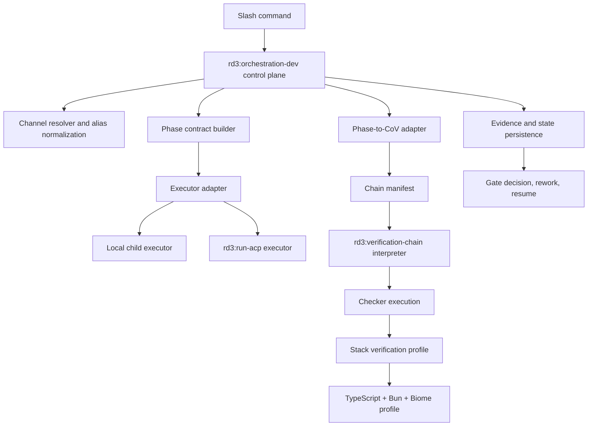

## 0275. Integrate orchestration-dev with verification-chain

### Background

Current state analysis shows `rd3:orchestration-dev` is not just missing `rd3:verification-chain` integration. It is still primarily a planner/spec layer, while the surrounding docs and slash commands already describe it like a reliable runtime executor.

Evidence from the existing codebase:
- `plugins/rd3/skills/orchestration-dev/SKILL.md` explicitly documents v1 limitations as `No verification-chain: Gates use simple checks, not CoV`, but also describes full execution, persistence, rework, and channel routing behavior that is not implemented as runtime code.
- `plugins/rd3/skills/orchestration-dev/scripts/plan.ts` is the only actual script in the skill and currently generates an `ExecutionPlan`; it does not execute phases, persist phase outputs, run gates, or reconcile paused state.
- `plugins/rd3/skills/verification-chain/SKILL.md` still marks `delegate_to` as future use.
- `plugins/rd3/skills/verification-chain/scripts/interpreter.ts` warns that `delegate_to` is not implemented and only falls back to command execution when a command is present.
- Current wrapper and skill contracts split cross-channel behavior across multiple layers, so there is no single routing authority and nested ACP delegation is a real risk.
- The task substrate still has profile-handling gaps: task parsing does not populate `frontmatter.profile`, and `request-intake` documents a `tasks update --section profile` write path that cannot update frontmatter.
- The planner currently uses generic predecessor outputs rather than the real phase input contracts documented for `solution`, `source_paths`, `bdd_report`, `target_docs`, and `change_summary`.

That leaves six concrete gaps:
1. `orchestration-dev` is not yet a real orchestration control plane with persisted state and delegated phase runtime behavior.
2. `orchestration-dev` cannot yet express phase execution and gate evaluation as CoV manifests.
3. `verification-chain` cannot yet execute delegated skill makers reliably.
4. Cross-channel execution semantics are ambiguous and need one authoritative routing boundary.
5. Task profile persistence is not reliable enough for profile-driven orchestration.
6. There is no reusable library of stack-specific verification profiles, so Bun/TypeScript/Biome projects cannot inherit a standard gate pack.

This task should therefore define the implementation core for the next phase: keep `orchestration-dev` as the planner, state owner, and delegation source; move concrete phase execution into isolated executors via `rd3:run-acp` or local spawned child processes; make `verification-chain` the verification substrate for gates; fix the task/profile and routing foundations that block reliable execution; and then add a first-class stack profile for `TypeScript + Bun + Biome`.

### Requirements

1. Implement a real `rd3:orchestration-dev` control-plane runtime that can plan phases, persist state, evaluate gates, and resume interrupted runs, while delegating phase execution to isolated executors rather than executing work inline.
2. Integrate `rd3:orchestration-dev` with `rd3:verification-chain` for phase verification and gate execution.
3. Implement real `delegate_to` support in `verification-chain` so maker nodes can invoke rd3 skills directly, not just shell commands.
4. Define how orchestration phases map to CoV nodes, including sequential phases, human approval points, retries, and rework loops.
5. Establish a single routing authority and executor contract. Slash commands should pass `--channel` into orchestration, orchestration should normalize/resolve it, and downstream phase routing should use either `rd3:run-acp` or a local spawned child executor without nested wrapper-level ACP delegation.
6. Define and implement channel normalization for user-facing values such as `current`, `claude-code`, `codex`, `openclaw`, `opencode`, `antigravity`, and `pi`.
7. Fix task profile persistence in the shared task substrate so `profile` is parsed from frontmatter, can be updated correctly, and can be consumed consistently by `request-intake` and `orchestration-dev`.
8. Define explicit phase input/output contracts for runtime execution, including `solution`, `source_paths`, `bdd_report`, `target_docs`, and `change_summary`, instead of generic predecessor placeholders.
9. Model and enforce the Solution Gate before Phase 5, and reconcile standard-profile Phase 8 semantics so plan, docs, and runtime agree.
10. Preserve backward compatibility during migration so the current 9-phase flow can still execute while CoV-backed phases are introduced incrementally.
11. Introduce a stack-profile mechanism for reusable verification packs, with the first supported profile being `TypeScript + Bun + Biome`.
12. Specify what belongs in a stack profile: commands, expected scripts, coverage thresholds, lint/typecheck/test gates, artifact checks, optional CI workflow expectations, and repo detection heuristics.
13. Decide where stack profiles should live and how `orchestration-dev` selects them from task context, repo signals, or explicit overrides.
14. Add examples and tests that prove the integrated flow works for happy path, failure/rework, pause/resume, profile persistence, and channel-routing scenarios.
15. Keep the resulting design aligned with the project's fat-skills/thin-wrappers model.
16. Define the pause/resume/proceed contract between `orchestration-dev`, `verification-chain` state files, and human gate UX so paused CoV runs can be resumed safely.
17. Define how `start_phase`, `skip_phases`, and tasks with undefined `profile` reconcile with CoV state and resumption semantics.
18. Standardize a manifest and evidence contract for downstream verification-aware skills such as `request-intake`, `bdd-workflow`, and `functional-review` so orchestration can consume their outputs predictably.
19. Decide whether parallel-group and convergence-mode support is required in the first orchestration integration for multi-specialist phases, or explicitly defer it with rationale while preserving a forward-compatible manifest shape.
20. Ensure any future CoV-backed Phase 9 flow aligns with the current canonical documentation refresh model, including Mermaid-only diagram requirements, rather than the superseded JSDoc/API-stub-only model.
21. Clean up wrapper and skill documentation drift so examples, profile descriptions, supported channels, and metadata match the implemented runtime behavior.

### Q&A

**Q1. Is `rd3:orchestration-dev` already built on `rd3:verification-chain`?**

No. The current orchestration implementation uses its own gate model and planner-generated criteria. `verification-chain` is mentioned as a future enhancement, not the runtime currently in use.

**Q2. Why is it not integrated yet?**

There are four visible reasons in the current repo state:
- `orchestration-dev` was shipped as a simpler v1 with direct phase and gate control.
- `verification-chain` does not yet implement delegated maker execution via `delegate_to`.
- There is no adapter layer that converts orchestration phases and gate semantics into CoV chain manifests.
- The current wrapper/task substrate/contracts still have unresolved runtime issues around channel ownership, profile persistence, and phase prerequisites.

**Q3. Is it a good idea to prepare stack-specific verification workflows?**

Yes, but only as part of the integration, not before it. Without CoV integration, those profiles would just be reference files with no execution path.

**Q4. Where should stack profiles live?**

Primary recommendation: keep the reusable verification profiles under `plugins/rd3/skills/verification-chain/references/` because they are verification assets, not orchestration policy. `orchestration-dev` should select and parameterize them, not own all stack-specific verification logic.

**Q5. What should the first stack profile be?**

`TypeScript + Bun + Biome` is the right first profile because it matches the project’s own verified toolchain and gives a concrete path for immediate adoption inside this repository.

**Q6. Should package.json scripts and CI workflow YAML be included?**

Yes, as reference fixtures/templates and validation expectations. The goal is not to edit `.github/workflows/` automatically, but to define what a compliant repository looks like and what commands/verifiers should run.

**Q7. Do wrappers and users need an explicit resume/proceed path once human CoV gates can pause?**

Yes. The original `verification-chain` and orchestration tasks both assume pause/resume semantics. The integration should either reuse a generic CoV proceed command or expose orchestration-facing resume/status entry points so paused runs are operable from user-facing workflows.

**Q8. Must parallel groups be supported immediately?**

Not necessarily, but the manifest contract should be designed so phases with multiple specialists or dual verification tracks are not boxed into a sequential-only model forever. If first delivery stays sequential, that should be an explicit deferral rather than an accidental omission.

**Q9. Which Phase 9 documentation model should this integration honor?**

The current canonical-doc refresh model, not the older JSDoc/API-reference-centric task language. Any future verification of documentation outputs should reflect the updated `code-docs` contract, including Mermaid fenced blocks for diagrams.

**Q10. Who should own routing and execution isolation?**

`orchestration-dev` should own it. Slash commands should collect the user-facing `--channel` value and pass it into orchestration. The orchestrator should normalize the alias, decide whether execution is local or ACP-backed, and route downstream phases itself. Wrappers should not pre-delegate the whole orchestration run through `rd3:run-acp` and then ask orchestration to delegate again. For `current`, orchestration should prefer a local spawned child executor so the main orchestration context stays clean.

**Q11. Is task profile handling already reliable enough for profile-driven orchestration?**

No. The current task parser/update path still needs work so `profile` is read from frontmatter and updated as frontmatter, not treated like a markdown section. This must be fixed as part of the foundation work for this task.

### Design

Implemented the integration as a control-plane architecture rather than an in-process executor rewrite. `rd3:orchestration-dev` now has a real runtime, shared phase contracts, explicit prerequisite enforcement, channel normalization, and a pilot CoV-backed Phase 6 path. `rd3:verification-chain` now supports structured delegated makers, including paused maker states, and the shared task substrate now supports frontmatter-safe profile and impl_progress updates.

2. `verification-chain` should become the verification substrate, not the owner of orchestration policy. `orchestration-dev` should still decide phase order, profile behavior, phase prerequisites, and gate types, then materialize those decisions as CoV manifests.

3. `orchestration-dev` needs an actual runtime module in addition to the planner. That runtime should own phase sequencing, state persistence, channel resolution, prereq validation, executor selection, and invocation of `verification-chain`.

4. `orchestration-dev` needs a phase contract layer that defines, for each phase, the maker skill, normalized inputs, required upstream evidence, checker configuration, retry policy, evidence requirements, and gate behavior.

5. The system needs an executor abstraction with two interchangeable backends:
- local spawned child process when `execution_channel` is `current`
- `rd3:run-acp` when `execution_channel` targets another agent

6. `verification-chain` needs real `delegate_to` execution with structured arguments so maker nodes can invoke rd3 skills directly.

7. Cross-channel routing should have one authority: `orchestration-dev`. Wrappers should not invoke `rd3:run-acp` around orchestration for the normal path. Instead, orchestration should resolve `--channel`, normalize aliases like `claude-code -> claude`, and decide whether each delegated phase runs locally or through `rd3:run-acp`.

8. A verification profile registry should live under `plugins/rd3/skills/verification-chain/references/profiles/`. The first profile should be `TypeScript + Bun + Biome` with a manifest, package.json example, and workflow YAML example.

9. Profile selection should stay in `orchestration-dev`. It should resolve a profile from explicit input, task metadata, or repo heuristics, then pass that profile into CoV checker configuration.

10. The task substrate must be updated so `profile` is parsed from frontmatter and updated via a frontmatter-aware write path. `request-intake` and orchestration should rely on that shared implementation, not ad hoc profile parsing.

11. The integration needs an explicit state and lifecycle contract covering task `impl_progress`, orchestration execution state, CoV state files, human gate pause states, and resume/proceed behavior. This contract also needs to define how `start_phase` and `skip_phases` work when prior CoV state exists.

12. Downstream verification-aware skills such as `request-intake`, `bdd-workflow`, and `functional-review` need a shared evidence/output envelope so orchestration can consume their results predictably.

13. Runtime phase contracts must explicitly model Solution Gate and other prerequisites. Phase 5 must require `solution`, Phase 6 and 7 must consume `source_paths`, Phase 8b must consume `bdd_report`, and Phase 9 must consume `target_docs` and `change_summary`.

14. Standard-profile Phase 8 semantics must be reconciled so plan output, docs, and runtime all agree on whether the standard path is BDD-only or hybrid review.

15. The manifest shape should remain forward-compatible with CoV parallel groups and convergence modes, even if the first delivery intentionally stays sequential.

16. The initial `TypeScript + Bun + Biome` profile should include accepted commands for `typecheck`, `test`, `check`, formatting/lint verification, the current unit thresholds, repo auto-detection signals, and CI expectation examples.

17. Wrapper and command follow-up should be tracked explicitly: if CoV-backed orchestration can pause on human gates, user-facing commands may need status inspection and resume/proceed entry points.

18. Any future Phase 9 verification should align with the current canonical docs refresh model and Mermaid-only diagram rule, not the superseded JSDoc/API-stub-focused model from the older task language.

19. Primary file touch points remain `plugins/rd3/skills/verification-chain/scripts/*`, `plugins/rd3/skills/verification-chain/references/profiles/*`, `plugins/rd3/skills/orchestration-dev/scripts/*`, `plugins/rd3/skills/orchestration-dev/SKILL.md`, `plugins/rd3/skills/orchestration-dev/references/*`, `plugins/rd3/skills/tasks/scripts/*`, and the matching test suites.

### Solution

### Workstream A. orchestration control-plane completion

Implement the missing runtime features that prevent `rd3:orchestration-dev` from being the reliable coordinator that the command surface already assumes:
- add an actual orchestration runtime alongside the plan builder
- persist orchestration state and phase outputs in a stable schema
- validate phase prerequisites before execution instead of relying on generic predecessor placeholders
- make gate evaluation, rework, and resume/proceed behavior runtime features rather than documentation-only behavior
- keep phase execution isolated from the main orchestration context

### Workstream B. executor abstraction, routing, and task substrate fixes

Fix the two foundational problems that make profile-driven orchestration unreliable today:
- make `orchestration-dev` the single owner of channel normalization and ACP routing
- remove nested-wrapper routing as the normal execution model
- add a local executor path based on spawned child processes for `execution_channel=current`
- define a shared executor result contract so local and ACP-backed execution produce the same evidence envelope
- implement frontmatter-aware read/write support for task `profile`
- update `request-intake` and related task workflows to use the corrected profile persistence path

### Workstream C. verification-chain runtime completion

Implement the missing runtime features that prevent orchestration integration:
- add first-class `delegate_to` execution for maker nodes
- support structured argument passing to delegated skills
- persist maker/checker evidence in a stable schema that orchestration can consume
- define failure, retry, and pause/resume behavior clearly for delegated skill nodes

### Workstream D. orchestration-dev adapter and phase contracts

Refactor `orchestration-dev` so the planner can output both:
- the high-level 9-phase execution plan used for user visibility
- a CoV-ready manifest or node bundle for phases backed by `verification-chain`

This adapter should start with the most verification-heavy and contract-sensitive phases:
- Phase 5: implementation prereq validation via Solution Gate
- Phase 6: implementation + unit verification
- Phase 7: code review gate
- Phase 8a: BDD workflow
- Phase 8b: functional review

### Workstream E. stack verification profiles

Create a reusable verification profile system with the first concrete pack for `TypeScript + Bun + Biome`.

That profile should include:
- command expectations
- gate thresholds
- fixture examples for `package.json`
- fixture examples for GitHub workflow YAML
- documentation on how orchestration selects and applies the profile

### Workstream F. migration and compatibility

Preserve a compatibility mode so existing tasks and wrappers do not break while CoV-backed phases are rolled in. The safest path is feature-flagged or phase-scoped adoption rather than a flag day rewrite.

### Done Criteria

This task should be considered complete only when:
1. `orchestration-dev` has a real control-plane runtime for planning, delegation, and persisted state management, not just plan generation.
2. `verification-chain` can execute delegated maker nodes for rd3 skills.
3. Channel routing has one authority, with alias normalization, a local child-executor path for `current`, and no nested ACP orchestration path in the normal workflow.
4. Task `profile` is parsed and updated reliably through the shared task substrate.
5. At least one real phase can run end-to-end through the isolated executor path and CoV-backed verification, with explicit prerequisite validation.
6. A `TypeScript + Bun + Biome` verification profile exists and is referenced by orchestration docs.
7. Tests cover success, failure/rework, profile persistence, channel routing, and pause/resume flows.
8. The resulting docs make it clear when orchestration uses direct gates versus CoV-backed gates, or the old path is removed entirely.

### Plan

1. Built the orchestration control-plane runtime and executor abstraction.
2. Fixed task profile persistence and phase-progress updates in the shared tasks substrate.
3. Implemented `verification-chain` delegated maker execution with pause/resume support.
4. Added explicit orchestration phase contracts, Solution Gate enforcement, and standard Phase 8 reconciliation.
5. Wired the pilot Phase 6 flow through CoV plus isolated executors, including success, failure, retry, and pause coverage.
6. Added the TypeScript + Bun + Biome verification profile and aligned wrapper/skill docs.
7. Added parent-level `start_phase` support and a shared downstream evidence-contract registry.

### Review

Reviewed against the original parent-task requirements after completing subtasks 0276 through 0282. The remaining parent-level gaps were `start_phase` semantics and the downstream evidence-contract definition; both are now implemented and covered. The current scope remains intentionally pilot-scoped for CoV execution: Phase 6 is real, while the remaining phases are still ready for later CoV migration behind the same control-plane contract.

### Testing

Validated with `bun run check`.
Additional focused verification covered:
- `bun test plugins/rd3/skills/orchestration-dev/tests/plan.test.ts plugins/rd3/skills/orchestration-dev/tests/runtime.test.ts plugins/rd3/skills/orchestration-dev/tests/pilot.test.ts`
- `bun test plugins/rd3/skills/verification-chain/tests/interpreter.test.ts`
- `bun test plugins/rd3/skills/tasks/tests/taskFile.test.ts plugins/rd3/skills/tasks/tests/cli-contract.test.ts`

1. Planner tests proving `orchestration-dev` can emit CoV-backed execution metadata without regressing the current plan output.
2. Runtime tests proving `orchestration-dev` can delegate phases, persist state, and resume interrupted runs.
3. Executor tests proving the local child-process backend and ACP backend produce the same result envelope.
4. Interpreter tests proving `verification-chain` can run delegated maker skills and capture evidence.
5. Channel-routing tests proving alias normalization works and the normal workflow does not nest ACP orchestration delegation.
6. Task substrate tests proving `profile` is parsed from frontmatter and updated through a frontmatter-aware write path.
7. Profile selection tests for explicit override, task metadata, repo heuristic detection, and undefined-profile fallback.
8. Phase contract tests for Solution Gate, `source_paths`, `bdd_report`, `target_docs`, and `change_summary`.
9. State reconciliation tests for paused runs, resumed runs, and `start_phase` / `skip_phases` interactions with existing CoV state.
10. Downstream evidence contract tests for `request-intake`, `bdd-workflow`, and `functional-review` integration points.
11. Profile validation tests for `TypeScript + Bun + Biome` commands and thresholds.
12. End-to-end tests covering successful Phase 6 verification, failing verification with retry/rework, human gate pause/resume, fallback behavior for non-CoV phases during migration, and explicit behavior for sequential-only versus parallel-capable manifest handling.
13. If Phase 9 is brought into scope, validation should check the current canonical-doc refresh model and Mermaid-only diagram convention rather than the superseded JSDoc/API-stub expectations.

Repository verification gate before completion:
- `bun run typecheck`
- targeted Bun tests for `orchestration-dev` and `verification-chain`
- any fixture/schema validation added for profile manifests

### Artifacts

| Type | Path | Agent | Date |
| ---- | ---- | ----- | ---- |

### References

- `plugins/rd3/skills/orchestration-dev/SKILL.md` — current v1 limitation explicitly states there is no verification-chain integration yet.
- `plugins/rd3/skills/orchestration-dev/scripts/plan.ts` — current planner-owned gate model and criteria generation.
- `plugins/rd3/skills/orchestration-dev/references/delegation-map.md` — current phase input/output contracts that are richer than the planner model.
- `plugins/rd3/skills/orchestration-dev/references/gate-definitions.md` — existing direct gate semantics.
- `plugins/rd3/commands/dev-run.md` — current wrapper contract and cross-channel examples.
- `plugins/rd3/skills/run-acp/SKILL.md` — ACP channel conventions and alias expectations.
- `plugins/rd3/skills/run-acp/references/agents.md` — slash-command channel value to ACP resolution table.
- `plugins/rd3/skills/verification-chain/SKILL.md` — current CoV contract and `delegate_to` gap.
- `plugins/rd3/skills/verification-chain/scripts/interpreter.ts` — runtime behavior showing `delegate_to` is not yet implemented.
- `plugins/rd3/skills/request-intake/SKILL.md` — current profile assignment and persistence workflow expectations.
- `plugins/rd3/skills/tasks/scripts/lib/taskFile.ts` — current task parsing and write-path behavior relevant to `profile`.
- `plugins/rd3/skills/tasks/scripts/commands/update.ts` — current task update capabilities and constraints.
- Task `0264` — original 9-phase plan, v1/v2 orchestration split, and pause/rework expectations.
- Task `0265` — original verification-chain build task and human pause/state model.
- Task `0266` — profile field optionality and backward-compatibility requirement.
- Task `0268` — historical Phase 9 task, now useful mainly as a record of superseded documentation assumptions.
- Task `0269` — BDD workflow expectations and checker-driven execution model.
- Task `0270` — functional-review evidence expectations.
- Task `0271` — original orchestration-dev build task.
- Task `0272` — agent/command entry-point expectations that may need resume/status follow-up.
- Task `0274` — dev wrapper command surface that now depends on orchestration behavior.
