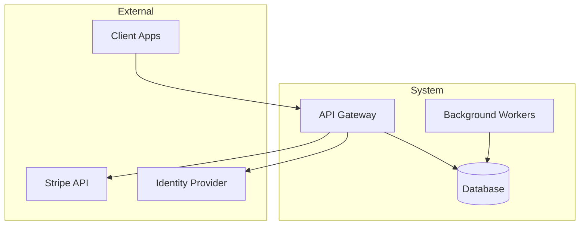
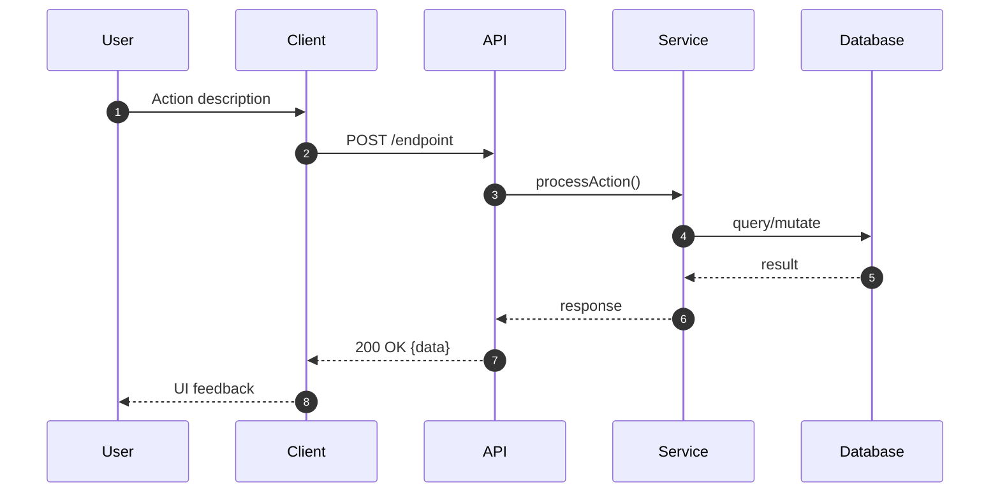
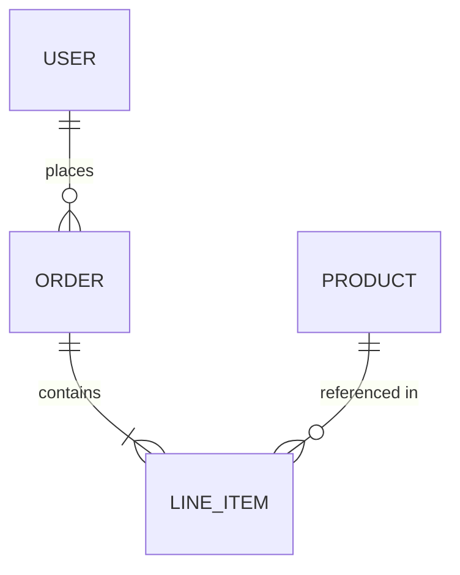

# Living Spec — Synchronize Functional Specification with Codebase

Generate and maintain a "Living Functional Specification" that stays synchronized with the codebase, serving as the authoritative source of truth for system behavior.

## Arguments

- `--full`: Regenerate entire specification from scratch
- `--diff`: Update only sections affected by recent changes (default)
- `--section <name>`: Update specific section only (e.g., `--section api`)

## Why Living Documentation?

> "Documentation that lives with the code is more likely to be updated."

**Benefits:**
- 30-45% faster onboarding for new team members (2025 industry research)
- 50% higher contributor participation in projects with clear docs
- Single source of truth reduces "doc drift" and stale information

**The Docs-as-Code Principle:** Documentation follows the same workflow as code—version controlled, reviewed in PRs, deployed via CI/CD.

## Core Principles

| Principle | What It Means |
|-----------|---------------|
| **Code is Truth** | Document what code *does*, not what it *should* do |
| **Automation First** | Extract information programmatically, not manually |
| **Incremental Updates** | Change only what needs changing, preserve the rest |
| **Traceability** | Link documentation to code locations (`file:line`) |
| **Audience Awareness** | Write for developers and architects, not marketing |
| **Concurrent Updates** | Update docs in same PR as code changes |

## Execution Workflow

```
Phase 1: Gather → Phase 2: Analyze → Phase 3: Update → Phase 4: Validate
```

### Phase 1: Context Gathering (Autonomous)

Execute these steps to understand the current state:

1. **Read Existing Spec**: Check `docs/FUNCTIONAL_SPEC.md` (or create if missing)
2. **Analyze Recent Changes** (for `--diff` mode):
   ```bash
   git diff HEAD~10 --name-only  # What files changed
   git log --oneline -10          # What was the intent
   ```
3. **Discover Architecture**:
   - Scan package manifests (`package.json`, `pyproject.toml`, `Cargo.toml`, `go.mod`)
   - Examine folder structure for architectural patterns
   - Identify entry points (`index.ts`, `main.py`, `app.ts`, `main.go`)
4. **Extract Domain Knowledge**:
   - Type definitions, interfaces, schemas → Domain model
   - Requirement documents (`docs/prompts/*.md`) → Business context
   - Tests → Expected behaviors and edge cases
5. **Map the System**:

   | Code Pattern | Documentation Section |
   |--------------|----------------------|
   | Controllers/Routes | Use Cases & API |
   | Services | Business Logic |
   | Repositories/DAOs | Data Model |
   | Middleware | Cross-Cutting Concerns |
   | Validators/Schemas | Business Rules |

### Phase 2: Analysis & Synthesis

1. **Compare**: Identify discrepancies between existing spec and current code
2. **Prioritize**: Focus on sections affected by recent changes
3. **Extract**: Pull information from code, not assumptions
4. **Validate**: Every claim must be traceable to actual code

### Phase 3: Update Specification

Write/update `docs/FUNCTIONAL_SPEC.md` following the Output Format below.

### Phase 4: Validation

Before completing, verify:
- [ ] All Mermaid diagrams render correctly
- [ ] All code references (`file:line`) are valid
- [ ] No placeholder text (`TBD`, `TODO`, `...`)
- [ ] Changelog entry added

## Content Guidelines

### What to Document (and What Not To)

| ✓ Document | ✗ Skip |
|------------|--------|
| Public APIs and contracts | Internal implementation details |
| Business rules and constraints | Framework boilerplate |
| Non-obvious design decisions | Self-evident code |
| Error handling and edge cases | Happy path only |
| Security-sensitive code paths | Every function signature |

### Writing Style

| ✓ Do | ✗ Don't |
|------|---------|
| "Users must verify email before checkout" | "`if (!user.verified) return 401`" |
| Use consistent domain terminology | Mix technical and business jargon |
| Include code references (`file:line`) | Assume reader knows the codebase |
| Explain "why", not just "what" | Restate obvious code behavior |

### Diagramming Standards (Mermaid.js)

| Diagram Type | Use For | Example |
|--------------|---------|---------|
| `sequenceDiagram` | API flows, workflows | User → API → DB |
| `erDiagram` | Data models | Entity relationships |
| `flowchart` | Decision trees, state machines | Auth flow |
| `C4Context` | System architecture | Service boundaries |

**Always validate Mermaid syntax** before committing.

### Versioning (SemVer for Docs)

| Change Type | Version Bump | Example |
|-------------|--------------|---------|
| Typo fixes, clarifications | PATCH (0.0.x) | Fixed typo in API section |
| New sections, significant updates | MINOR (0.x.0) | Added webhooks documentation |
| Major restructuring, breaking changes | MAJOR (x.0.0) | Reorganized entire spec |

### Preservation Rules

- **Never delete sections** without user approval
- Mark obsolete content with `[DEPRECATED]` tag
- Keep changelog of all changes
- Preserve manually-added content not covered by code analysis

## Output Format (Markdown)

The specification MUST follow this structure. Sections may be extended but not removed.

```markdown
# [Project Name] Functional Specification

> **Last Sync:** YYYY-MM-DD | **Version:** X.Y.Z | **Status:** Draft | Review | Approved

## Document Changelog

| Version | Date | Author | Changes |
|---------|------|--------|---------|
| X.Y.Z | YYYY-MM-DD | Claude | [Brief description] |

---

## 1. Executive Summary

[2-3 paragraphs: What the system does, primary value proposition, target users, and scope boundaries]

## 2. Technology Stack & Terminology

### 2.1 Technology Stack

| Layer | Technology | Purpose |
|-------|------------|---------|
| Runtime | e.g., Node.js 20, Python 3.12 | Core execution environment |
| Framework | e.g., Hono, FastAPI, Django | Web/API framework |
| Database | e.g., PostgreSQL, D1/SQLite | Primary data store |
| Cache | e.g., Redis, Cloudflare KV | Session/cache layer |
| Queue | e.g., Cloudflare Queues, RabbitMQ | Async processing |

### 2.2 Domain Glossary

| Term | Definition | Code Reference |
|------|------------|----------------|
| [Term] | [Business definition derived from code] | `path/to/file.ts:123` |

## 3. Architecture & Design Decisions

### 3.1 High-Level Architecture



[Describe: Monolith vs Microservices, Serverless vs Traditional, Event-Driven patterns, etc.]

### 3.2 Key Design Decisions (ADR Summary)

| Decision | Context | Rationale | Consequences |
|----------|---------|-----------|--------------|
| [Pattern/Choice] | [Problem being solved] | [Why this solution] | [Trade-offs accepted] |

_Full ADRs: `docs/adr/` (if available)_

## 4. User Roles & Access Control

### 4.1 Role Definitions

| Role | Description | Authentication | Authorization |
|------|-------------|----------------|---------------|
| [Role] | [Who this represents] | [How they authenticate] | [What they can access] |

### 4.2 Permission Matrix

| Resource | Anonymous | User | Admin |
|----------|-----------|------|-------|
| [Resource] | ❌ | ✓ (own) | ✓ (all) |

## 5. Core Functional Modules

### 5.X [Module Name]

**Purpose:** [Single sentence describing the module's responsibility]

**Code Location:** `path/to/module/`

**Key Components:**
- `ComponentA` — [responsibility]
- `ComponentB` — [responsibility]

**Business Rules:**
1. [Rule derived from validation logic, constraints, or guards]
2. [Rule]

**Error Handling:**
| Condition | Response | Recovery |
|-----------|----------|----------|
| [Error case] | [HTTP status / message] | [What happens next] |

## 6. Key Use Cases & Workflows

### 6.X [Use Case Name]

**Actor:** [Who initiates this]
**Goal:** [What they want to achieve]
**Preconditions:** [What must be true before starting]

**Workflow:**



**Success Criteria:** [Observable outcome]
**Error Scenarios:** [What can go wrong and how it's handled]

## 7. Data Model

### 7.1 Entity Relationship Diagram



### 7.2 Entity Descriptions

| Entity | Description | Key Attributes | Relationships |
|--------|-------------|----------------|---------------|
| [Entity] | [Purpose] | [Important fields] | [Links to other entities] |

## 8. API & Interface Contracts

### 8.1 Endpoint Summary

| Method | Path | Auth | Purpose |
|--------|------|------|---------|
| POST | /api/v1/resource | Bearer | Create resource |

### 8.2 Detailed Contracts

#### `POST /api/v1/resource`

**Request:**
```json
{
  "field": "type — description (required/optional)"
}
```

**Response (200):**
```json
{
  "id": "string — resource identifier"
}
```

**Errors:**
| Code | Condition |
|------|-----------|
| 400 | Invalid input |
| 401 | Unauthenticated |
| 403 | Unauthorized |

## 9. Integration Points

### 9.X [External System Name]

**Purpose:** [Why we integrate]
**Protocol:** REST | GraphQL | Webhook | SDK
**Authentication:** API Key | OAuth | HMAC Signature
**Key Operations:**
- [Operation] — [when/why used]

**Error Handling:** [Retry policy, circuit breaker, fallback]

## 10. Non-Functional Characteristics

### 10.1 Security Controls

| Control | Implementation | Reference |
|---------|----------------|-----------|
| Authentication | [e.g., OIDC via Zitadel] | `middleware/auth.ts` |
| Input Validation | [e.g., Zod schemas] | `validators/*.ts` |
| Rate Limiting | [e.g., Cloudflare] | `wrangler.toml` |

### 10.2 Observability

- **Logging:** [Structured JSON, log levels, destinations]
- **Metrics:** [Key metrics collected, where exposed]
- **Tracing:** [Distributed tracing, correlation IDs]

### 10.3 Deployment

| Environment | Infrastructure | URL Pattern |
|-------------|----------------|-------------|
| Development | Local | localhost:PORT |
| Staging | [Platform] | staging.example.com |
| Production | [Platform] | api.example.com |

---

## Appendix A: Revision History

[Auto-generated changelog of spec updates]

## Appendix B: Open Questions

[Items requiring clarification or decisions—remove when resolved]

- [ ] [Question or uncertainty discovered during analysis]
```

## Quality Checklist

Before finalizing, verify:

- [ ] All sections reflect current code, not aspirational features
- [ ] Every claim can be traced to specific code
- [ ] Mermaid diagrams render correctly (valid syntax)
- [ ] Domain terms are used consistently
- [ ] Version number incremented appropriately
- [ ] Changelog entry added for this update
- [ ] No TODO/TBD markers left unaddressed
- [ ] Obsolete content marked or removed with approval

## Output Location

Write the updated specification to: `docs/FUNCTIONAL_SPEC.md`

If the file doesn't exist, create it. If it exists, update in place while preserving any manually-added content not covered by code analysis.

## Completion Report

After updating, provide a summary:

```markdown
## Spec Update Summary

**Version:** X.Y.Z → X.Y.Z+1
**Sections Updated:** [list]
**Lines Changed:** +X / -Y

### Key Changes
- [Change 1]
- [Change 2]

### Validation
- ✅ Mermaid diagrams valid
- ✅ Code references verified
- ✅ No placeholder text

### Next Steps
- Review changes in `docs/FUNCTIONAL_SPEC.md`
- Commit with message: `docs: update functional spec to vX.Y.Z`
```

## References

- [Docs-as-Code (Write the Docs)](https://www.writethedocs.org/guide/docs-as-code/)
- [Living Documentation Best Practices 2025](https://www.docsie.io/blog/glossary/living-document/)
- [Code Documentation Best Practices](https://dualite.dev/blog/code-documentation-best-practices)
- [Enterprise Documentation Standards](https://www.augmentcode.com/guides/10-enterprise-code-documentation-best-practices)
