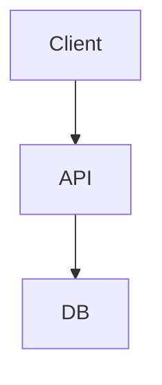
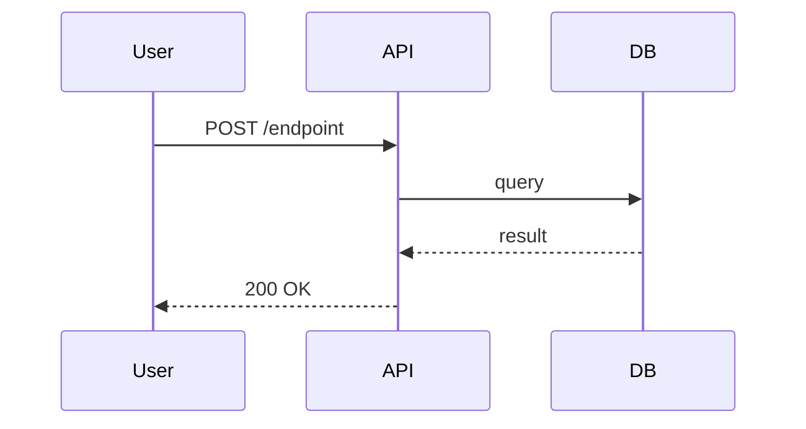
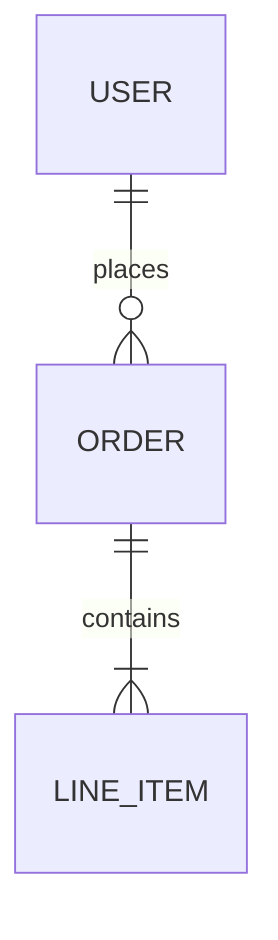

# Living Spec — Sync Functional Specification with Codebase

Generate and maintain a "Living Functional Specification" synchronized with the codebase.

## Quick Start

```bash
/rd:task-spec --diff          # Update affected sections (default)
/rd:task-spec --full          # Regenerate entire spec
/rd:task-spec --section api   # Update specific section
```

## Core Principles

| Principle | Meaning |
|-----------|---------|
| **Code is Truth** | Document what code *does*, not what it *should* do |
| **Automation First** | Extract information programmatically |
| **Traceability** | Link documentation to code (`file:line`) |
| **Incremental** | Change only what needs changing |

## Workflow

```
Phase 1: Gather → Phase 2: Analyze → Phase 3: Update → Phase 4: Validate
```

### Phase 1: Context Gathering

1. **Read existing spec** at `docs/FUNCTIONAL_SPEC.md`
2. **Analyze recent changes** (for `--diff`):
   ```bash
   git diff HEAD~10 --name-only
   git log --oneline -10
   ```
3. **Discover architecture**: package manifests, folder structure, entry points
4. **Extract domain knowledge**: types, schemas, tests
5. **Map code to sections**:

   | Code Pattern | Doc Section |
   |--------------|-------------|
   | Controllers/Routes | Use Cases & API |
   | Services | Business Logic |
   | Repositories | Data Model |
   | Middleware | Cross-Cutting |

### Phase 2: Analysis

1. Compare existing spec vs current code
2. Prioritize sections affected by changes
3. Extract from code, not assumptions
4. Every claim must trace to actual code

### Phase 3: Update Specification

Write/update `docs/FUNCTIONAL_SPEC.md` using output format below.

### Phase 4: Validation

- [ ] Mermaid diagrams render correctly
- [ ] Code references (`file:line`) are valid
- [ ] No placeholder text (TBD, TODO)
- [ ] Changelog entry added

## Content Guidelines

| Document | Skip |
|----------|------|
| Public APIs and contracts | Internal implementation |
| Business rules and constraints | Framework boilerplate |
| Non-obvious design decisions | Self-evident code |
| Error handling and edge cases | Every function signature |

## Output Format

```markdown
# [Project Name] Functional Specification

> **Last Sync:** YYYY-MM-DD | **Version:** X.Y.Z | **Status:** Draft | Review | Approved

## Changelog

| Version | Date | Changes |
|---------|------|---------|
| X.Y.Z | YYYY-MM-DD | [Description] |

---

## 1. Executive Summary
[2-3 paragraphs: What system does, value prop, target users]

## 2. Technology Stack & Terminology

### 2.1 Stack
| Layer | Technology | Purpose |
|-------|------------|---------|
| Runtime | Node.js 20 | Execution |
| Framework | Hono | API |
| Database | PostgreSQL | Data store |

### 2.2 Glossary
| Term | Definition | Reference |
|------|------------|-----------|
| [Term] | [Definition] | `file:line` |

## 3. Architecture

### 3.1 High-Level Diagram


### 3.2 Design Decisions
| Decision | Rationale | Trade-offs |
|----------|-----------|------------|
| [Choice] | [Why] | [Consequences] |

## 4. Access Control

| Role | Authentication | Authorization |
|------|----------------|---------------|
| User | JWT | Own resources |
| Admin | JWT | All resources |

## 5. Core Modules

### 5.X [Module Name]
**Purpose:** [Responsibility]
**Location:** `path/to/module/`

**Business Rules:**
1. [Rule from validation/constraints]

**Error Handling:**
| Condition | Response | Recovery |
|-----------|----------|----------|
| [Error] | [Status] | [Action] |

## 6. Use Cases

### 6.X [Use Case]
**Actor:** [Who]
**Goal:** [What]



## 7. Data Model



| Entity | Description | Key Attributes |
|--------|-------------|----------------|
| User | Account holder | id, email, role |

## 8. API Contracts

| Method | Path | Auth | Purpose |
|--------|------|------|---------|
| POST | /api/v1/resource | Bearer | Create resource |

### `POST /api/v1/resource`
**Request:** `{ field: string }`
**Response:** `{ id: string }`
**Errors:** 400 Invalid, 401 Unauth, 403 Forbidden

## 9. Integrations

### 9.X [External System]
**Protocol:** REST | GraphQL | Webhook
**Auth:** API Key | OAuth
**Error Handling:** [Retry/fallback policy]

## 10. Non-Functional

### Security
| Control | Implementation | Reference |
|---------|----------------|-----------|
| Auth | OIDC | `middleware/auth.ts` |
| Validation | Zod | `validators/*.ts` |

### Observability
- **Logging:** Structured JSON
- **Metrics:** [Key metrics]
- **Tracing:** [Correlation IDs]

---

## Appendix: Open Questions
- [ ] [Unresolved items]
```

## Versioning (SemVer)

| Change | Version |
|--------|---------|
| Typo fixes | PATCH (0.0.x) |
| New sections | MINOR (0.x.0) |
| Major restructure | MAJOR (x.0.0) |

## Completion Report

```markdown
## Spec Update Summary

**Version:** X.Y.Z → X.Y.Z+1
**Sections Updated:** [list]

### Validation
- ✅ Mermaid valid
- ✅ References verified
- ✅ No placeholders

**Commit:** `docs: update functional spec to vX.Y.Z`
```
