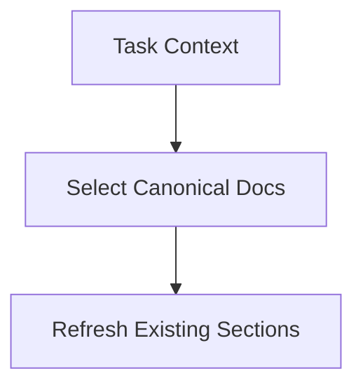

# rd3:code-docs — Cumulative Documentation Refresh

Refresh a fixed set of cumulative project documents after implementation so knowledge is preserved in the right place instead of being left in tasks, commits, or chat history.

## Quick Start

```bash
# Refresh docs affected by task 0274
rd3:code-docs 0274

# With custom paths
rd3:code-docs 0274 --source ./src --architecture docs/ARCH.md

# Force specific target docs
rd3:code-docs 0274 --target-docs docs/02_DEVELOPER_SPEC.md,docs/99_EXPERIENCE.md
```

**Key distinction:**
- **`code-docs`** = refresh and curate long-lived project documentation (Phase 9)
- **`request-intake`** = define requirements before implementation (Phase 1)
- **`functional-review`** = verify implementation against requirements (Phase 8)

## When to Use

**Trigger phrases:** "refresh docs", "update architecture doc", "update developer spec", "update user manual", "record experience", "phase 9 docs"

Load this skill when:
- Implementation changed architecture, workflows, APIs, or user-visible behavior
- A task exposed a bug fix, workaround, or operational lesson worth preserving
- The task closed a gap between current behavior and project documentation
- Selectively refresh project docs instead of generating source-level API docs

Do not use this skill for requirements authoring (use `rd3:request-intake`) or implementation verification (use `rd3:functional-review`).

## Workflows

1. **Collect** — Gather task context from requirements, implementation artifacts, review notes, and tests
2. **Classify** — Determine which canonical docs are affected
3. **Read** — Load existing target docs before editing
4. **Merge** — Integrate new information into the right sections
5. **Validate** — Ensure docs remain cumulative, specific, and non-duplicative
6. **Persist** — Write only the docs that materially changed

## Canonical Documentation Set

Phase 9 operates on a small, stable set of cumulative project docs.

| Path | Purpose | Update When |
|------|---------|-------------|
| `docs/01_ARCHITECTURE_SPEC.md` | System architecture, boundaries, major design decisions | Structure, responsibilities, flow, integration points, or invariants changed |
| `docs/02_DEVELOPER_SPEC.md` | Internal developer-facing functional and implementation guidance | New workflows, commands, extension points, conventions, or operational steps were introduced |
| `docs/03_USER_MANUAL.md` | User-facing usage guidance | CLI behavior, setup steps, options, or user-visible output changed |
| `docs/99_EXPERIENCE.md` | Lessons learned from bugs, fixes, regressions, and operational surprises | A task revealed a non-obvious pitfall, debugging pattern, or durable workaround |

This set is intentionally opinionated. Prefer updating one of these files over creating a new ad hoc document.

See `references/canonical-doc-structure.md` for the default skeleton of each canonical doc.

## Overview

The code-docs skill is a documentation refresh workflow, not a doc generator:

1. **Collect** task context from requirements, implementation artifacts, review notes, and tests
2. **Classify** which canonical docs are actually affected
3. **Read** the existing target docs before editing
4. **Merge** the new information into the right sections
5. **Validate** that the docs remain cumulative, specific, and non-duplicative
6. **Persist** only the docs that materially changed

## Input Schema

```typescript
interface CodeDocsInput {
  task_ref: string;                    // WBS number or path to task file
  source_paths?: string[];             // Changed files or artifact paths from implementation
  target_docs?: CanonicalDoc[];        // Optional override; default = auto-select from canonical set
  change_summary?: string[];           // Key changes, fixes, or behaviors to preserve
  style?: 'delta-first' | 'integrated'; // Default: integrated
  // Custom paths (override defaults for user customization)
  source?: string;                     // Source code root path (default: '.')
  architecture_path?: string;          // Architecture doc path (default: 'docs/01_ARCHITECTURE_SPEC.md')
  spec_path?: string;                  // Developer spec path (default: 'docs/02_DEVELOPER_SPEC.md')
  user_manual_path?: string;           // User manual path (default: 'docs/03_USER_MANUAL.md')
}

type CanonicalDoc =
  | 'docs/01_ARCHITECTURE_SPEC.md'
  | 'docs/02_DEVELOPER_SPEC.md'
  | 'docs/03_USER_MANUAL.md'
  | 'docs/99_EXPERIENCE.md';
```

## Canonical Documentation Set

Phase 9 operates on a small, stable set of cumulative project docs. Paths are customizable via input parameters.

| Path Parameter | Default Path | Purpose | Update When |
|---------------|--------------|---------|-------------|
| `architecture_path` | `docs/01_ARCHITECTURE_SPEC.md` | System architecture, boundaries, major design decisions | Structure, responsibilities, flow, integration points, or invariants changed |
| `spec_path` | `docs/02_DEVELOPER_SPEC.md` | Internal developer-facing functional and implementation guidance | New workflows, commands, extension points, conventions, or operational steps were introduced |
| `user_manual_path` | `docs/03_USER_MANUAL.md` | User-facing usage guidance | CLI behavior, setup steps, options, or user-visible output changed |
| (fixed) | `docs/99_EXPERIENCE.md` | Lessons learned from bugs, fixes, regressions, and operational surprises | A task revealed a non-obvious pitfall, debugging pattern, or durable workaround |

This set is intentionally opinionated. Prefer updating one of these files over creating a new ad hoc document.

See `references/canonical-doc-structure.md` for the default skeleton of each canonical doc.

## Selection Rules

Choose the smallest set of docs that preserves the task's durable knowledge. Use the path parameters to customize locations for different project structures.

### Architecture Spec (`architecture_path`)

Update when the task changed:
- component boundaries
- data/control flow
- integration points between modules or plugins
- invariants, constraints, or layering rules
- architecture decisions that future work must preserve

Do **not** update this file for small implementation details with no design impact.

### Developer Spec (`spec_path`)

Update when the task changed:
- internal developer workflows
- command/skill behavior
- extension points, conventions, or maintenance guidance
- troubleshooting instructions developers need during future work

This is the default target for most implementation-oriented tasks.

### User Manual (`user_manual_path`)

Update when the task changed:
- user-facing commands, flags, or options
- installation, setup, or usage steps
- visible output, examples, or expected behavior

Do not put internal maintenance details here.

### Experience Log

Update when the task uncovered:
- root causes behind bugs or regressions
- durable debugging heuristics
- common failure modes
- workarounds, caveats, or lessons learned worth reusing

This file should capture insight, not a chronological dump.

## Refresh Workflow

### 1. Gather Inputs

Read:
- task Background, Requirements, Solution, Review, Testing, and Artifacts sections
- changed file paths from `source_paths` or task artifacts
- relevant command/skill docs that were touched by the task

### 2. Decide Target Docs

```text
IF boundaries / architecture changed
  → update {architecture_path} (default: docs/01_ARCHITECTURE_SPEC.md)

IF internal behavior / developer workflow changed
  → update {spec_path} (default: docs/02_DEVELOPER_SPEC.md)

IF user-visible behavior changed
  → update {user_manual_path} (default: docs/03_USER_MANUAL.md)

IF the task taught a durable lesson
  → update docs/99_EXPERIENCE.md (always fixed path)
```

### 3. Read Existing Docs First

Never overwrite blindly. Merge into the existing structure:
- extend existing sections where possible
- add a small new section only when the information does not fit anywhere
- avoid repeating the task narrative in multiple files

### 4. Diagram Rule

If a document needs a diagram, it MUST be written as Mermaid inside a fenced markdown code block.

~~~~markdown

~~~~

Do not use ASCII art, screenshots, or prose-only substitutes when a diagram would materially improve understanding.

### 5. Write Integrated Updates

Preferred style: **integrated**
- update the relevant section directly so the doc reads as current truth
- avoid large "Task 0274 update" dumps unless the doc is explicitly changelog-like

Alternative style: **delta-first**
- add a short update block first, then fold it into integrated prose when practical

## Document Patterns

See `references/doc-templates.md` for section patterns. High-level expectations:

- `architecture_path`: systems, boundaries, flow, invariants
- `spec_path`: commands, lifecycle, maintenance steps, extension rules
- `user_manual_path`: user tasks, examples, expected results, caveats
- `docs/99_EXPERIENCE.md` (always fixed): concise lesson, trigger/symptom, root cause, fix, prevention

## Quality Checklist

See `references/quality-checklist.md`.

The core quality bar:
- update only docs affected by the task
- preserve cumulative readability
- remove or rewrite stale statements that conflict with the implementation
- do not duplicate the same detail across architecture, developer, and user docs unless the audience truly differs
- record durable lessons in `99_EXPERIENCE.md`, not transient debugging noise
- when diagrams are used, render them as Mermaid fenced blocks

## Integration

**tasks CLI integration:**
```bash
# Refresh docs selected from task context
rd3:code-docs 0274

# Refresh docs for a task with explicit source context
rd3:code-docs 0274 --source-paths plugins/rd3/skills/orchestration-dev/,plugins/rd3/commands/

# Force a specific target set
rd3:code-docs 0274 --target-docs docs/02_DEVELOPER_SPEC.md,docs/99_EXPERIENCE.md
```

**Custom paths:**
```bash
# Use custom doc paths (useful for monorepos or alternative structures)
rd3:code-docs 0274 --source ./packages/core --architecture docs/ARCH.md --spec docs/SPEC.md --user-manual docs/MANUAL.md

# Combine with source paths
rd3:code-docs 0274 --source ./src --source-paths ./src/auth/,./src/api/ --architecture docs/ARCH.md
```

**Phase integration:**
- Phase 9 of the rd3 orchestration pipeline
- Input typically comes from implementation artifacts, review findings, and testing outcomes
- Output is a refreshed subset of canonical project docs

## Additional Resources

- `references/canonical-doc-structure.md` — Default skeleton of each canonical doc
- `references/doc-templates.md` — Section patterns for architecture, developer spec, user manual, experience
- `references/quality-checklist.md` — Quality criteria for doc refreshes
- `references/examples/` — Example refresh scenarios
