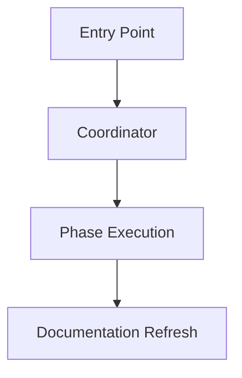
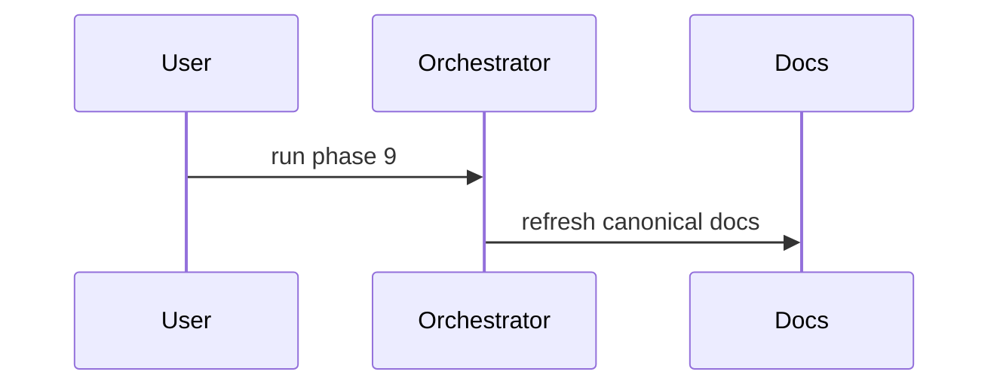

# Canonical Doc Default Structure

This file shows the default structure for the canonical docs refreshed by `rd3:code-docs`.

These are starting structures, not mandatory line-by-line output. Prefer reusing an existing project structure if it already organizes the same information well.

## `docs/01_ARCHITECTURE_SPEC.md`

~~~~markdown
# Architecture Spec

## Purpose

## System Boundaries

## Core Components

## Runtime Flow



## Data and Control Flow

## Invariants and Constraints

## Integration Points

## Operational Notes
~~~~

## `docs/02_DEVELOPER_SPEC.md`

```markdown
# Developer Spec

## Purpose

## Key Workflows

## Command and Skill Behavior

## Extension Points

## Maintenance Rules

## Troubleshooting

## References
```

## `docs/03_USER_MANUAL.md`

```markdown
# User Manual

## Overview

## Getting Started

## Common Tasks

## Commands and Options

## Examples

## Expected Outputs

## Caveats and Limitations
```

## `docs/99_EXPERIENCE.md`

```markdown
# Experience

## Lesson Title

### Symptom

### Root Cause

### Fix

### Prevention
```

## Diagram Rule

All diagrams in these docs should use Mermaid fenced blocks:

~~~~markdown

~~~~

Do not use:
- ASCII diagrams
- pasted screenshots
- image-only flows when Mermaid can express the same concept
