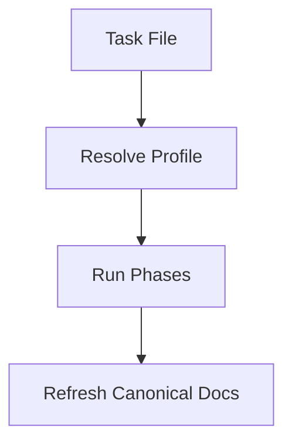

# Documentation Refresh Patterns

This document provides section patterns for the canonical documentation set refreshed by `rd3:code-docs`.

The goal is not to generate boilerplate. The goal is to merge new implementation knowledge into the right long-lived document with minimal duplication.

If a diagram is useful, write it as Mermaid in a fenced markdown block.

## `docs/01_ARCHITECTURE_SPEC.md`

Use this document for enduring system truth.

### Good update shapes

```markdown
## Runtime Flow

1. Phase 1 refines the task and assigns a profile.
2. The planner resolves the profile from task frontmatter before applying overrides.
3. Phase 9 refreshes canonical project docs based on changed behavior.
```

~~~~markdown
## Runtime Flow Diagram


~~~~

```markdown
## Constraints

- `--skip-phases` only supports trailing phases because downstream phases depend on upstream artifacts.
- `simple` and `research` profiles default to a 60% test gate; `standard` and `complex` default to 80%.
```

### Avoid

- task-by-task chronology
- detailed command examples better suited for developers or users
- bug diary content that belongs in `99_EXPERIENCE.md`

## `docs/02_DEVELOPER_SPEC.md`

Use this document for internal developer-facing guidance.

### Good update shapes

```markdown
## Phase 9 Documentation Refresh

When Phase 9 runs, update only the relevant canonical docs:

- `docs/01_ARCHITECTURE_SPEC.md` for architectural changes
- `docs/02_DEVELOPER_SPEC.md` for internal workflow changes
- `docs/03_USER_MANUAL.md` for user-visible behavior changes
- `docs/99_EXPERIENCE.md` for durable lessons from bugs and fixes
```

```markdown
## Command Behavior

`/rd3:dev-review` is task-scoped. It accepts a WBS number or task file path and delegates to Phase 7 using task context.
```

### Avoid

- architecture rationale already captured in `01_ARCHITECTURE_SPEC.md`
- user-facing step-by-step usage that belongs in `03_USER_MANUAL.md`

## `docs/03_USER_MANUAL.md`

Use this document for externally visible behavior.

### Good update shapes

```markdown
## Reviewing a Task

Use `/rd3:dev-review <task-ref>` to review a task after implementation.

Examples:

- `/rd3:dev-review 0274`
- `/rd3:dev-review docs/tasks2/0274_add_dev_slash_commands.md`
```

```markdown
## Running the Pipeline

Use `/rd3:dev-run <task-ref> --profile research` for investigation-heavy work. This profile runs the full pipeline and uses a lighter default test gate.
```

### Avoid

- internal implementation details of the skill system
- maintenance heuristics intended only for developers

## `docs/99_EXPERIENCE.md`

Use this document for durable lessons from real work.

### Preferred entry pattern

```markdown
## Trailing Phase Skips Only

### Symptom

The planner could emit impossible phase chains such as testing without implementation.

### Root Cause

`--skip-phases` was treated as a simple filter, and phase dependencies were recomputed from the previous remaining phase instead of validated against required upstream outputs.

### Fix

Reject non-trailing skipped phases and keep the dependency chain explicit.

### Prevention

When a phase consumes artifacts from an earlier phase, validate skip combinations before producing a plan.
```

### Avoid

- raw terminal transcripts
- transient debugging notes without reusable lessons
- emotional narrative instead of operational insight

## Merge Strategy

When updating docs:

1. Prefer integrating into an existing section.
2. Add a new section only when the topic is genuinely new.
3. Rewrite stale lines instead of appending contradictory text.
4. Keep examples short and specific to current behavior.
5. When a diagram helps, use Mermaid fenced blocks only.
