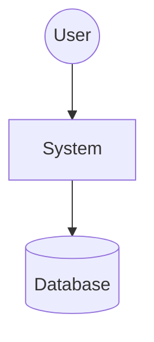
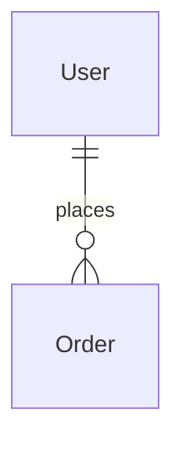

# Info Reve

Analyze codebases and generate comprehensive High-Level Design (HLD) documents with critical issue audits. Use for understanding unfamiliar codebases, documenting architecture, or identifying technical debt before refactoring.

## When to Use

- Understanding unfamiliar or undocumented codebases
- Generating architecture documentation for onboarding
- Identifying critical issues before major refactoring
- Conducting code quality audits with file-level evidence
- Creating HLD documents for design reviews
- Assessing technical debt and modernization needs

## Arguments

| Argument | Required | Description | Default |
|----------|----------|-------------|---------|
| `[codebase-path]` | No | Path to codebase (default: current directory) | `.` |
| `--scope` | No | Analysis focus: `all`, `security`, `performance`, `architecture`, `maintainability` | `all` |
| `--format` | No | Output format: `brief`, `standard`, `detailed` | `standard` |

## Input Validation

### Required Arguments
- **`[codebase-path]`**: Optional, defaults to current directory (`.`)

### Optional Arguments
- **`--scope`**: Must be one of `all`, `security`, `performance`, `architecture`, `maintainability`
- **`--format`**: Must be one of `brief`, `standard`, `detailed`

### Error Handling

| Error | Behavior |
|-------|----------|
| Invalid `--scope` | Default to `all` with warning message |
| Invalid `--format` | Default to `standard` with warning message |
| Codebase path not found | Report error and suggest valid path |
| Empty/minimal codebase | Report as "Insufficient code for analysis" with recommendations |
| Binary-heavy repo | Focus on configuration and scripting files |
| Permission denied | Suggest checking file permissions and ownership |

## Analysis Scopes

| Scope | Description | Focus Areas |
|-------|-------------|-------------|
| **all** | Comprehensive analysis | All categories below |
| **security** | Security audit | Hardcoded secrets, SQL injection, input validation, exposed endpoints |
| **performance** | Performance analysis | N+1 queries, missing indexes, blocking I/O, caching |
| **architecture** | Architecture review | Abstractions, coupling, boundaries, patterns |
| **maintainability** | Code quality | Long files, circular deps, dead code, deprecated APIs |

## Output Formats

| Format | Description | Size |
|--------|-------------|------|
| **brief** | Executive summary + top critical issues | ~500-1000 words |
| **standard** | Full HLD + critical issues + recommendations | ~1500-2500 words |
| **detailed** | Extended analysis with all findings + diagrams | ~3000-5000 words |

## Workflow

This command delegates to the **super-reve** agent for comprehensive codebase analysis:

### Phase 1: Reconnaissance

```
Step 1: Analyze project structure
→ Task(subagent_type="rd2:super-reve",
    prompt="Analyze codebase at: {codebase_path}
     Scope: {scope}
     Format: {format}

     Execute reconnaissance:
     - Scan project structure (tree, dependency files)
     - Identify infrastructure (Dockerfile, docker-compose, K8s, CI)
     - Classify architecture type (monolith/microservices/serverless)
     - Locate entry points and core business logic")
```

### Phase 2: Component Mapping

```
Step 2: Map components and data flow
→ Task(subagent_type="rd2:super-reve",
    prompt="Continue analysis:

     Component Mapping:
     - Trace request lifecycle (Entry → Router → Logic → Data)
     - Group files into logical domains
     - Map external dependencies and integrations
     - Identify data models and storage patterns")
```

### Phase 3: Quality Audit

```
Step 3: Perform quality audit
→ Task(subagent_type="rd2:super-reve",
    prompt="Execute quality audit for scope: {scope}

     Security Audit (if applicable):
     - Hardcoded secrets, credentials
     - SQL injection, XSS vulnerabilities
     - Missing input validation
     - Exposed endpoints

     Performance Audit (if applicable):
     - N+1 queries, missing indexes
     - Blocking I/O operations
     - Caching opportunities

     Architecture Audit (if applicable):
     - Missing abstractions
     - Tight coupling issues
     - Unclear boundaries

     Maintainability Audit (if applicable):
     - Files >500 lines
     - Circular dependencies
     - Dead code, deprecated APIs

     Cite specific evidence: file/path:line_number for each finding")
```

### Phase 4: Synthesis & Output

```
Step 4: Generate HLD document
→ Task(subagent_type="rd2:super-reve",
    prompt="Generate HLD document:

     Include:
     - Executive Summary
     - System Architecture with diagrams
     - Key Components with locations
     - Data Design with ER diagrams
     - Critical Business Flows
     - Cross-Cutting Concerns
     - Critical Issues (prioritized by severity)
     - Actionable Recommendations
     - Modernization Roadmap

     Format: {format}
     Use Mermaid for diagrams when applicable")
```

## Output Template

### Brief Format

```markdown
# HLD & Audit: {Project}

**Date**: {YYYY-MM-DD}
**Tech Stack**: {Languages, Frameworks}
**Type**: {Backend/Frontend/Fullstack}

## Executive Summary

{3-5 sentence overview}

## Top Critical Issues

| Severity | Issue | Location | Impact |
|----------|-------|----------|--------|
| 🔴 | {Issue} | `file:line` | {Impact} |
| 🟡 | {Issue} | `file:line` | {Impact} |

## Quick Recommendations

{Top 3-5 prioritized actions}
```

### Standard Format

```markdown
# High-Level Design & Audit: {Project}

| Metadata | Details |
|----------|---------|
| **Analysis Date** | {YYYY-MM-DD} |
| **Tech Stack** | {Stack} |
| **Type** | {Type} |
| **Entry Point** | `path/to/entry` |

## 1. Executive Summary

{System purpose, current state, business value}

## 2. System Architecture

### 2.1 Architectural Pattern

{Pattern description}

### 2.2 System Context Diagram



## 3. Key Components

| Module | Responsibility | Location |
| ------ | -------------- | -------- |
| {Name} | {What it does} | `path/to/module` |

## 4. Data Design

### 4.1 Entity Relationships



## 5. Critical Business Flows

{Key workflows with sequence diagrams}

## 6. Cross-Cutting Concerns

| Concern | Implementation | Evidence |
|---------|---------------|----------|
| Auth | {Method} | `path:line` |

## 7. Critical Issues & Recommendations

### 7.1 Security & Stability

| Severity | Issue | Location | Fix |
|----------|-------|----------|-----|
| 🔴 | {Issue} | `file:line` | {Fix} |

### 7.2 Modernization Roadmap

| Priority | Action | Effort | Impact |
|----------|--------|--------|--------|
| 1 | {Action} | {S/M/L} | {Benefit} |
```

## Examples

### Example 1: Analyze Current Directory

```bash
/info-reve
```

**Output**: Comprehensive HLD and audit of current codebase with all issue categories.

### Example 2: Security-Focused Audit

```bash
/info-reve ./my-project --scope security
```

**Output**: Security audit focusing on:
- Hardcoded secrets and credentials
- SQL injection and XSS vulnerabilities
- Missing input validation
- Exposed endpoints and authentication issues

### Example 3: Brief Architecture Review

```bash
/info-reve ~/projects/app --scope architecture --format brief
```

**Output**: Concise architecture overview with:
- System pattern and design
- Component mapping
- Top architectural issues
- Quick recommendations

## Resource Coordination

| Resource | Role | When Used |
|----------|------|-----------|
| `rd2:super-reve` | Core analysis agent | Always (primary) |
| `mcp__auggie-mcp__codebase-retrieval` | Semantic code search | Phase 1-2 (exploration) |
| `Grep` | Pattern searching | Phase 3 (audit) |
| `Glob` | File discovery | Phase 1 (reconnaissance) |

## Quality Assurance

All analysis outputs include:

- [x] File path and line number evidence for all findings
- [x] Severity prioritization (High/Medium/Low)
- [x] Mermaid diagrams for architecture and data flows
- [x] Actionable remediation steps
- [x] Modernization roadmap with effort/impact estimates

## Implementation

This command uses a thin wrapper approach:

**Command Layer (this file)**: Pseudocode for orchestration

**Agent Layer**: Delegates to `rd2:super-reve` for:
- Project reconnaissance
- Component mapping
- Quality audit
- HLD document generation

## Troubleshooting

### Common Issues

| Issue | Symptoms | Solution |
|-------|----------|----------|
| **Insufficient code** | "Empty/minimal codebase" error | Add more source files, check correct path, or analyze subset |
| **Permission denied** | Cannot read files | Check file permissions, run with appropriate user rights |
| **Timeout on large repo** | Analysis stops mid-execution | Use `--scope` to focus on specific areas, try `--format brief` |
| **No clear entry point** | Cannot identify architecture | Report findings based on file structure, suggest manual entry point |
| **Binary-heavy repo** | Limited source code found | Analysis focuses on config files, scripts, and infrastructure |

### Performance Expectations

| Codebase Size | Expected Duration | Memory Usage |
|---------------|------------------|--------------|
| Small (<100 files) | ~1-2 minutes | ~100-200 MB |
| Medium (100-500 files) | ~3-5 minutes | ~200-500 MB |
| Large (500-2000 files) | ~5-10 minutes | ~500 MB - 1 GB |
| Very Large (>2000 files) | ~10-20 minutes | ~1-2 GB |

**Factors affecting duration:**
- Number of files and total lines of code
- Selected scope (`all` takes longest)
- Output format (`detailed` requires more synthesis)
- Disk I/O speed
- Available memory

## See Also

- `rd2:super-reve` - Core codebase analysis agent
- `/info-researcher` - Deep research command for literature reviews
- `rd2:sys-debugging` - Four-phase debugging methodology
